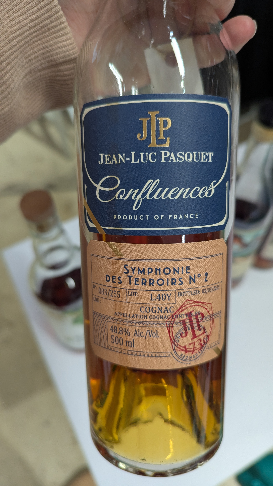
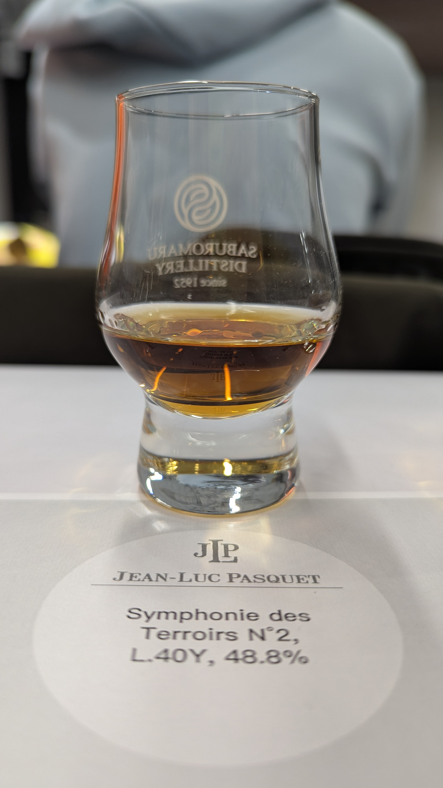
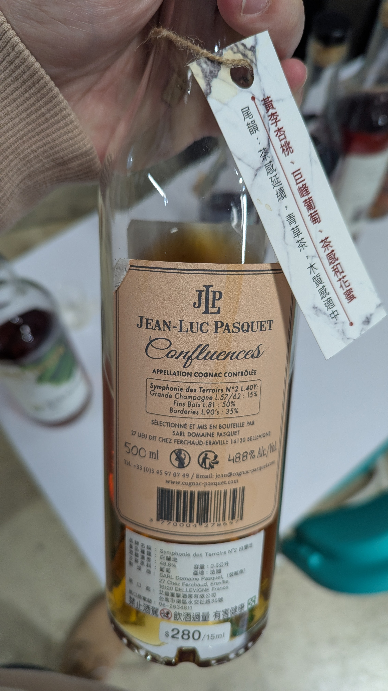
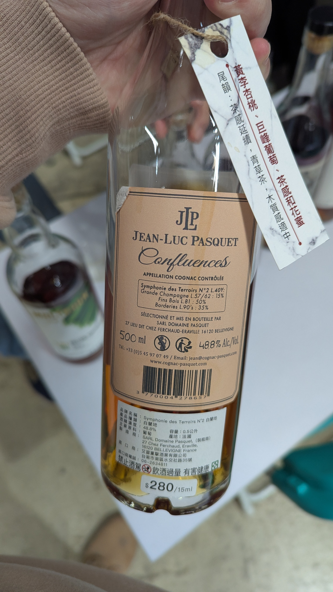

🥃
# Symphonie des Terroirs N°2 Jean-Luc Pasquet Cognac 40yo 48.8%

### 【香氣】百香果 鳳梨 有一點利口的新鮮水果味 肉桂 密蘋果
### 【味道】也是有點水水的 鳳梨罐頭汁 福壽山蘋果
### 【結語】滿滿的蜜水果的味道 可惜酒體跟尾韻稍稍淡薄
### 【日期】2026.01.09
### 【評分】88
### 【價格】5000

---

📜地名即酒名：

只有在法國干邑(Cognac)地區生產的白蘭地，才能稱作 "Cognac"。

📜蒸餾的鐵律：

法律強制規範必須在產區內完成種植與蒸餾，為的是確保「風土（Terroir）」的純粹。這也是為什麼各大 Cognac Houses 都要爭奪大、小香檳區（Grande & Petite Champagne）的優質原酒。

📜陳年的彈性：

有趣的是，一旦蒸餾完成，法律對陳年地點的限制相對寬鬆，但多數酒莊仍會選擇在當地的潮濕地窖中熟成，賦予酒液圓潤的層次。

📜Dry 的優雅：

真正的白蘭地其實是非常乾爽（Dry）的，那種甜美的氣息來自果實與橡木桶的單寧交織，而非添加糖分。

#whiskyage
#whiskyblue
#symphoniedesterroirsn°2
#jeanlucpasquet
#brandy
#cognac
#spicy9night

