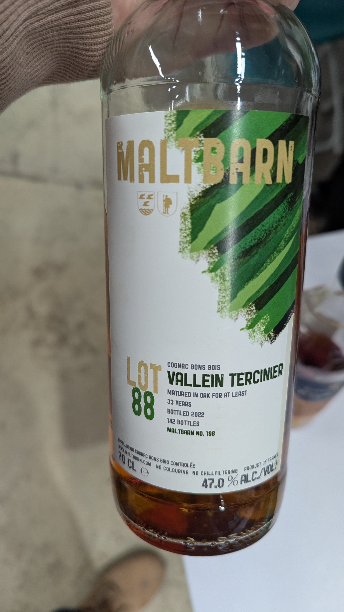
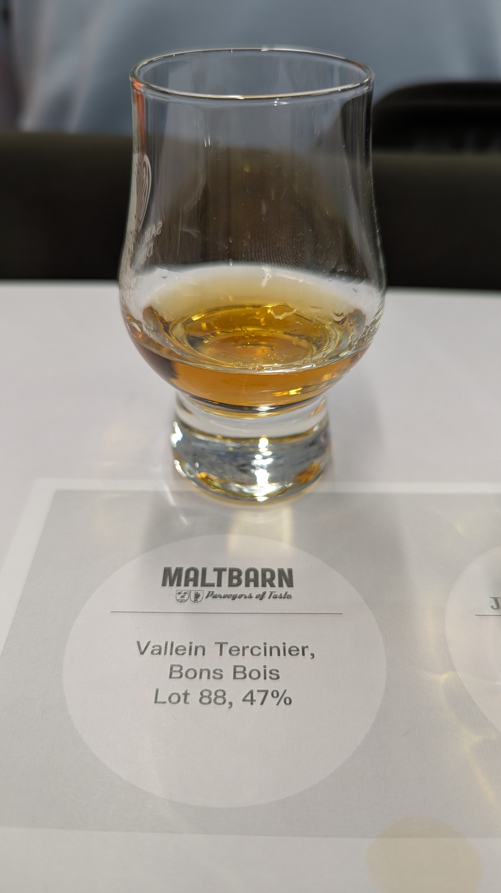

# Maltbarn Vallein Tercinier Bons Bois 1988 33yo 47%

### 【香氣】水果 一點點木頭香 放很久有花香
### 【味道】櫻桃 水掉了 尾韻淡薄
### 【結語】味道很棒 但是口感的味道水了很多 尾韻咻一下就沒了
### 【日期】2026.01.09
### 【評分】85

----

📜沒有蒸餾廠概念：

蒸餾是由眾家小型農莊自己施作，品牌(如軒尼詩)收購，Brandy喝的是「品牌」與「酒莊」的調配藝術。
比起單一廠址，干邑更強調大香檳區、小香檳區等六大產區的風土（Terroir）特色。

📜隱晦的年份密碼： 

在干邑的世界，法律嚴格限制禁止標示年份。只能從 VSOP、XO 這些等級中，去知道答案。因此有些酒標會標示密碼暗指年份，比如LOT89 意思是1989蒸餾的，隨便都比XO 老年份。

📜喜好用老桶： 

新酒放進新桶只會放一年，就會移到別桶陳年，新桶洗了四年就會變成老桶。為了不讓新桶的味道喧賓奪主，干邑常先用新桶洗禮數年，待木質調變得溫潤後，才開始漫長的陳年之路。

📜不玩過桶，只論風土： 

干邑追求的是像葡萄酒的思維，在意的是葡萄在該年度的本質與風土。

#whiskyage
#maltbarn
#valleintercinier
#bonsbois
#brandy
#cognac
#spicy9night

