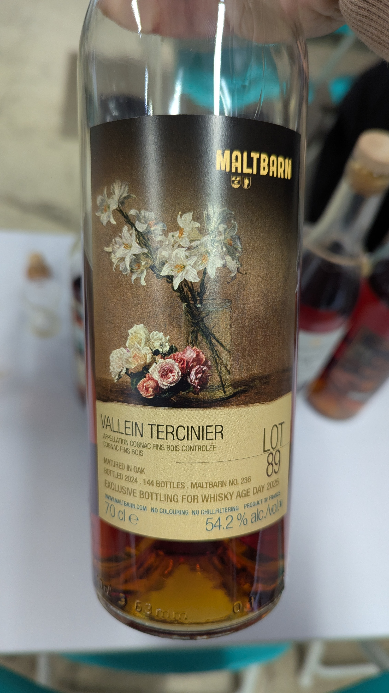
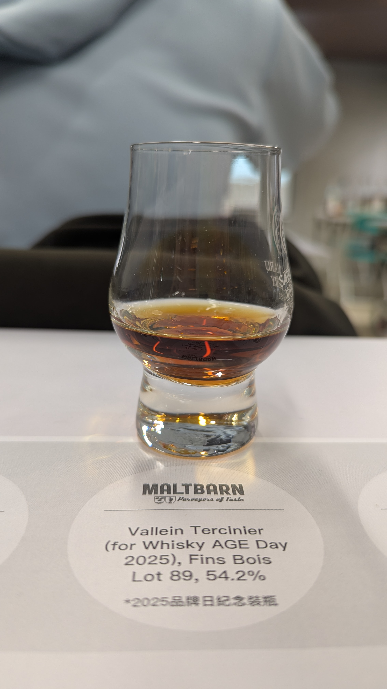

🥃
# Maltbarn 236 Maltbarn Vallein Tercinier Fins Bois 1989 35yo 54.2%

### 【香氣】沉香 葡萄乾 太妃糖
### 【味道】烏梅汁 酒體飽滿 螢火蟲之墓水果糖
### 【結語】酒體飽滿深得我心 濃郁黑色水果我的菜越有趣
### 【日期】2026.01.09
### 【評分】89
### 【價格】6600

---

【選酒人的藝術：Vallein Tercinier】 🥃

在干邑的世界，品牌不一定要有自己的葡萄園，也不一定要親自操作蒸餾器。像是傳奇家族 Vallein Tercinier，他們的角色更接近「伯樂」。
很多人以為酒莊一定要從頭做到尾，但其實：

📜不一定種葡萄：

他們與各個 Crus（產區） 的優質農夫（Grower-distillers）長期合作。

📜不一定親自蒸餾：

他們在這些農場的小蒸餾廠中，尋找最有潛力的 Eau-de-vie（生命之水）。

📜那他們的價值在哪？

答案是「Selection（挑選）」與「Elevage（陳養）」。

Vallein Tercinier 家族最厲害的是那雙銳利的眼睛。他們遊走在大小香檳區、邊緣區的小農地窖間，買下那些被遺忘的珍稀原酒，並在自己的地窖中進行漫長的陳年與調配。

這就是為什麼雖然「酒不一定是他做的」，但最後那種細膩、充滿油脂感與熱帶水果香氣的風格，卻是標標準準的 Vallein Tercinier Style。
這不只是釀酒，這是在時光中「獵酒」的藝術。

#whiskyage
#maltbarn
#valleintercinier
#finsbois
#brandy
#cognac
#spicy9night

