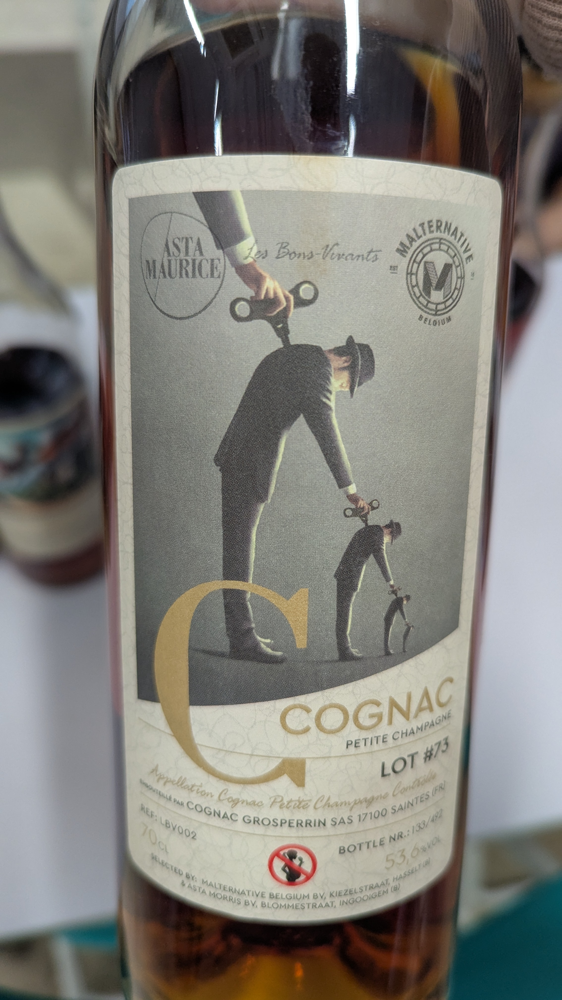
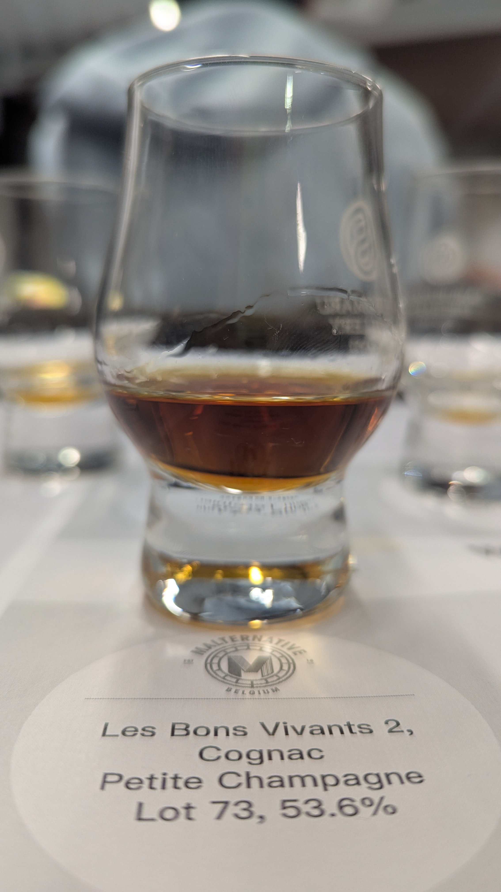

🥃
# Les Bons Vivants 2 Malternative Belgium Cognac Grosperrin Petite Champagne 1973 50yo 53.6%

### 【香氣】甘草糖 中藥味
### 【味道】花雕雞
### 【結語】藥膳酒 藥膳湯
### 【日期】2026.01.09
### 【評分】86
### 【價格】9500

---

【干邑巨頭與皇家禮炮：你買的是風味，還是地窖的收藏？】 🥃🏰

品飲會上最直白的一句話：「白蘭地大集團其實就像威士忌裡的皇家禮炮，重點不在蒸餾，而在收藏與調配。」

很多人以為大品牌就是自己種葡萄、自己蒸餾，但真相往往更接近於「專業採購商」：

📜他不蒸餾的（或是比例極低）：

像軒尼詩（Hennessy）或馬爹利（Martell）這類巨頭，他們的核心競爭力是「地窖」與「合約」。他們與產區數千個小農蒸餾戶（Grower-distillers）簽約，買下他們蒸餾好的「生命之水（Eau-de-vie）」。

📜買別人最好的生命之水：

大集團的角色是 Négociant（酒商）。他們每年評鑑上萬樣品，只挑選符合品牌風格的原酒。這些原酒入窖後，在大集團的倉庫中陳年數十年甚至上百年。

📜調配的魔術（Blending Art）：

就像皇家禮炮調和了無數蘇格蘭蒸餾廠的精華，干邑大廠的 Master Blender（首席調酒師） 則是負責把幾百種來自不同農戶、不同產區的原酒，調配出那種數十年如一日、品牌標誌性的穩定風味。

📜結論是：

這不是「農場作品」，而是大集團「傳承百年的風味庫存」與「調配美學」。下次喝大牌子時，試著感受那種集結眾人之力、匯聚整個干邑產區精華的宏大感！

#whiskyage
#lesbonsvivants2
#malternativebelgium
#cognacgrosperrin
#petitechampagne
#brandy
#cognac
#spicy9night

