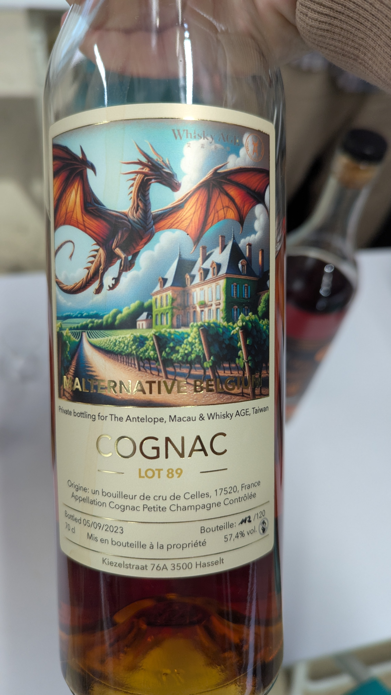
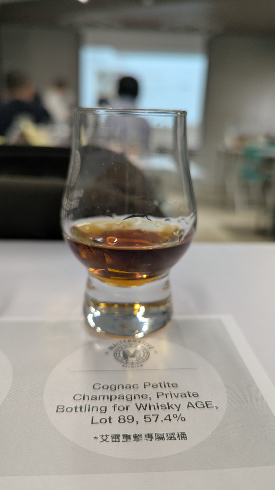

🥃
# Malternative Belgium Petite Champagne 1989 34yo 57.4%

### 【香氣】去光水 泡泡膠 新鮮木頭 水梨
### 【味道】有一個海鮮的鮮甜 油脂感很棒 umami 尾韻有個芭樂味 酷
### 【結語】味道嗆辣 去光水 但是喝下去很舒服 味道酒體都好
### 【日期】2026.01.09
### 【評分】88
### 【價格】6600

---

💎Bouilleur de Cru 的免稅特權 (The Privilege)

📜歷史起源：

這項被稱為「Privilège des bouilleurs de cru」的免稅特權可追溯至拿破崙時代。當時為了獎勵果農，允許他們每年蒸餾前 10 公升純酒精（約相當於 25 瓶 40% 的干邑）不需要繳納任何烈酒稅。

📜終止發照與落日條款：

1959 年：法國政府決定停止發放新的免稅許可證，以打擊酗酒並增加稅收。

📜世襲限制：

原本這項權利是可以世襲的，但在 1960 年代後改為「終身制」。這意味著這項權利不能轉讓、不能繼承，會隨著持有者（農夫本人）的去世而永久消失。

現狀（2026年環境）：目前仍保有此項「完全免稅特權」的農戶已極其稀少，多為高齡的家族長輩。雖然 2024 年後有針對一般小農提供部分稅務減免，但那種「拿破崙時代流傳至今、完全免稅」的原始證照，確實是喝一瓶少一瓶的歷史見證。 

#whiskyage
#malternativebelgium
#petitechampagne
#brandy
#cognac
#spicy9night

