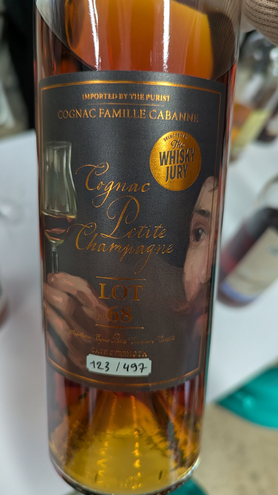
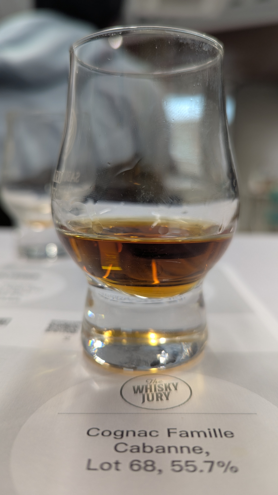
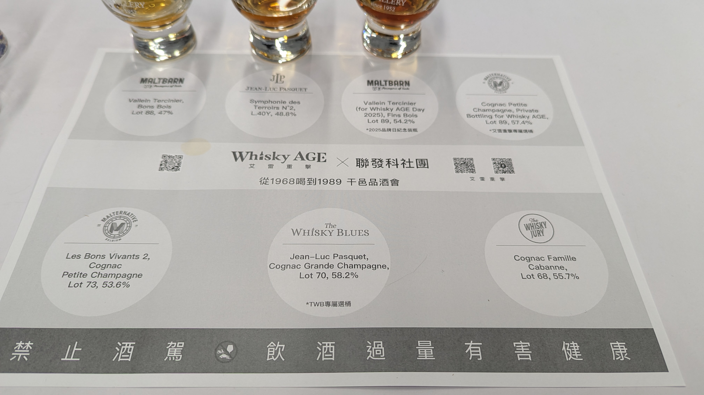

🥃
# The Whisky Jury Cognac Famille Cabanne Petite Champagne 1968 55yo 55.7%

### 【香氣】土味 有點泥煤
### 【味道】酸甜 喝完的酸梅湯、烏梅汁尾韻
### 【結語】有點花生的油脂與香氣
### 【日期】2026.01.09
### 【評分】87
### 【價格】12000

---

【這瓶酒不是香檳，但它叫 Champagne？🍾】

如果在酒單上看見「大香檳區 (Grande Champagne)」的白蘭地，千萬別問服務生為什麼沒有氣泡！😅 其實這指的是干邑最強的產區，因為土壤富含石灰質，跟香檳省很像而得名。

🍷 干邑等級小筆記（快收藏起來！）：

V.S. (Very Special)： 最低陳年 2 年。充滿活力與果香，適合調酒或加冰塊。

V.S.O.P (Very Superior Old Pale)： 最低陳年 4 年。口感開始變圓潤，帶有香草與焦糖感。

X.O. (Extra Old)： 以往是 6 年，現在新規範要陳年 10 年以上！這才是真正展現層次感的藝術品。

💡 冷知識： 你知道嗎？干邑的陳年計算不是從裝桶那天開始，而是每年的 4/1 才是「截止日」，沒趕上就要多等一年！ 這種法國式的浪漫（龜毛），就是干邑之所以珍貴的原因。

#whiskyage
#thewhiskyjury
#cognacfamillecabanne
#petitechampagne
#brandy
#cognac
#spicy9night

