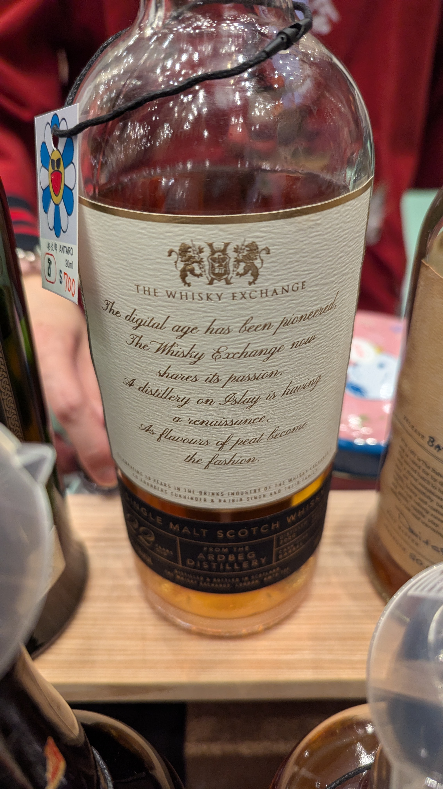
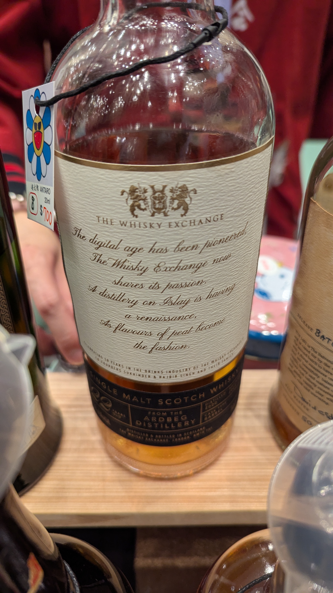

# Ardbeg The Whisky Exchange The Decades 2000 22yo Heavy Charred Ex-Jack Daniel's Barrel 53.4%

### 【結語】桃子灰燼
### 【日期】2025.11.22 @高雄酒展
### 【價格】700/20ml

### 官方品飲筆記

蒸餾廠介紹：

一款非常特別的 2000 年份Ardbeg酒，專為紀念 The Whisky Exchange 聯合創始人家族開設其最初的西倫敦非特許經營 50 週年而裝瓶。這款威士忌在一對嚴重燒焦的前傑克丹尼酒桶中陳釀，充滿了海邊煙燻味和水果味。

 

口感風味：

入喉時，焦油、薄荷醇是主角，鼻腔充斥甜美可口的水果香氛。中段擁有燃燒的海藻和海灘篝火的煙火氣味，而後被洶湧的海浪撲滅，迎接而上的是帶有蘋果和杏子的橡木桶香味，尾韻暗含鹹黃油太妃糖，以及焦油和甘草糖的混合氣味，如同站在海浪拍打潮濕的岩石的岸邊，詮釋出艾雷島最獨特的浪漫風情。

 

酒廠簡介：

Ardbeg單一純麥威士忌在所有艾雷島上的純麥威士忌中，口感最細緻且豐富，其特點並不在於泥煤味的誇飾，而是以麥芽為主，讓麥芽甜味淡淡透出，創造完美的平衡口感。平衡就是關鍵，所有的艾雷島威士忌都很獨特，但只有Ardbeg單一麥芽威士忌能夠如此達到口感的和諧，而與其他酒廠有所區隔。

#ardbeg
#thewhiskyexchange
#whisky
#whiskylover
#whisky
#spicy9night

