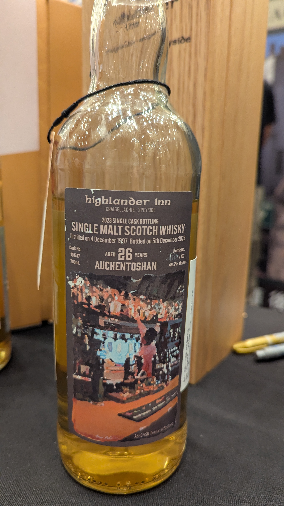

# 2023年度典藏 Auchentoshan Highlander Inn 1997 26yo Bourbon 49.2%

### 【結語】小花、玉蘭花，Whiskybase 來到89.5分的品項，難怪會有花香味
### 【日期】2025.11.22
### 【價格】14800

### 官方品飲筆記
高地人小酒館

全球最佳單一純麥威士忌酒吧─高地人小酒館。

被公認為全世界最佳威士忌酒吧的高地人小酒館，致力於傳達蘇格蘭威士忌文化及傳統，憑藉著專業與經驗要將此信念散播全世界，也讓全球知名威士忌大師Michael Jackson深受感動，每年皆會從蘇格蘭各酒廠酒窖中，精心挑選出一款最具代表性的單一麥芽單一酒桶蘇格蘭威士忌，以原桶酒精濃度裝瓶，並由威士忌大師Michael Jackson親自品嚐，寫下獨一無二的品酩筆記，作為高地人小酒館年度典藏系列。 

在2007年Michael Jackson過世後，高地人小酒館決定仍維持年度典藏系列的推出，藉此代表高地人小酒館與Michael Jackson之間的永久情誼，並對Michael Jackson獻上最高的敬意在此之後，要能夠替高地人小酒館撰寫品酩筆記的人，要在威士忌業界具有權威及代表性，而這次的便是邀請歐肯前酒廠經理/現任Clydeside酒廠經理-Alistair McDonald撰寫。

香氣：甜美、青草、糖漿、濃郁十足。

口感：豐富果香、奇異果、焦糖布丁、香草、香蕉。

尾韻：杏仁、黑胡椒、持久的牛奶巧克力餘韻。

#auchentoshan
#highlanderinn
#whisky
#whiskylover
#whiskey
#spicy9night

