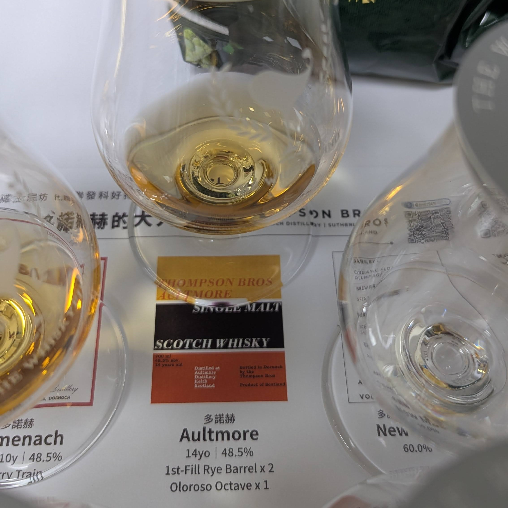
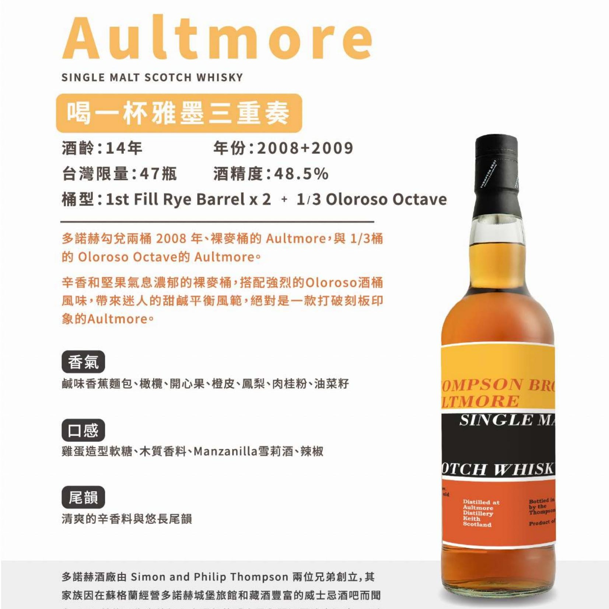

# Aultmore WhiskyFind 2008+2009 14yo 1st-Rye Barrel x2 + 1/3 Oloroso Octave 55.7%

【香氣】桂花、香蕉水果麵包、一點點荔枝、青梅 、鹹麵包、披薩、起司  
【味道】水果軟糖，雜糧麵包感，放一下的裸麥味出來了  
【結語】第一口雖然有點不柔順口，覺得怪異，有了第一口的打底，水果軟糖鳳梨口味都出來了，熱帶水果都有了，搭配麵包味道豐富，酒體厚實，食物感強烈  
【日期】2025.01.16/2025.06.17  
【評分】89  
【價格】2XXX  

#aultmore  
#rye  
#oloroso  
#whisky  
#whiskey  
#whiskyfind  
#spicy9night   
#whiskylover  

