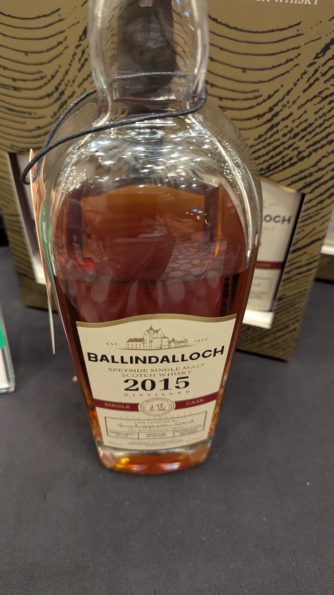

🥃
# Ballindalloch OB 2015 9yo Sherry Butt 61.7%

### 【香氣】初次雪莉桶帶來的乾果、核桃與黑巧克力感非常直接。
### 【味道】61.7% 衝擊力強，酒體紮實。前段為葡萄乾甜感，中後段出現可可碎片的微苦與木質香氣。
### 【結語】木質香氣與油脂感留存時間長。
### 【日期】2025.11.22 @高雄酒展

1. Single Estate (單一莊園)：

位於 Speyside，是該區首家落實「單一莊園」概念的酒廠。從大麥種植、水源、蒸餾到熟成裝瓶，所有工序均在莊園內完成，垂直整合度極高。

2. 家族經營：

由 Macpherson-Grant 家族於 2014 年創立，該家族自 1546 年起即居住於百赫堡（Ballindalloch Castle），具備近兩百年釀酒經驗。

3. 工藝認證：

主打傳統古法與手工操作，曾於 2016、2018、2020、2022 四度獲《Whisky Magazine》評選為年度最佳手工酒廠。

#ballindalloch
#sherrybutt
#whisky
#whiskylover
#whiskey
#spicy9night

