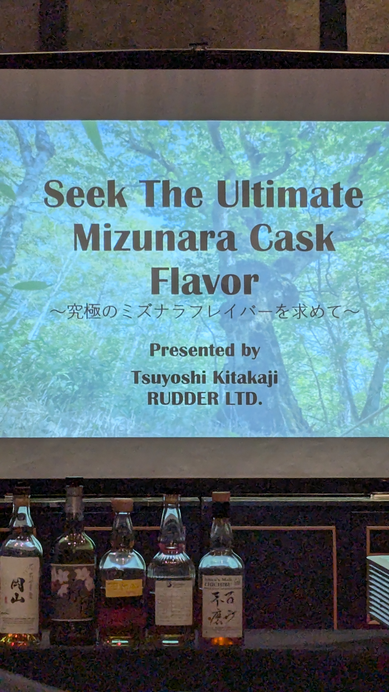
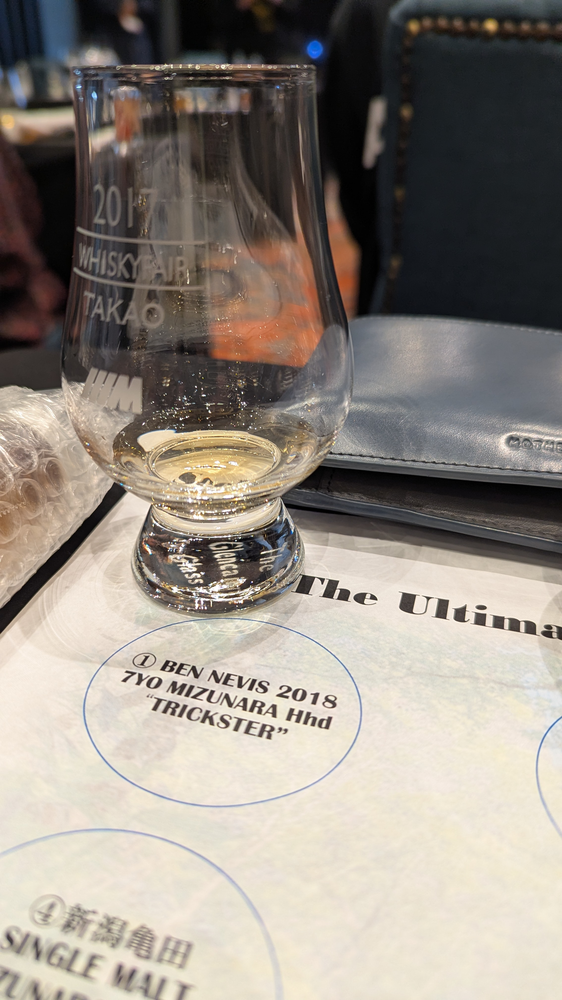
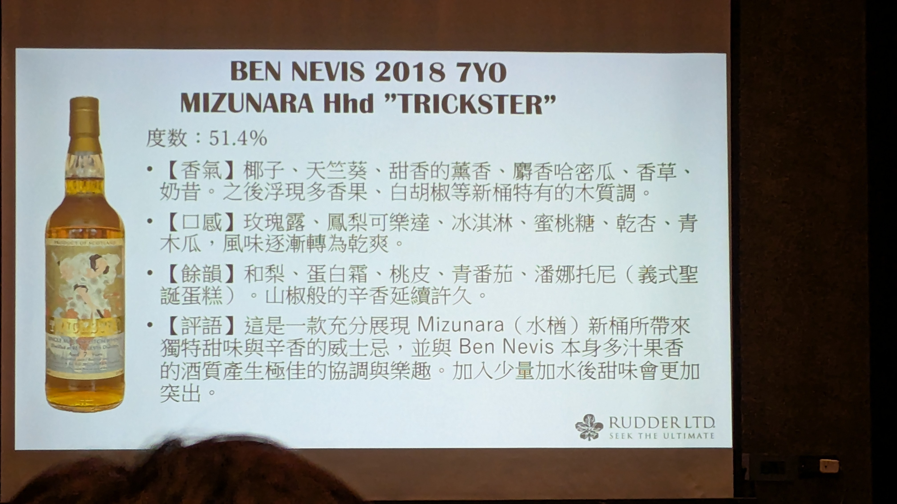
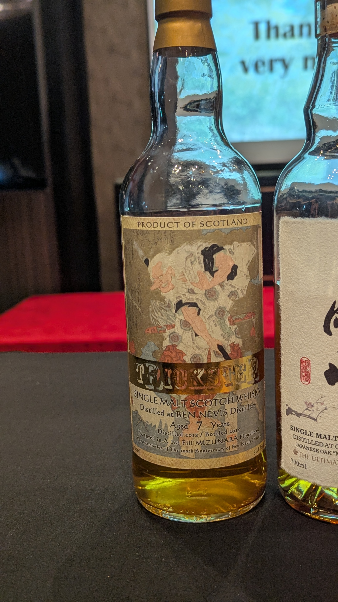
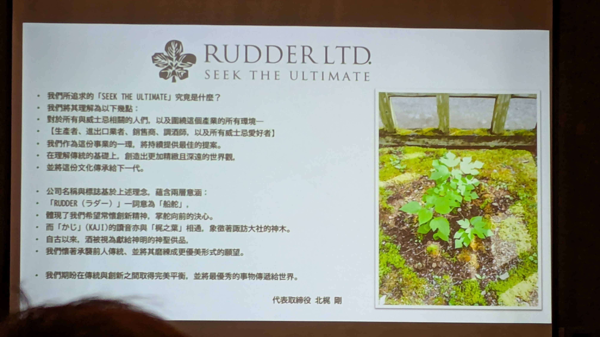
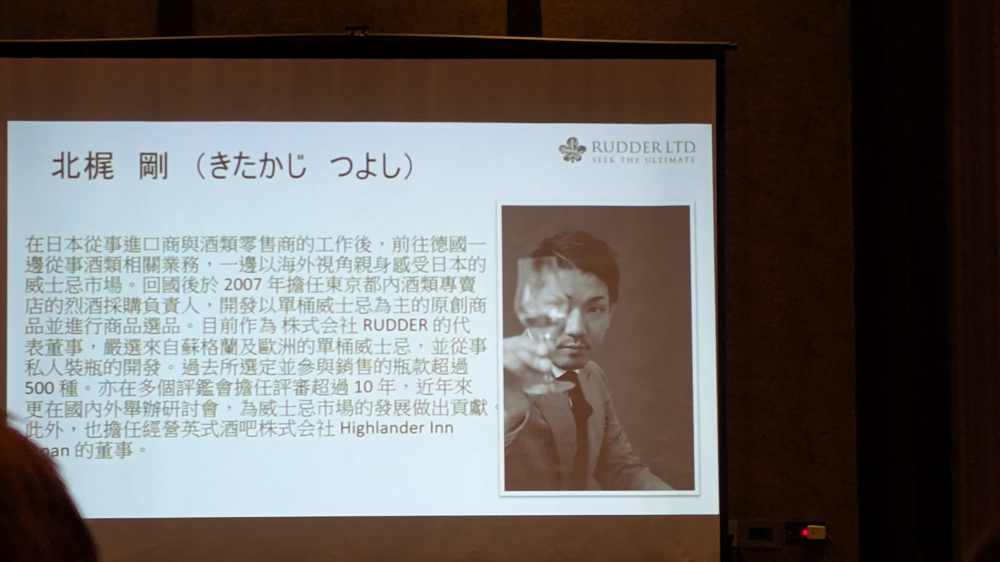
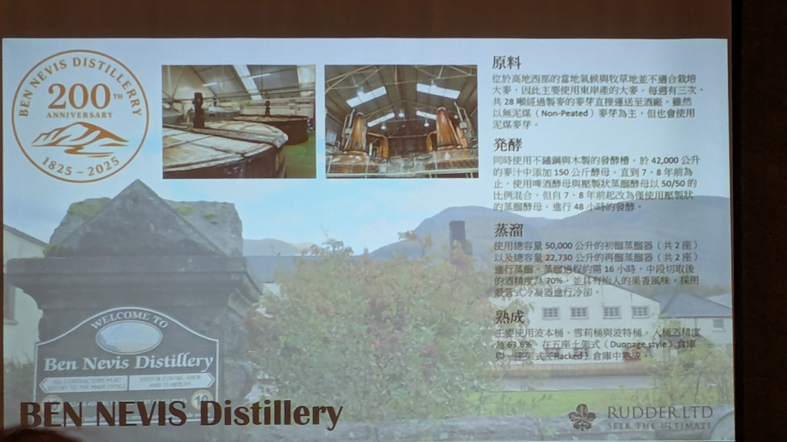
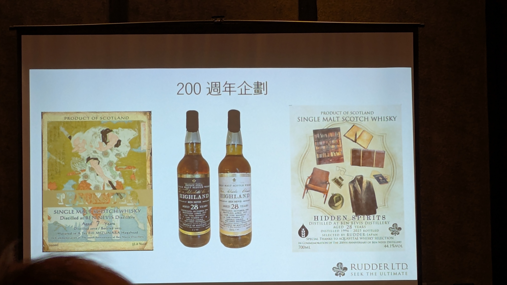
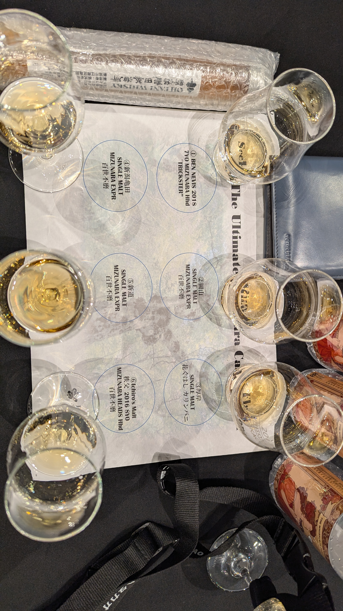

🥃
# Trickster Ben Nevis Rudder Ltd. 2018 7yo 1st Mizunara HHD 51.4%

### 【香氣】椰奶 哈密瓜 紅茶 美國生日蛋糕
### 【味道】拜拜的煙香 麻糬的花生粉
### 【結語】水楢新桶的辛香與酒廠果香完美融合 。
### 【日期】2025.11.22 @高雄酒展

Ben Nevis 蒸餾廠 200 週年慶典：（1825–2025）

工藝細節：

原料：使用東海岸大麥，以無泥煤（Non-Peated）為主。

發酵：同時使用不鏽鋼與木製發酵槽，進行 48 小時發酵。

蒸餾：中段切取後的酒精度為 70%，強調具有迷人的果香。

熟成：酒精強度基準為 63.6%，存放於傳統倉庫中。

週年酒款：展示了名為 "TRICKSTER" 的 7 年水楢桶酒款，以及名為 "HIDDEN SPIRITS" 的 28 年高年份酒款。
其中右邊酒標的日常用品是竹鶴政孝的生活用品

格蘭冠 之後也會有水猶桶

官方品飲筆記

香氣：椰子、天竺葵、麝香哈密瓜、奶昔與香草。

口感：玫瑰露、鳳梨可樂達、冰淇淋，隨後轉為乾爽。

評語：展現水楢新桶帶來的甜味與辛香，與 Ben Nevis 自身的多汁果香完美協調。

追求極致的水楢桶風味 (Seek The Ultimate Mizunara Cask Flavor)

RUDDER LTD.

品牌精神：RUDDER 意為「船舵」，象徵掌舵前進的決心；品牌標誌(KAJI)結合了「梶之葉」，象徵神木與獻給神明的聖品。

核心目標：在理解傳統的基礎上，創造精緻且深邃的世界觀，並致力於傳統與創新的平衡。

北梶 剛

專業經歷：曾於德國從事酒業，回國後於 2007 年擔任東京烈酒採購負責人，專精於單桶威士忌選品。

業界地位：擁有超過 10 年的評審經驗，曾選定並參與銷售超過 500 種瓶款，現任 RUDDER 及 Highlander Inn Japan 董事。

本次品飲菜單

1. BEN NEVIS 2018 7YO (TRICKSTER)。

2. 岡山 SINGLE MALT MIZUNARA EX。

3. 厚岸 SINGLE MALT (花ぐはし カリンパニ)。

4. 新潟龜田 SINGLE MALT MIZUNARA EX。

5. 新道 SINGLE MALT MIZUNARA EX。

6. Ichiro's Malt 秩父 2016 8YO。

#bennevis
#rudder
#trickster
#mizunara
#whisky
#whiskylover
#whiskey
#spicy9night

