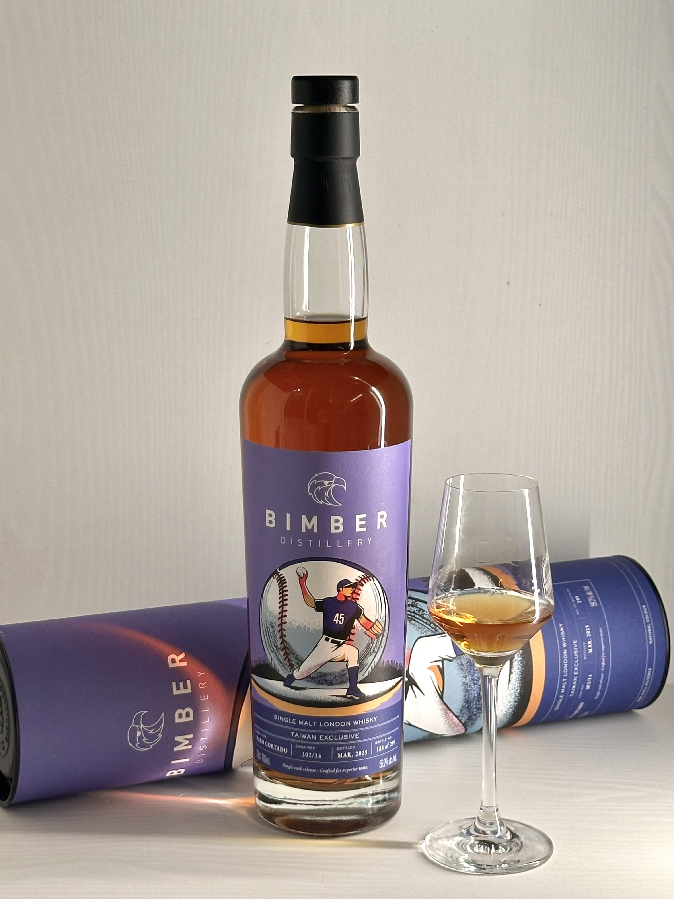
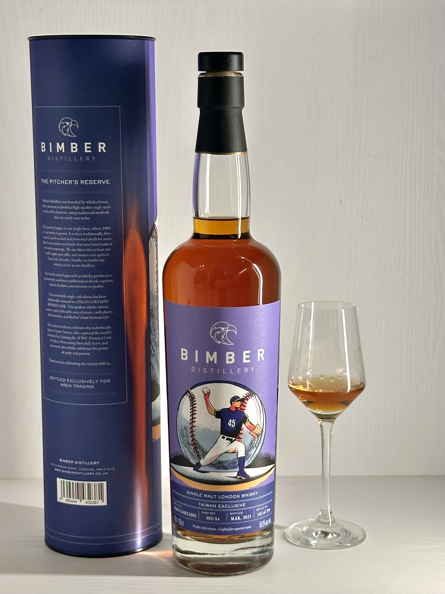
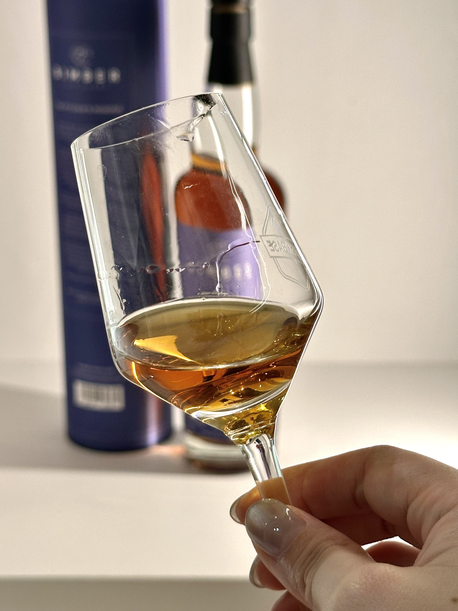
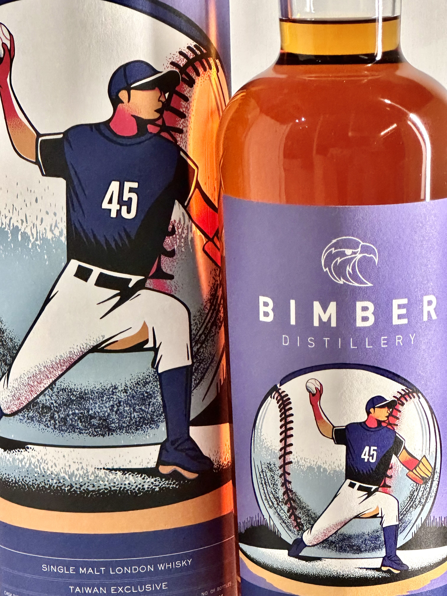

# The Pitcher's Reverse Bimber Taiwan Edition 2020 5yo Palo Cortado 59.2%

【香氣】果乾、淡淡可可調性、木質調以及有點潮濕木頭味  
【味道】奶油、烘焙堅果  
【結語】年輕的新酒味明顯，需要放一陣子可以感受到濃郁的果乾，放置一陣子後味道就消散了，尾韻還不夠深遠，雖然味道爆發的時候果乾飽滿，但保持不住，可能是一支太年輕的酒款，三個月後再喝柔順多了，在柔順的基底下(加分)  
【日期】2025.09.09  
【評分】86 -> 88  
【價格】3780  

這支是台灣2024世界棒球特別選酒，封面照片就是冠軍重要功臣林昱珉

官方品飲筆記  
【外觀】  

深琥珀色，酒體呈現厚實且明亮的光澤，顯示桶中與氧化的交互作用明顯。  

【香氣】  

初聞：充滿燉花香氣的房間氛圍，帶有小小果盤般的果香。  

中段：出現灰燼感（粉筆、礦石感），再帶出蜂蜜、堅果氣息。  

尾段：些許乾果、紅色果實氣息，帶隱約的硫化感，層次複雜。  

【味道】

飽滿厚實，帶濃郁的蜂蜜乾果調。

紅色漿果風味突出，結構中隱含礦物與硫化感，帶來獨特張力。

乾爽且有包覆感，酒體緊實，展現出雪莉桶的深度。

【尾韻】

悠長甜美，帶薄荷般的清涼感。

乾型雪莉風格鮮明，伴隨辛香料與木質感。

最後殘留蜂蜜與果乾韻味，餘韻持久。

【結語】

這是一支少見的 Palo Cortado 風格雪莉桶，兼具 Fino 與 Oloroso 特徵。既有氧化熟成的厚重與堅實結構，又帶出花果清新與細膩感。展現「意外之美」，層次複雜、個性鮮明，非常適合偏愛獨特雪莉桶表現的愛好者

#bimber
#palocortado
#whisky
#whiskylover
#whiskey
#spicy9night

