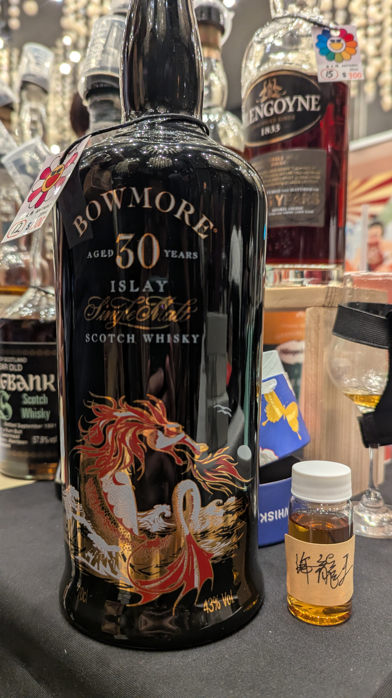

# Sea Dragon Bowmore 30yo 43%

### 【香氣】硫味有點重ㄟ，自然酒的臭雞蛋味，榴槤、酸奶油、一點點花香味、鹽味可頌、肥皂味隨著時間慢慢飄出來
### 【味道】油脂飽滿的薰衣草肥皂，新衣服、剛洗好的衣服曬乾後的味道，果乾味道跟上了
### 【結語】一開始的味道不太行，需要放好一陣子，不然真是難喝，低調柔順油脂剛剛好的肥皂
### 【日期】2025.12.26  
### 【評分】90  
### 【價格】1100/30ml

### **Nose**

Initially, this dram is quite bold and "funky," carrying a heavy **reductive sulfur** note reminiscent of natural wines or boiled eggs. However, with patience, it evolves into a complex layer of **durian** and **sour cream**. As it breathes, delicate **floral undertones** emerge, followed by a savory touch of **salted croissants** and a clean, **soapy fragrance**.

### **Taste**

The mouthfeel is impressively **oily and full-bodied**. It leads with a distinct **lavender soap** quality—reminiscent of the crisp, nostalgic scent of **freshly laundered clothes** dried in the sun. This clean, "new fabric" sensation is eventually joined by a steady wave of **dried fruit sweetness** that rounds out the palate.

### **Finish**

A true exercise in patience. To be honest, it’s a rough start, but it transforms beautifully if you give it the time it needs. What remains is a **subtle, silky-smooth soapiness** with a perfectly balanced **oily texture**. It’s an understated and mellow finish that rewards the persistent drinker.

#bowmore
#whisky
#whiskylover
#whiskey
#spicy9night

