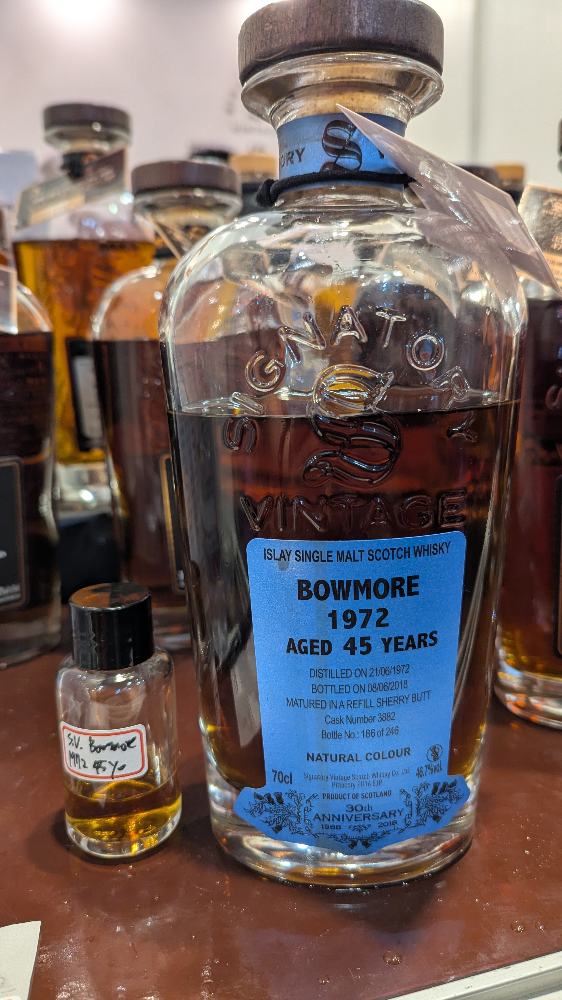

# 30th Anniversary Bowmore Signatory Vintage 1972 45yo Refill Sherry Butt 46.7%

### 【香氣】非常濃郁的熱帶水果，果乾，鳳梨，葡萄軟糖
### 【味道】柚木，酸感，而且還有奶油的香味，尾韻帶有西洋梨酸甜
### 【結語】爆發的香氣，濃郁的水果，油脂豐富又帶酸，非常棒的酒款，不愧是WB 92.16分的酒款 https://www.whiskybase.com/zh-cn/whiskies/whisky/118514
### 【日期】2026.5.18
### 【評分】94

這款來自 Bowmore 的 1972 年老酒，交由 Signatory Vintage 裝瓶，搭配 30th Anniversary 系列設計，45 年的陳年歷史讓酒液保有深厚油脂感。採用 Refill Sherry Butt 熟成，加上 46.7% 酒精濃度，讓整體風味既有雪莉桶的柔和，又能把熱帶水果和果乾香氣保留得很完整。

喝起來像是一個成熟果園的早晨，鳳梨和葡萄軟糖先跳出來，後段則帶著柚木和奶油感，那個酸甜的西洋梨尾韻讓整體更有層次。這是一款有背景、也有實力的酒款，單杯就能感受到 Signatory 的細膩與 Bowmore 的海岸氣息。

#bowmore
#signatoryvintage
#whisky
#whiskylover
#whiskey
#spicy9night

