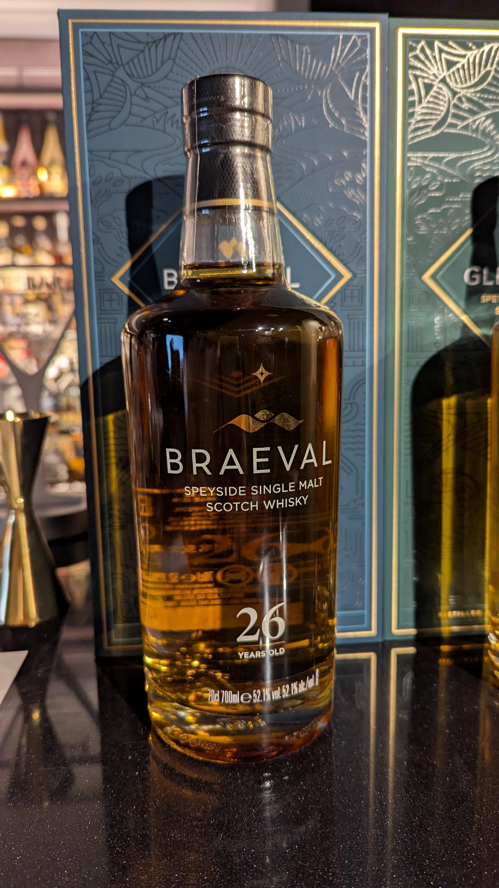
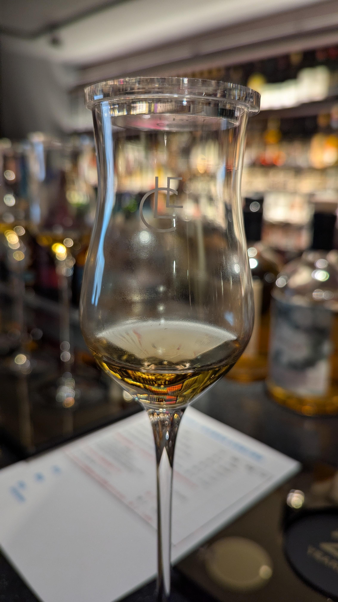
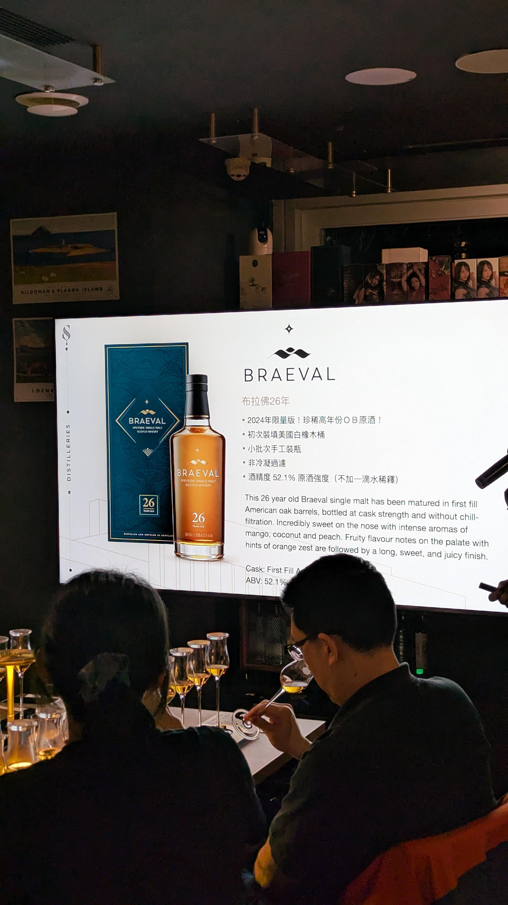
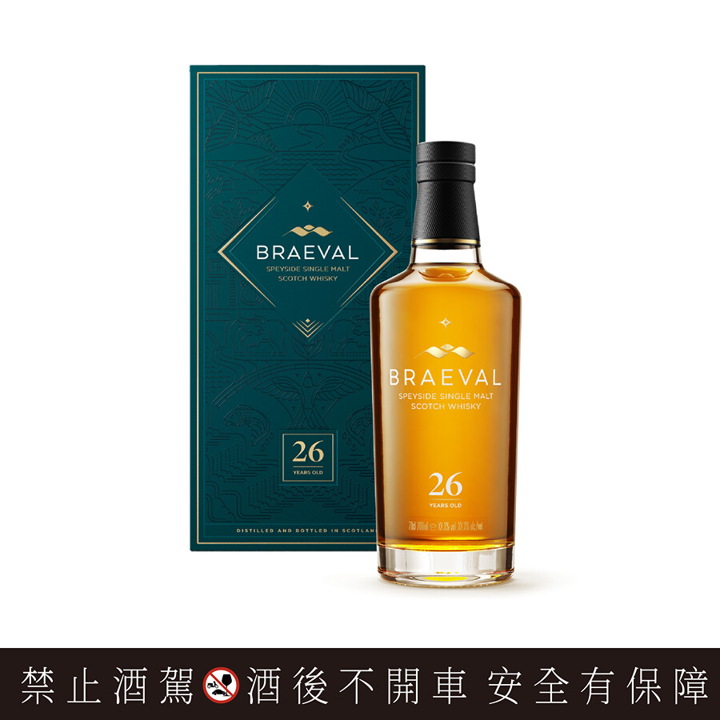
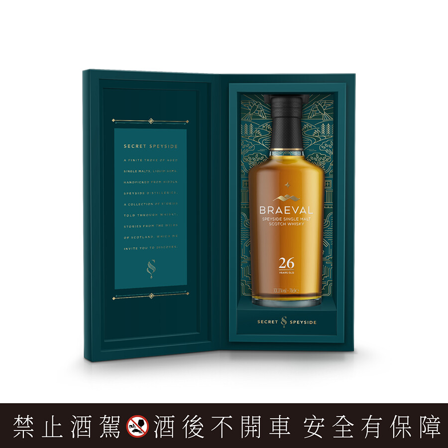
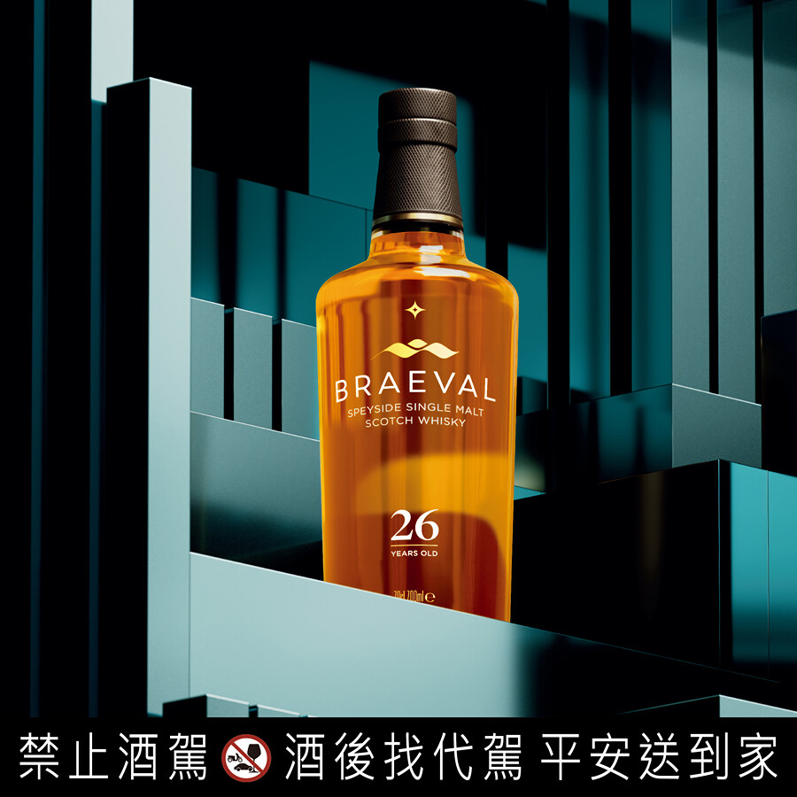

# Braeval 斯貝賽秘境 26yo 1st-Barrel 55.7%

【香氣】香菜 柚木 香檳葡萄 葡萄柚白色的地方  
【味道】回甘 柑橘皮 酸度高 生口水 皮油味很濃 真的有campari 的感覺 太皮了  
【結語】上乘之作可惜不是我的菜  
【日期】2025.4.25  
【評分】92  
【價格】16000  

蘇格蘭最高的酒廠也是現代化酒廠  
02-08年有關場沒有蒸餾   
Chivas Brothers 建立的最後一家酒廠  
格蘭冠、班瑞克，以前也是保樂的  

以下資訊以及部分圖片來自https://www.097.com.tw/article/2619

「三大賣點」  
從未發行，首次釋出原廠裝瓶的布拉佛酒廠單一麥芽威士忌，屹立在Speyside最高處，位居海拔1655英尺，冷冽泉水形成獨特原始風味。  
2024限量臻藏版，小批次手工生產：首次臻選單一麥芽高年份裝瓶問世，存量屈指可數，僅此一版，滴滴珍稀，無法復刻。  

臻選初次裝填美國橡木桶，原桶強度：非冷凝過濾，不加一滴水稀釋，保留住古老威士忌酒廠最原始而純粹的斯貝賽風味，如同身歷罕為人至的酒廠桶邊品飲。  

「品飲筆記」  
香氣：芬芳馥郁熱帶果香，甜熟鳳梨、芒果帶有清淡發酵氣息，結合椰子奶油的草本輕盈木質調性。  
口感：甜美蜜桃交織香濃蘋果奶油派皮，綴以絲縷肉桂柑橘辛香，為酒液增添了爽朗層次，豐美飽滿。  

尾韻：肉桂辛香調性揉合水果甜香的甜美尾韻，悠長迷人。  

#braeval
#1st-barrel
#pernodricard
#whisky
#whiskey
#whiskyfind
#spicy9night
#whiskylover

