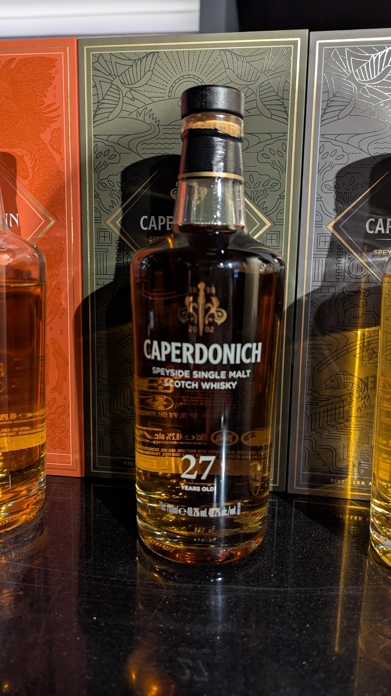
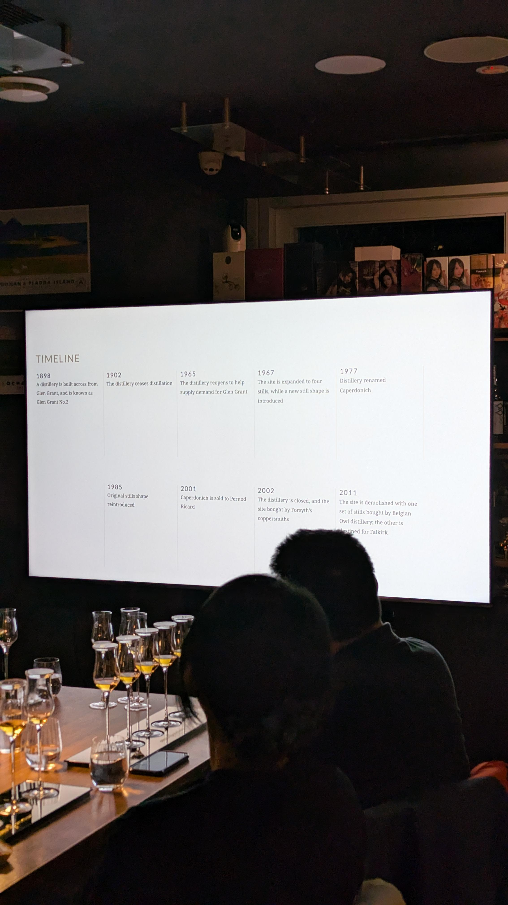
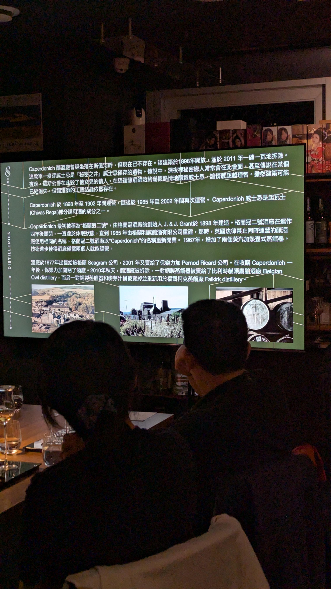
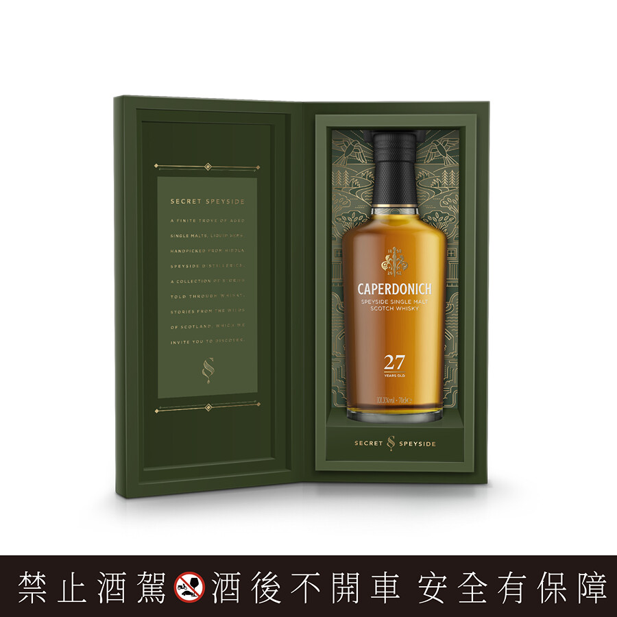
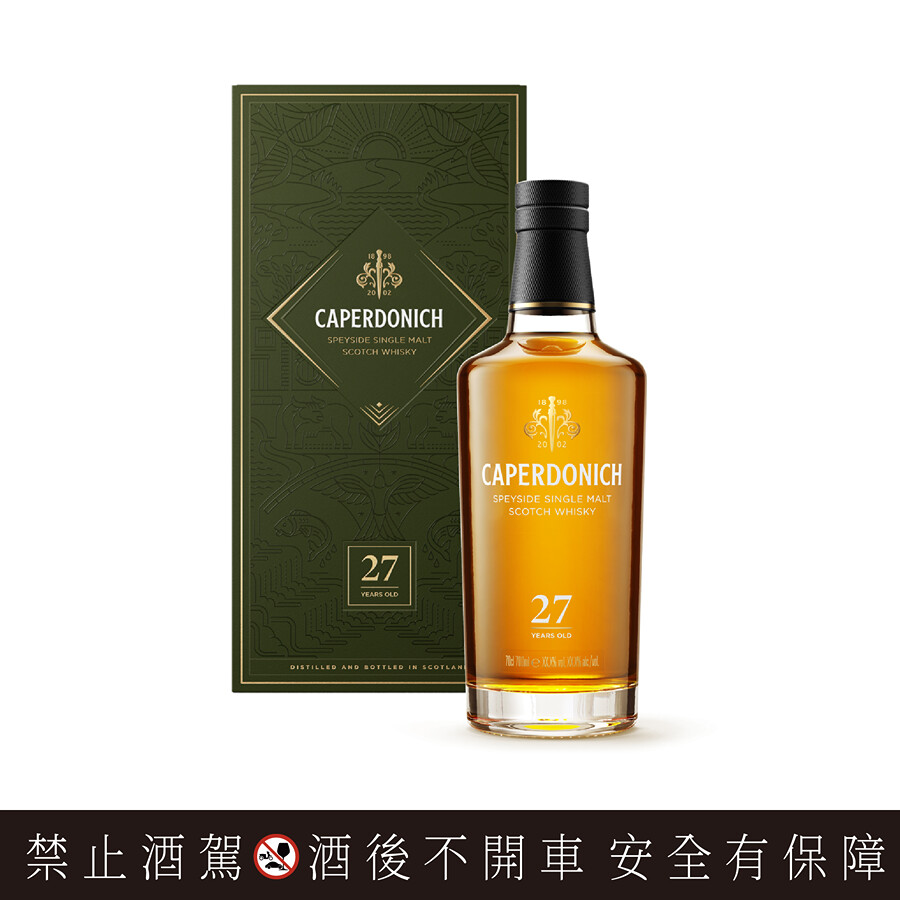

# Caperdonich 斯貝賽秘境 27yo 49.2%

【香氣】甜玉米 西洋梨 白肉軟質水果 琵琶 楊桃  
【味道】炒香甜高麗菜 甘草 百合 桂花 佛手柑  
【結語】關廠酒廠，喝一支少一支，香甜口感，滑順酒體，清香美味，走的甜味是蔬菜水果的香甜，蔬菜高湯的清甜感，是我喜歡的類型
【日期】2025.4.25  
【評分】94  
【價格】27000  

酒廠歷史

1898年 Glen Grant 對面建的一座釀酒廠，稱為 Glen Grant No.2  
1902年 釀酒廠停止蒸餾  
1965年 釀酒廠重新開業以幫助滿足Glen Grant的需求  
1967年 擴展到四個蒸餾器，同時引入了新型蒸餾器  
1977年 酒廠更名為 Caperdonich  
1985年 原蒸餾器重新啟用  
2001年 Caperdonich 出售給Pernod Ricard (保樂力加)  
2002年 酒廠關閉，場地賣給Forsyth's coppersmiths  
2011年 該場地被拆除，一套蒸餾器賣給Belgian Owl (比利時貓頭鷹蒸餾場)，另一套運往Falkirk  

#caperdinich
#pernodricard
#whisky
#whiskey
#spicy9night
#whiskylover

以下資訊以及部分圖片來自https://www.097.com.tw/article/2619

「三大賣點」
鉅獻藏家，可水平對比同年份、源自同酒廠，泥煤與非泥煤版本單一麥芽高年份威士忌。
2024限量臻藏版，小批次手工生產：產量稀少的已拆除酒廠，作為皇家禮炮30年王者之鑰風味來源珍稀基酒，首次臻選單一麥芽高年份裝瓶問世，存量屈指可數，僅此一版，滴滴珍稀，無法復刻。

原桶強度：非冷凝過濾，不加一滴水稀釋，保留住古威士忌酒廠最原始而純粹的斯貝賽風味，如同身歷罕為人至的酒廠桶邊品飲。

「品飲筆記」
香氣：溫暖烘烤木頭香氣綴以檸檬皮及生薑的辛香調性，與香濃絲滑奶油波本風韻完美平衡。

口感：香甜野莓、蘋果揉合濃郁香草奶油派，伴隨溫暖橡木桶單寧風韻，綴以絲縷甘草巧克力氣息，層次豐厚。

尾韻：可可調性油脂感的尾韻鮮明細長，極致的感官享受。