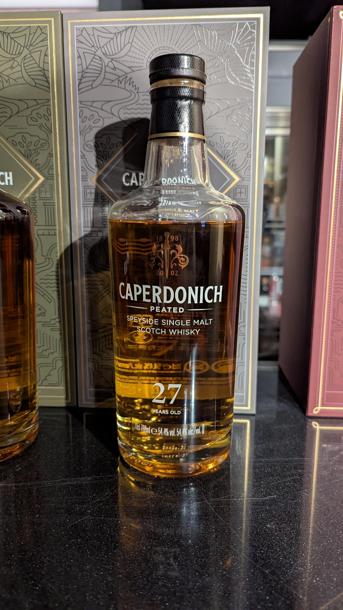
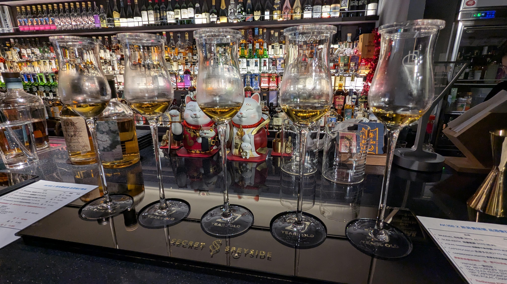
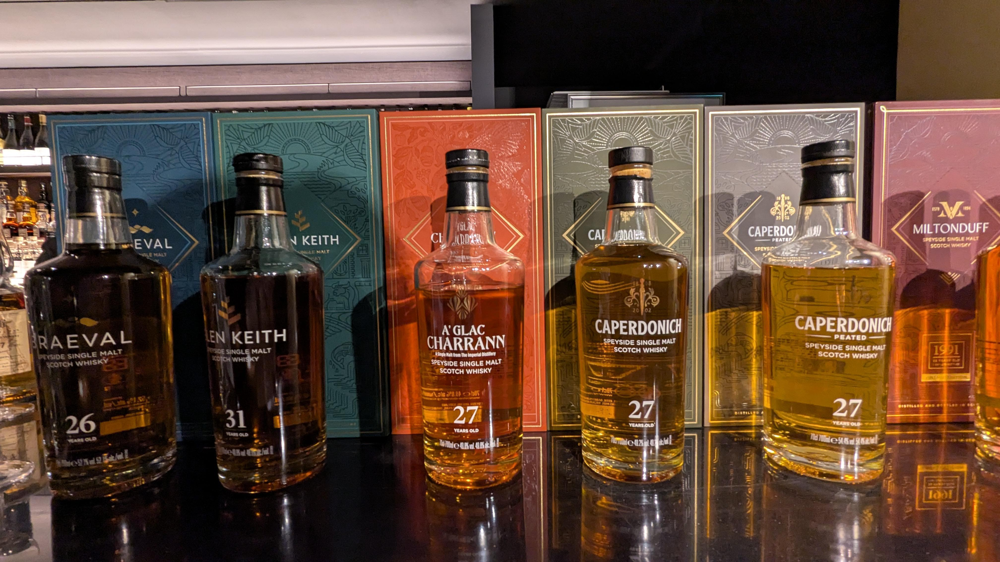
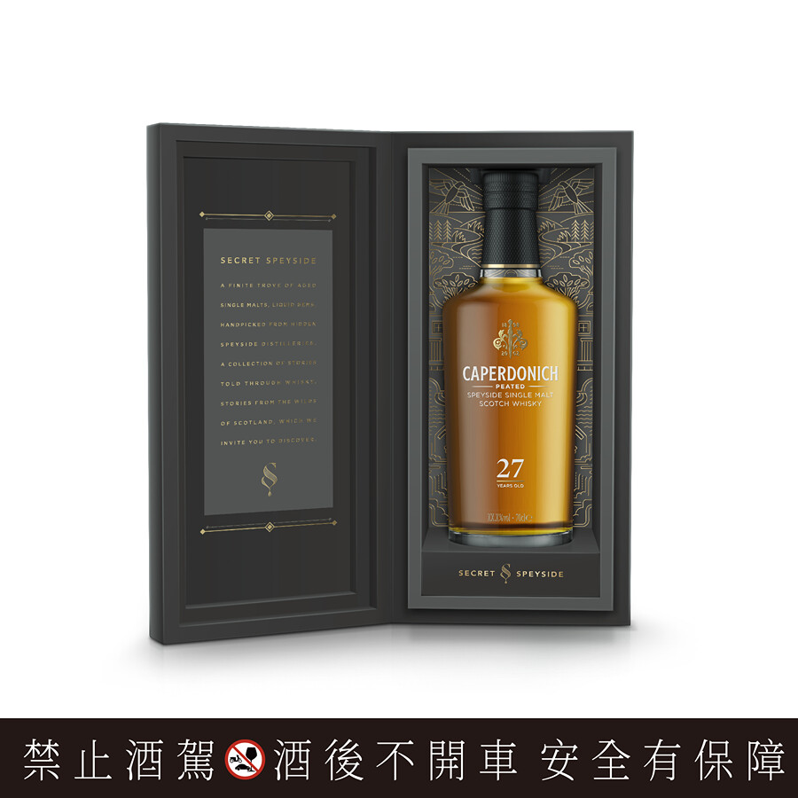
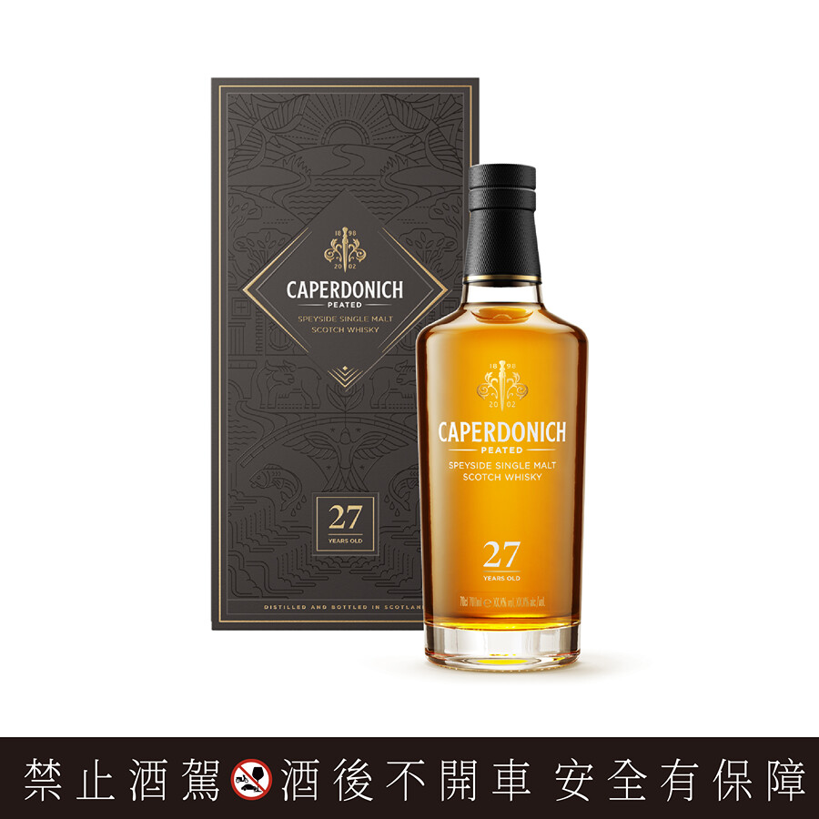

# Caperdonich 斯貝賽秘境 27yo Peated 54.4%

【香氣】花香味的泥煤 墨魚麵包 煙熏香薰 放一下 喝完裡面竟然有蘋果香 好香 
【味道】瓜味的泥煤 好瓜好瓜 哈密瓜 鳳梨  
【結語】關廠酒廠，喝一支少一支，瓜瓜泥煤，頂呱呱泥媒  
【日期】2025.4.25  
【評分】93  
【價格】27000  

酒廠歷史

Caperdonich 釀酒廠曾經坐落在斯佩河畔,但現在已不存在。該建築於1898年開放,並於2011 年一磚一瓦地拆除。 這款單一麥芽威士忌是「秘密之井」威士忌僅存的遺物。傳說中,深夜裡秘密戀人常常會在此會面,甚至傳說在某個夜晚,羅斯公爵在此殺了他女兒的情人。在這裡釀酒師始終滿懷熱情地釀造威士忌,讓情感超越理智。雖然建築可能已經消失,但釀酒師的工藝結晶依然存在。

Caperdonich 於 1898 年至1902年間運營,隨後於1965年至2002年間再次運營。Caperdonich 威士忌是起瓦士 (Chivas Regal)部分調和酒的成分之一。

Gaperdonich 最初被稱為“格蘭冠二號”,由格蘭冠酒廠的創始人J. & J. Grant於1898年建造。格蘭冠二號酒廠在運作四年後關閉,一直處於休眠狀態,直到1965年由格蘭利威釀酒有限公司重建,那時,英國法律禁止同時運營的釀酒廠使用相同的名稱,格蘭冠二號酒廠以“Caperdonich”的名稱重新開業。1967年,增加了兩個蒸汽加熱壺式蒸餾器。 技術進步使得酒廠僅需兩個人就能經營。

酒廠於1977年出售給施格蘭 Seagram公司,2001年又賣給了保樂力加 Pernod Ricard 公司。在收購 Caperdonich 一年後,保樂力加關閉了酒廠。2010年秋天,釀酒廠被拆除,一對銅製蒸餾器被賣給了比利時貓頭鷹釀酒廠 Belgian Owl distillery,而另一對銅製蒸餾器和麥芽汁桶被賣掉並重新用於福爾柯克蒸餾廠 Falkirk distillery

#caperdinich
#pernodricard
#whisky
#whiskey
#spicy9night
#whiskylover

以下資訊以及部分圖片來自https://www.097.com.tw/article/2619

「三大賣點」
鉅獻藏家，可水平對比同年份、源自同酒廠，泥煤與非泥煤版本單一麥芽高年份威士忌。
2024限量臻藏版，小批次手工生產：產量稀少的已拆除酒廠，作為皇家禮炮30年王者之鑰風味來源珍稀基酒，首次臻選單一麥芽高年份裝瓶問世，存量屈指可數，僅此一版，滴滴珍稀，無法復刻。

原桶強度：非冷凝過濾，不加一滴水稀釋，保留住古威士忌酒廠最原始而純粹的斯貝賽風味，如同身歷罕為人至的酒廠桶邊品飲。

「品飲筆記」
香氣：淡雅迷人泥煤與石楠花香揉合瓜果甜美氣息，伴隨沉穩的柑橘辛香調交織以牛奶巧克力香味。
口感：入口襲來鮮明奶油香草調性及糖漬柳橙甜美風韻，伴隨營火繚繞煙燻甜香。

尾韻：細緻優雅的煙燻氣息綴以甜美淡淡肉桂糖粉，綿長誘人。

