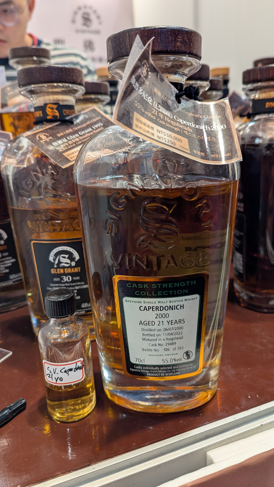

# Cask Strength Collection Caperdonich Signatory Vintage 2000 21yo HHD 55%

來自蘇格蘭斯佩塞德的 Caperdonich，這瓶由 Signatory Vintage 推出的 Cask Strength Collection 作品，以其強勁的 55% 酒精度展現出威士忌最原始而溫暖的面貌。2000 年份、21 年熟成，經過橡木桶的歲月打磨，這支酒的風味層次豐富而深邃。

### 【香氣】蘋果與蜜餞的香甜氣息迎面撲來，烏梅的酸香為整體增添了優雅的層次感。高酒精度帶來的火熱感讓香氛更加躍動，在杯中翻騰著成熟果實與深色背景音符的交融。

### 【味道】口感豐盈而富有表現力。飛壘口香糖般的香水質感在舌尖蔓延，伴隨著胭脂般的優雅與內斂。強勁的酒質彰顯了 Cask Strength 的特色，但同時保持著出人意料的柔順感，讓人能感受到 21 年橡木桶賦予的成熟度與包裹感。

### 【結語】這是一瓶柔順而美味的威士忌，儘管酒精度高達 55%，卻沒有刺鼻的灼燒感。反而是像絲綢一樣溫柔地鋪展在口腔中，留下長久而舒服的餘韻。Caperdonich 在 Signatory Vintage 的精心挑選下，展現了其特有的甜感與優雅，是一瓶值得細細品味的佳釀。

### 【日期】2026.5.20

### 【評分】91

### 【價格】10000

---

#whisky #whiskylover #whiskey #spicy9night #caperdonich #signatoryvintage
