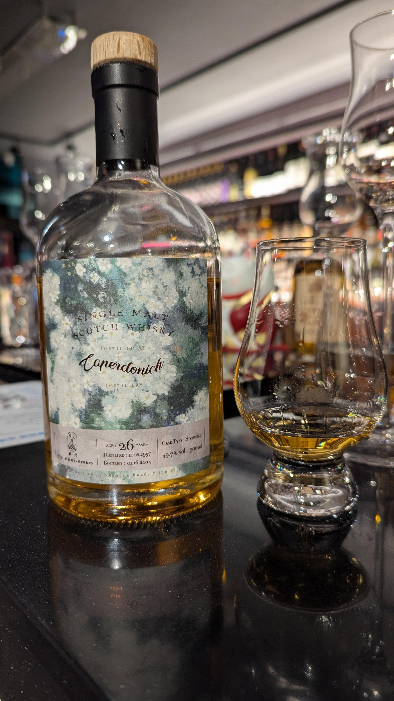

# Caperdonich 威佬 1997 26yo HHD 49.7%

【香氣】瓜皮  
【味道】瓜皮  
【結語】當天喝完跟前兩支Caperdonich，這支不喜歡QQ， 不過當天也喝了很多杯，嗅覺味覺都快不行了XD  
【日期】2025.04.25  
【評分】82  
【價格】1千左右 15ml  

以下文字來自文威佬臉書
https://www.facebook.com/whiskyfogey/posts/%E9%81%A9%E9%80%A2%E4%BA%94%E9%80%B1%E5%B9%B4%E5%A8%81%E4%BD%AC%E4%B9%9F%E7%B6%93%E6%AD%B7%E4%BA%86%E7%96%AB%E6%83%85%E7%9A%84%E6%B4%97%E7%A6%AE%E9%9D%9E%E5%B8%B8%E9%96%8B%E5%BF%83%E8%83%BD%E5%9C%A8%E6%AD%A4%E6%99%82%E7%AB%AF%E4%B8%8A%E5%A6%82%E6%AD%A4%E9%9B%A3%E5%BE%97%E4%B8%94%E7%89%B9%E6%AE%8A%E7%9A%84%E9%81%B8%E6%A1%B6%E4%BB%A5%E8%8C%B2%E7%B4%80%E5%BF%B5%E9%80%99%E5%B9%BE%E5%B9%B4%E9%96%8B%E6%A5%AD%E7%9A%84%E9%BB%9E%E6%BB%B4%E7%82%BA%E4%BB%80%E9%BA%BC%E8%AA%AA%E5%AE%83%E7%89%B9%E6%AE%8A%E9%80%99%E6%94%AF%E9%81%B8%E6%A1%B6%E8%BF%A5%E7%95%B0%E6%96%BC%E5%B8%B8%E8%A6%8B%E7%9A%84%E8%80%81%E9%85%92%E9%A2%A8%E6%A0%BC%E4%BB%A5%E6%B8%85%E6%96%B0%E7%9A%84%E7%99%BD%E8%8A%B1%E8%AA%BF%E6%80%A7%E7%82%BA%E4%B8%BB%E5%A6%82/1180429684082458/
適逢五週年，威佬也經歷了疫情的洗禮，非常開心能在此時端上如此難得且特殊的選桶，以茲紀念這幾年開業的點滴。
為什麼說它特殊？這支選桶迥異於常見的老酒風格，以清新的白花調性為主，如果說要拿店裡架上的酒款來類比，想到的是鄭問的諸葛亮（Littlemill27yo），同樣的清新端麗，光從香氣就展現不凡的氣質。
花香在威士忌的香氣表現中本來就較為抽象，藉著Caperdonich 酒體輕盈的特性把白花的輪廓鮮明的勾勒出來，你可以輕易地在杯中嗅到花的芬芳，嚐一口甚至有些花團錦簇的意象，同時高年份的底蘊也讓整體的架構更為完整。不論是以風味來說，或是紀念價值，都是十分值得收藏的逸品。
這支選桶也表達對佬朋友們的感謝，仰賴各位的支持，讓威佬的經營能夠細水長流，成為東部宜蘭的指標性酒吧。
威佬5th anniversary 
地區：Speyside (Caperdonich)
蒸餾：Distilled  1997
裝瓶：Bottled  2024
酒齡：26yO
酒精：49.7% VOL. 500ml裝瓶
桶型：hogshead 
聞香：白花、口哨糖、白可可、糖漬橘皮、橙花、麥芽甜香。
口感：一抹薄荷茶的清涼，礦物感，些許的肉桂“生薑刺激讓兩頰生津，鼻腔充滿白花氣息，同時覆上一層淡淡的粉味，像在嚼蜂巢蜜般，舌上的蠟質地每喝一口越發的疊加，許多美好的風味都墊舖在烘烤的木頭和麥芽上。
尾韻：薄薄的蜂蠟、菊花茶、絲滑的牛奶巧克力及麥芽香。
有興趣收藏威佬五週年紀念選桶的佬朋友歡迎留言分享。

#caperdonich
#whisky
#whiskey
#spicy9night
#whiskylover

