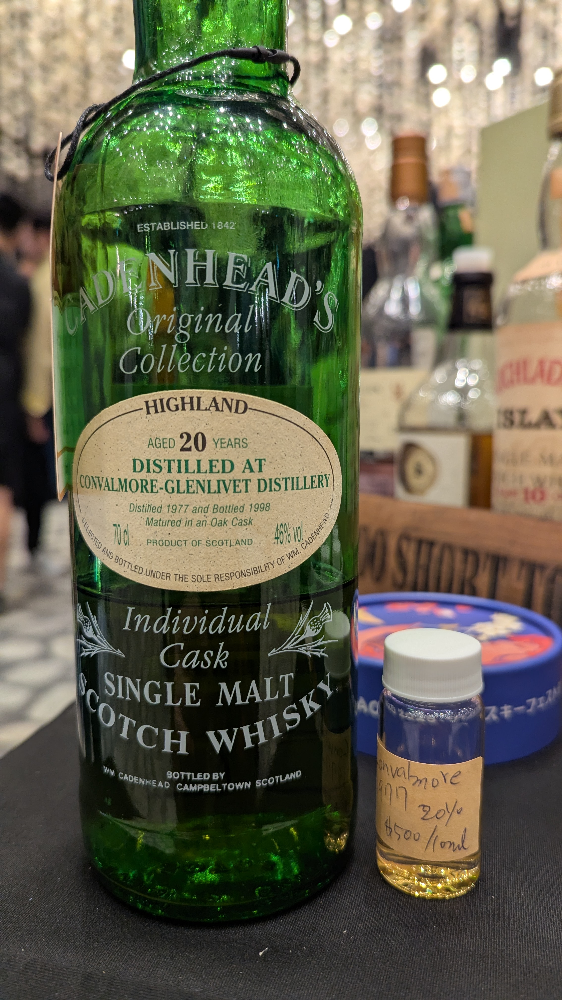
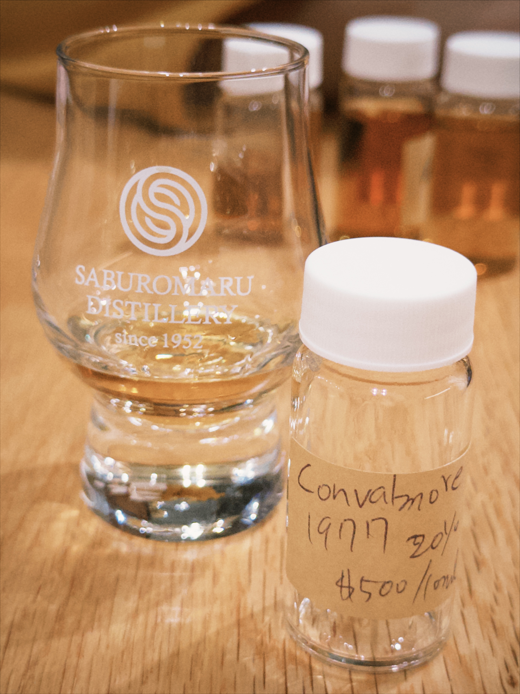
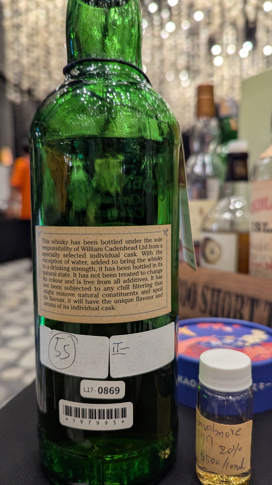

# Convalmore Cadenhead's Original Collection 1977 20yo 46%

### 【香氣】脆化的塑膠味 紫蘇 葡萄酒 糖果橘皮
### 【味道】片狀起司奶油 成年醃漬醬菜味 薑糖帶有草本的尾韻 炭燒味 
### 【結語】一開始突出的塑膠味 後面尾韻帶有綠葉的調性 喝一隻少一支的關廠酒 但是我沒有很愛
### 【日期】2025.12.26  
### 【評分】88
### 【價格】500/10ml

### **Nose**

The aroma opens with a distinctive **industrial note of brittle, weathered plastic**, which gradually gives way to an herbal freshness of **shiso leaf**. This is layered over a base of **fortified wine** and the concentrated sweetness of **candied orange peel**.

### **Taste**

On the palate, it reveals a savory, textured profile reminiscent of **creamy sliced cheese**, followed by the deep, umami complexity of **aged pickled preserves**. The mid-palate transitions into **ginger candy** with a lingering **herbal undertone** and a touch of dry **charcoal smoke**.

### **Finish**

The experience is defined by its evolution: the **prominent plastic note** from the start eventually yields to a crisp, **green leafy character** in the tail. While it carries the prestige of a **"ghost distillery" (closed distillery)** bottling—a rare "sip it and it's gone" experience—it remains a challenging profile that doesn't quite suit my personal preference.🤷‍♂️

#convalmore
#whisky
#whiskylover
#whiskey
#spicy9night

