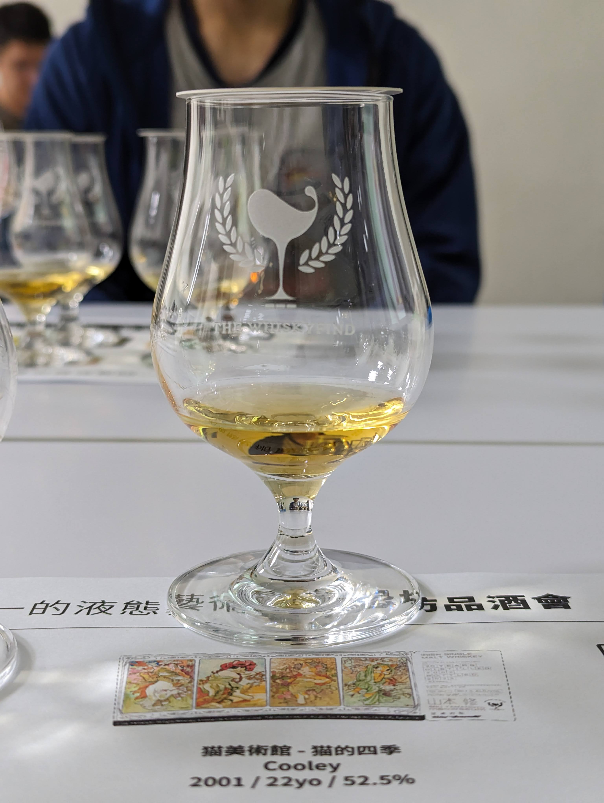
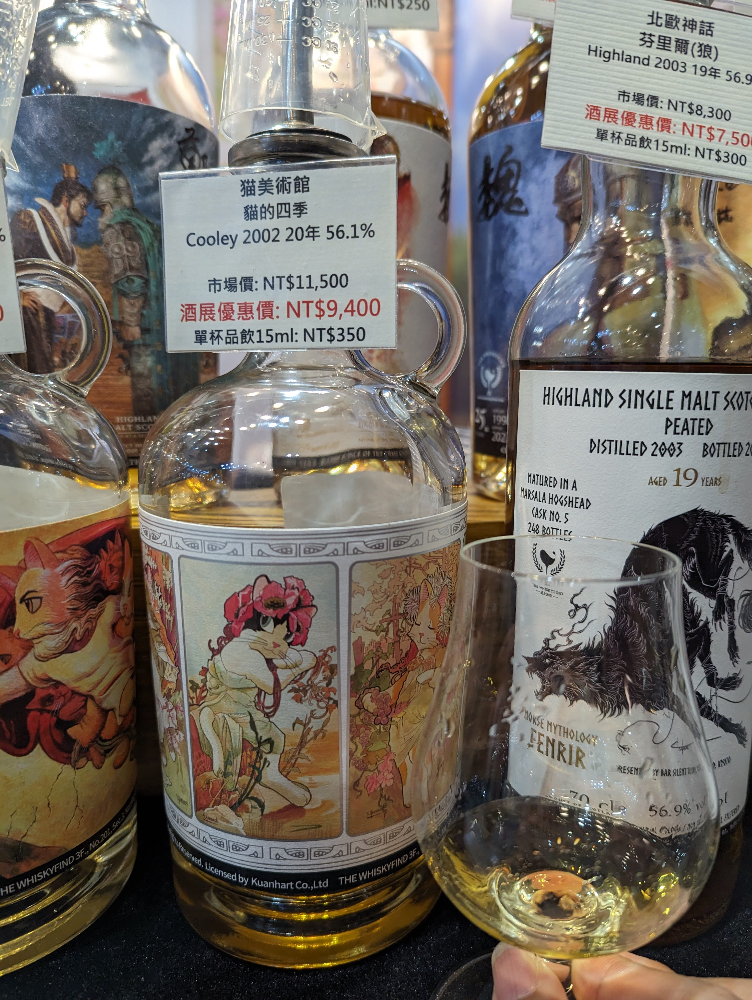
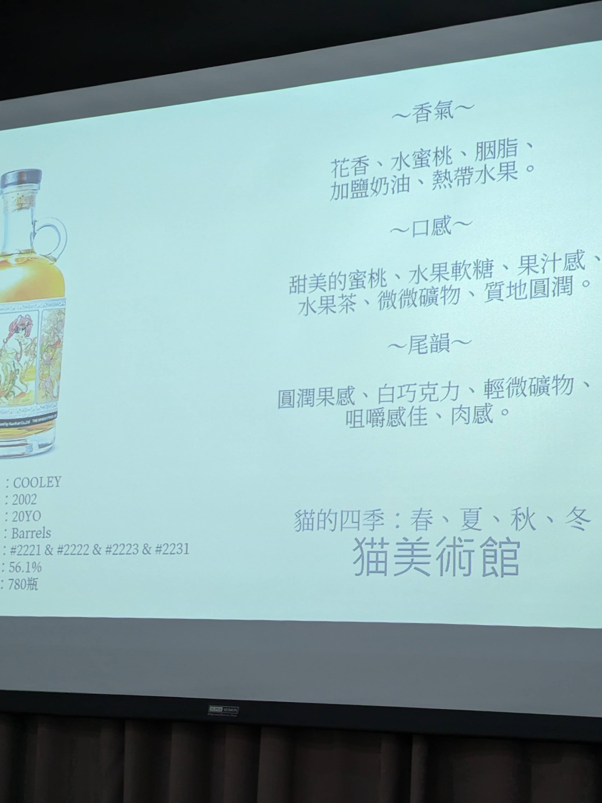
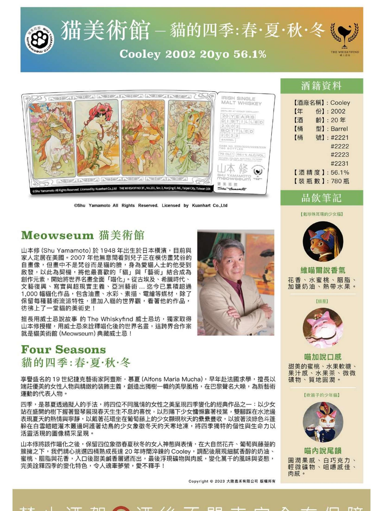
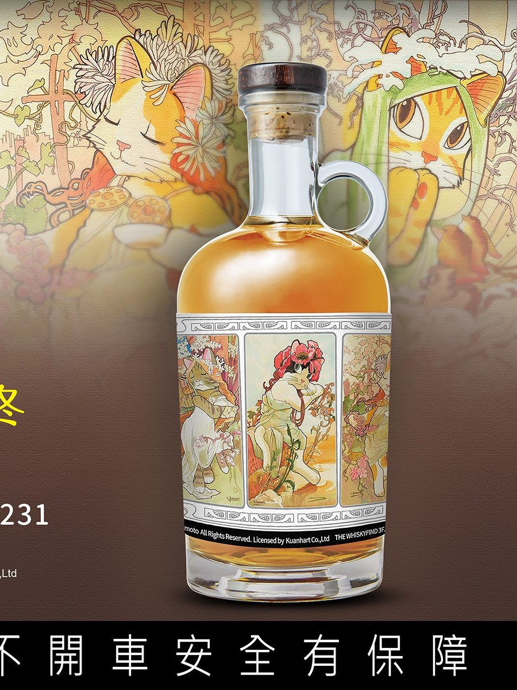

# 貓的四季 Cooley  WhiskyFind 猫美術館 2002 20yo Barrel 56.1%

【香氣】第一次一打開杯蓋，濃郁的巧克力、可可脂撲鼻而來，第二次小白花、桂花的香氣，蜜桃香氣也慢慢顯現  
【味道】第一次喝花生巧克力、花生醬、太妃、焦糖，第二次喝有濃郁的蜜漬蘋果味還有甘草芭樂，第三次喝有鳳梨味以及真實的酸甜感，第四次喝有蘑菇濃湯的味道  
【結語】表裡如一，酒如其名，一支酒就可以喝到多種大相逕庭的風味，宛如春夏秋冬  
【日期】2023.12.14  
【評分】95  
【價格】9400  

由四桶20年的cooley 調製而成，cooley 一直都是我很喜歡的酒廠

#cooley
#whisky
#whiskey
#whiskyfind
#spicy9night
#whiskylover

部分圖片為whiskyfind 官方文宣截圖，版權為whiskyfind 所有

