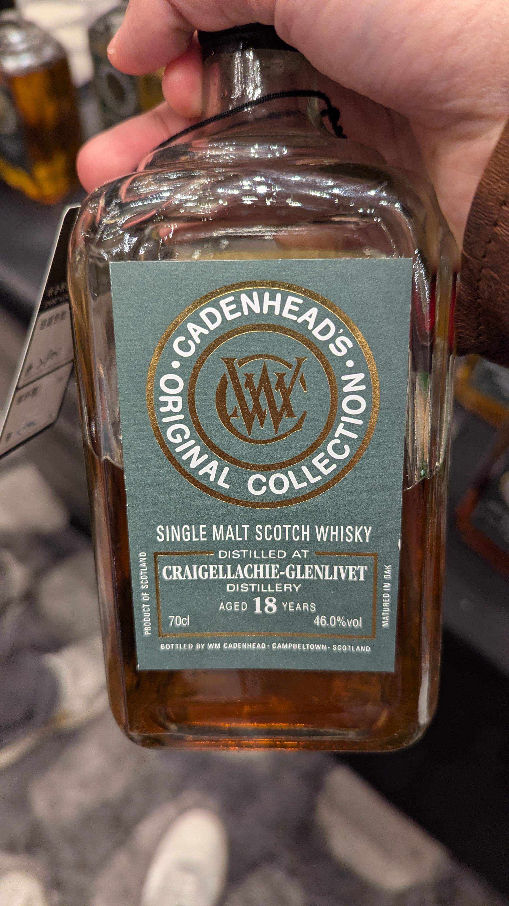

🥃
# Original Collection Craigellachie Cadenhead's 2006 18yo Refill Oloroso HHD 46%

### 【香氣】帶有潮濕的氣息，燉煮水果、白巧克力鈕扣，甚至有一點點像是毛豆的鹹鮮感。
### 【味道】口感油脂感重且濃郁。出現皮革、黑巧克力、抹茶與開心果的風味。這反映了魁列奇經典的重酒體與雪莉桶帶來的層次。
### 【結語】聖誕蛋糕、檸檬汁、花生醬，最後轉為葡萄乾和牛奶巧克力。
### 【日期】2025.11.22 @高雄酒展

酒標上寫著 "Craigellachie-Glenlivet"，這反映了蘇格蘭威士忌的一段歷史。早期許多 Speyside (斯貝賽) 地區的蒸餾廠為了提升知名度，都會在名字後面掛上「-Glenlivet」的後綴。

魁列奇蒸餾廠以其獨特的 **「蟲桶冷凝器」(Worm Tubs)** 聞名，這讓酒體通常帶有一種獨特的硫磺感、油脂感和非常厚實的肌肉感。18年的陳年通常會讓這種粗曠的風格變得稍微優雅一些，並增加更多果乾、香料或蜜餞的層次。

#craigellachie
#cadenhead
#originalcollextion
#refillolorossohogshead
#whisky
#whiskylover
#whiskey
#spicy9night

