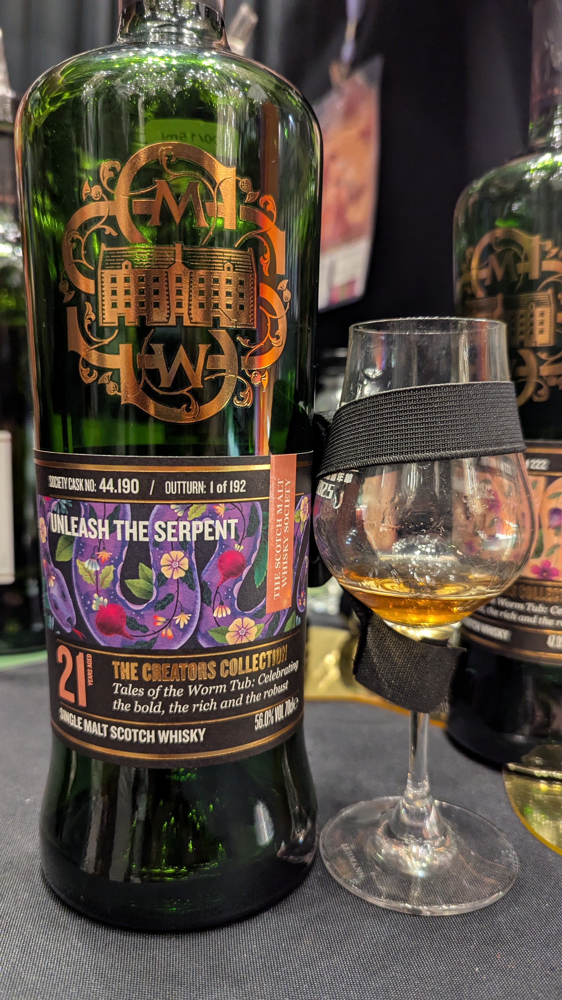

🥃
# 44.190_Unleash The Serpent_Deep rich and dried fruit Craigellachie SMWS 2003 21yo Ex-Bourbon hogshead+1st fill #4 char hogshead 56%

### 【香氣】酸條糖果甜
### 【味道】回甘甘草糖
### 【日期】2025.11.22 @高雄酒展

官方品飲筆記

濃郁的香氣帶來一股洪流般的bramely青蘋果(源自英國的烹飪用蘋果品種)、李子果醬與阿薩姆紅茶，衝擊著森林地面上的巧克力泥土與落葉腐植。甜菜根布朗尼、糖蜜塔與栗子也被捲入其中，在橡木與新鮮松樹之間奔湧。加入水後，呈現出黏稠的止咳糖漿，帶有橙油、薰衣草與清涼樟腦的氣息，隨後沉重的黑森林蛋糕登場，伴隨著用雅馬邑浸泡的李子、櫻桃與葡萄乾。這份甜美濃稠的糖漿感一路延續至尾韻，並融合了帶有泥土氣息的陶花盆、劈開的木柴，以及清涼的薄荷巧克力。這款酒在前 18 年於波本桶陳年，之後轉入初次的四級炙燒桶完成其餘的熟成過程。

#craigellachie
#smws
#bourbon
#hogshead
#whisky
#whiskylover
#whiskey
#spicy9night

