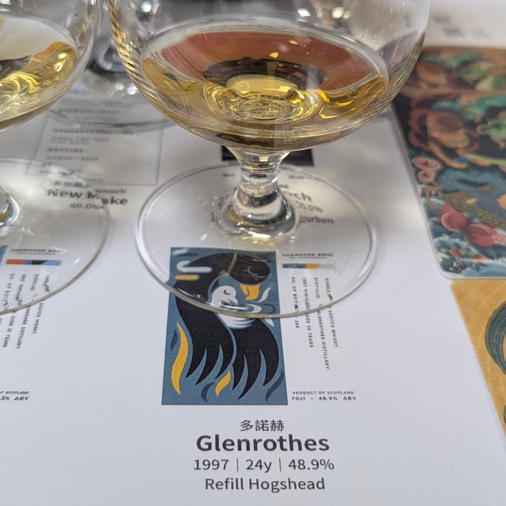
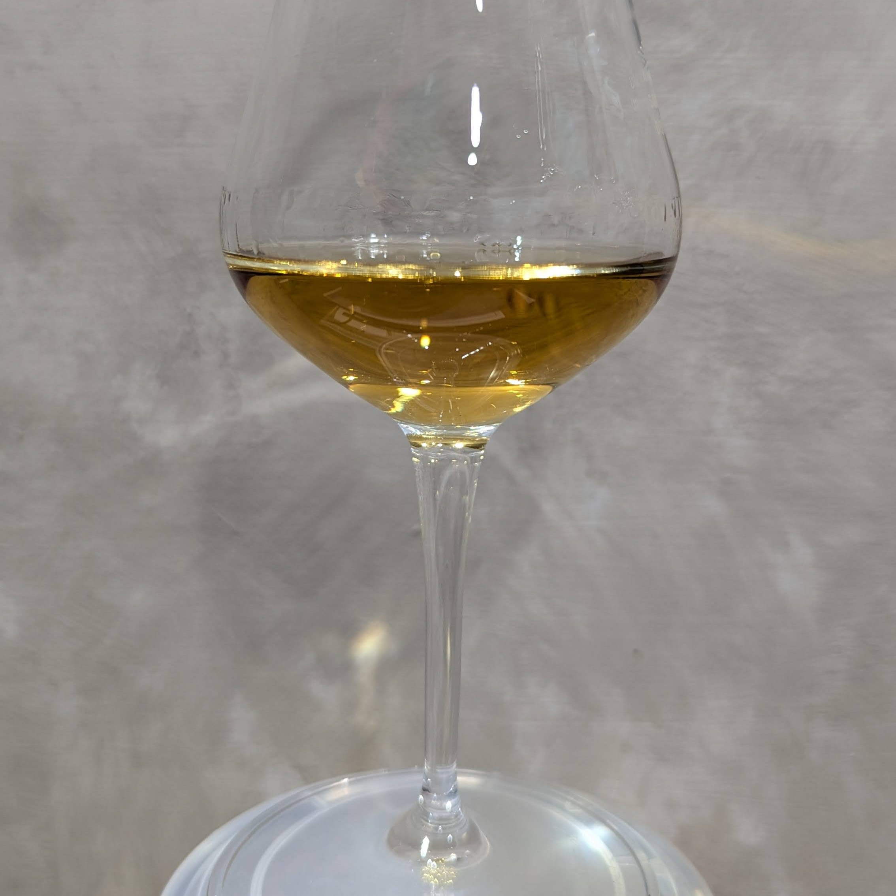
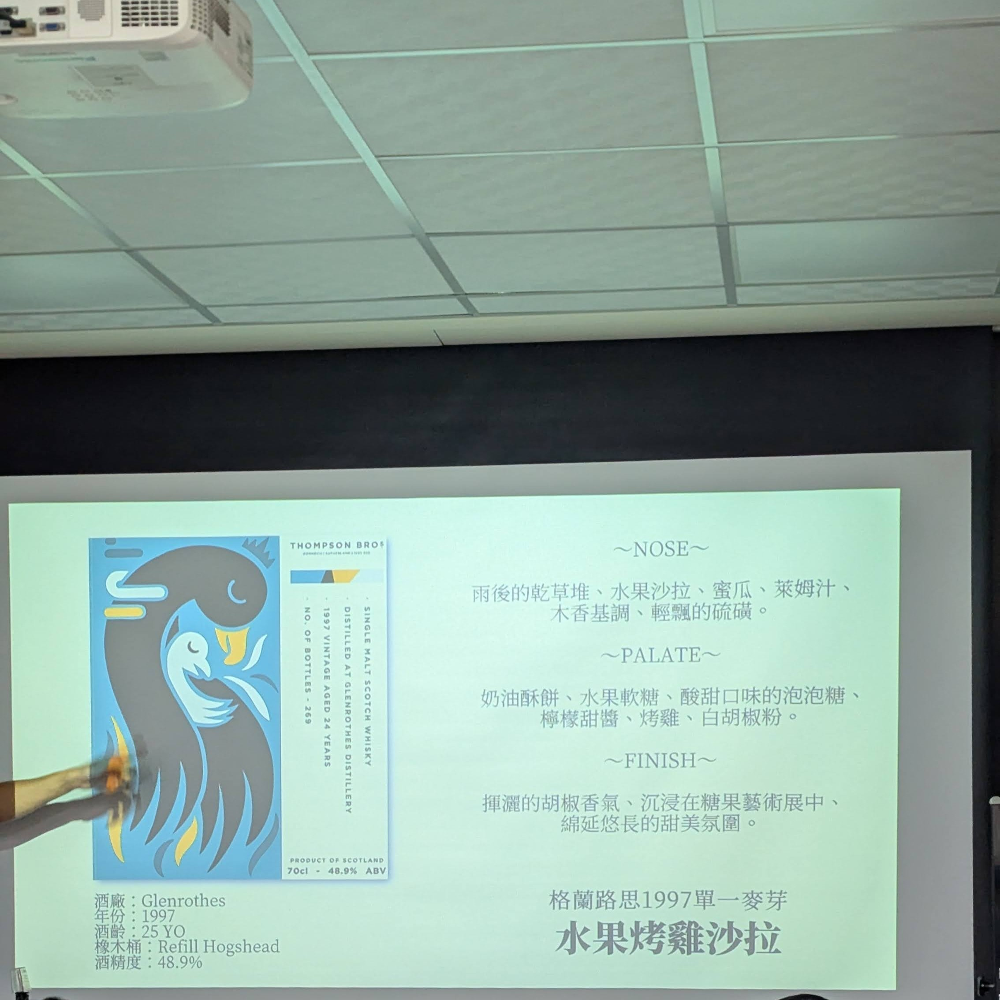

# Glenrothes 1997 24yo Refill Hogsheand 48.9%

【香氣】檸檬 水蜜桃 霧峰葡萄 香草    
【味道】烤雞雞腿肉又甜又多汁的肉感，仙草糖，水果軟糖   
【結語】酒體剛好，油脂豐富，包覆性強，味道感覺很多但都輕輕柔柔的   
【日期】2025.01.16   
【評分】88   
【價格】7X00/700ml   

#glenrothes
#whisky
#whiskey
#whiskyfind
#spicy9night
#whiskylover

