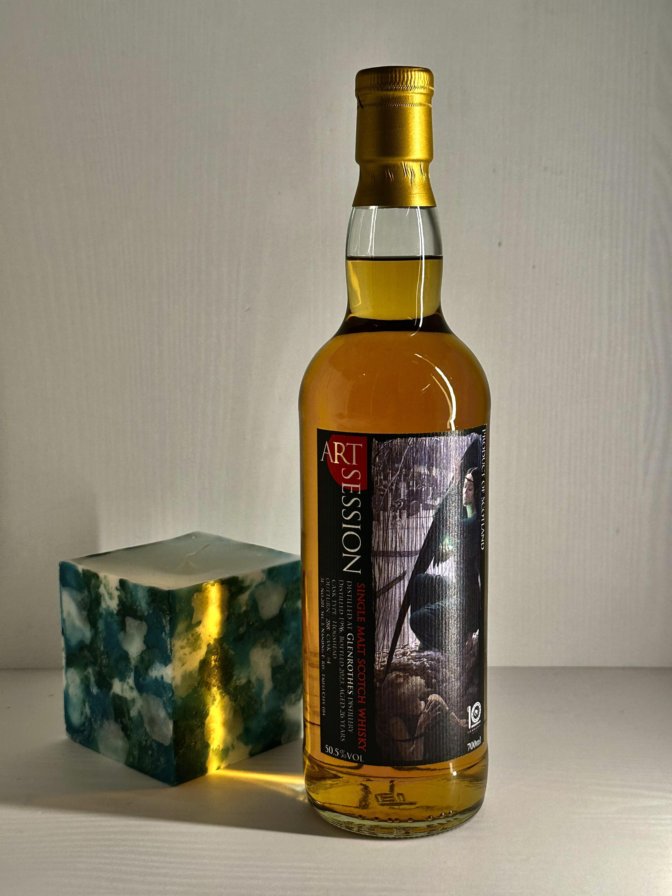

# Glenrothes WhiskyFind 1996 26yo HHD 50.5%

【香氣】 胡椒 偏白胡椒調性 臘肉 放了一下轉甜 金黃蘋果 蜜蘋果調性  
【味道】 皮革 辛香料 胡椒 一點點皂味 口感帶有蠟質感 轉甜之後的花蜜非常的多 帶有百香果味道  
【結語】 一開始滿嗆辣 辛辣，到後面有轉換成非常甜美的樣子 ，變了一種酒，再放還有柚木的味道，剛開簡直不能喝，越放越香越有趣  
【日期】2025.03.26  
【價格】7950  

#glenrothes
#whiskyfind
#whisky
#spicy9night

