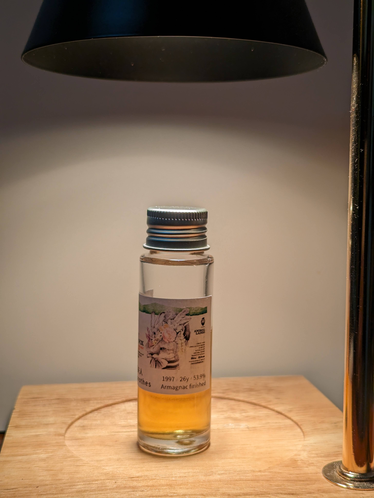
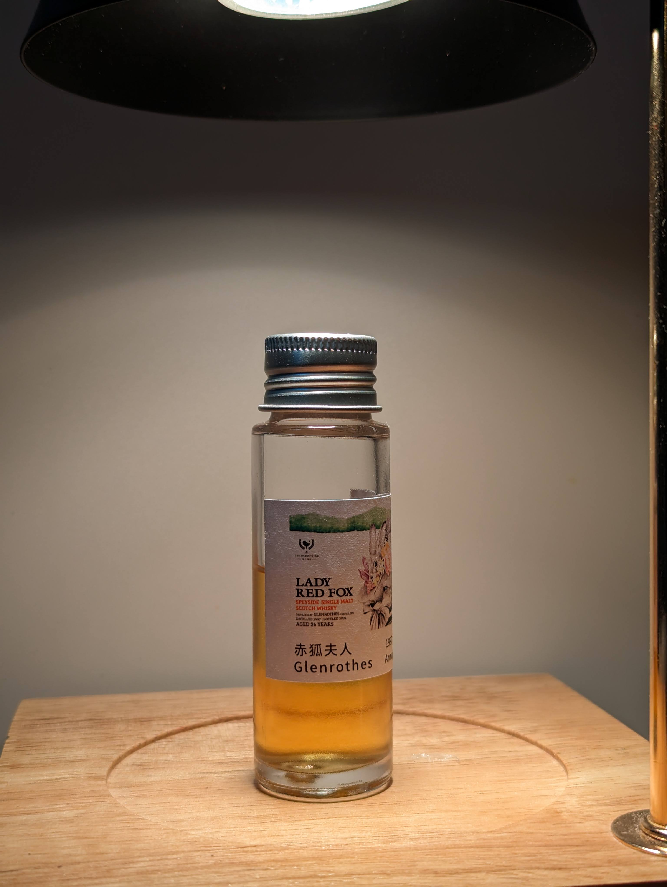
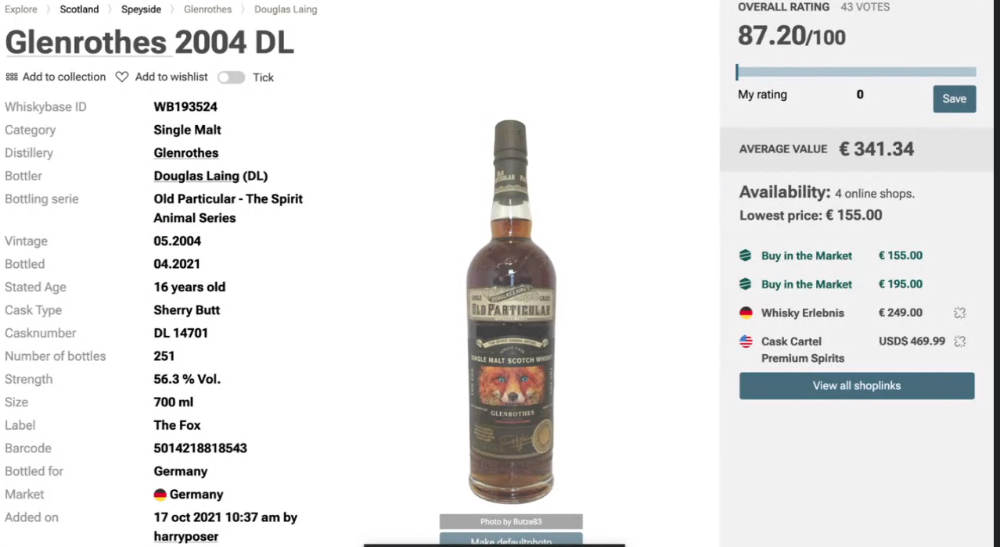
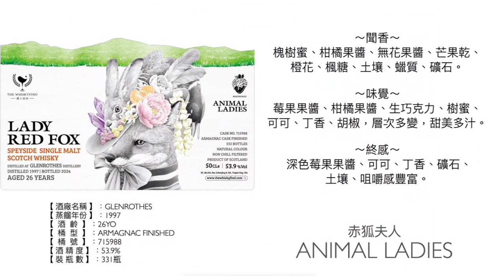
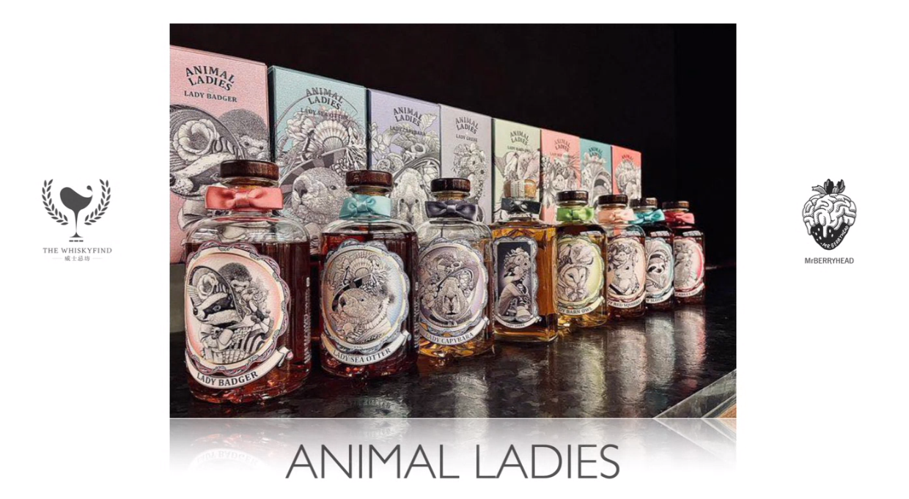

# 赤狐夫人 Glenrothes WhiskyFind 夫人系列 1997 26yo Armagnac 53.9%

【香氣】雜糧白麵包，香草，礦石，蠟質，放了一下的麵包感沒有那麼重了  
【味道】酒體輕盈、質地薄薄，但是裹了一層糖衣，入口即化，像是舒跑，電解質的味道，胡椒  
【結語】這支特別的是用雅瑪邑桶finished，雖然不知道跟雅瑪邑桶有沒有關係，總結是舒服，就是舒服，最優雅的配角，如果我在看海，希望有個酒相伴，伴隨我看海的思緒，讓我更容易一點一點帶入海浪的漲潮之中，我覺得這是一個很好的選擇。  
【評分】87  
【日期】2024.04.17  

WhiskyFind 動物夫人即將推出第二代，
第一代的圖案是使用代針筆繪製，
比較注重夫人的形象
第二代的圖案是使用色鉛筆繪製
比較注重動物與酒款之間的關聯

選擇赤狐代表Glenrothes，
就是因為赤狐有在Glenrothes旁邊棲息。

#glenrothes
#whiskyfind
#whisky
#spicy9night

