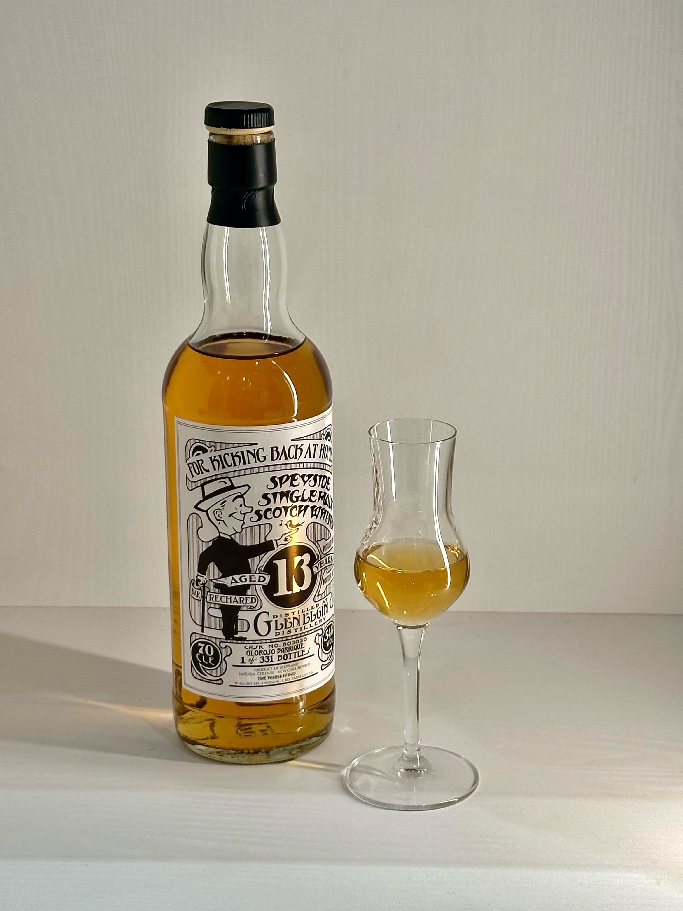
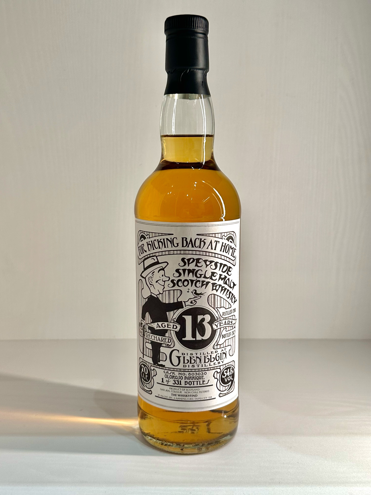
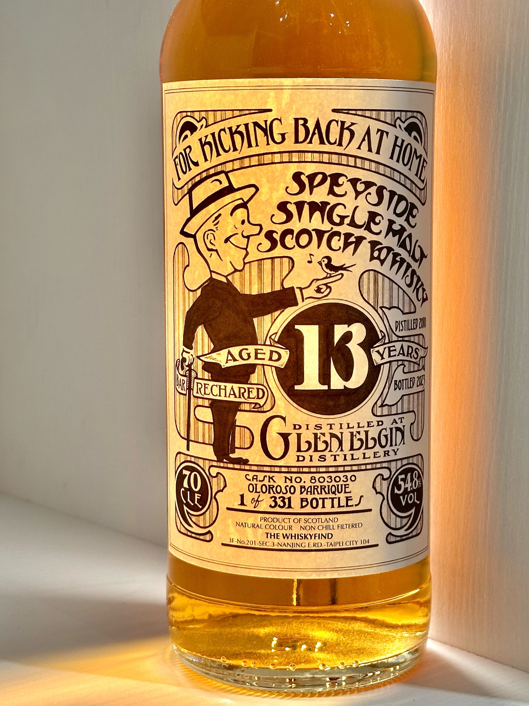
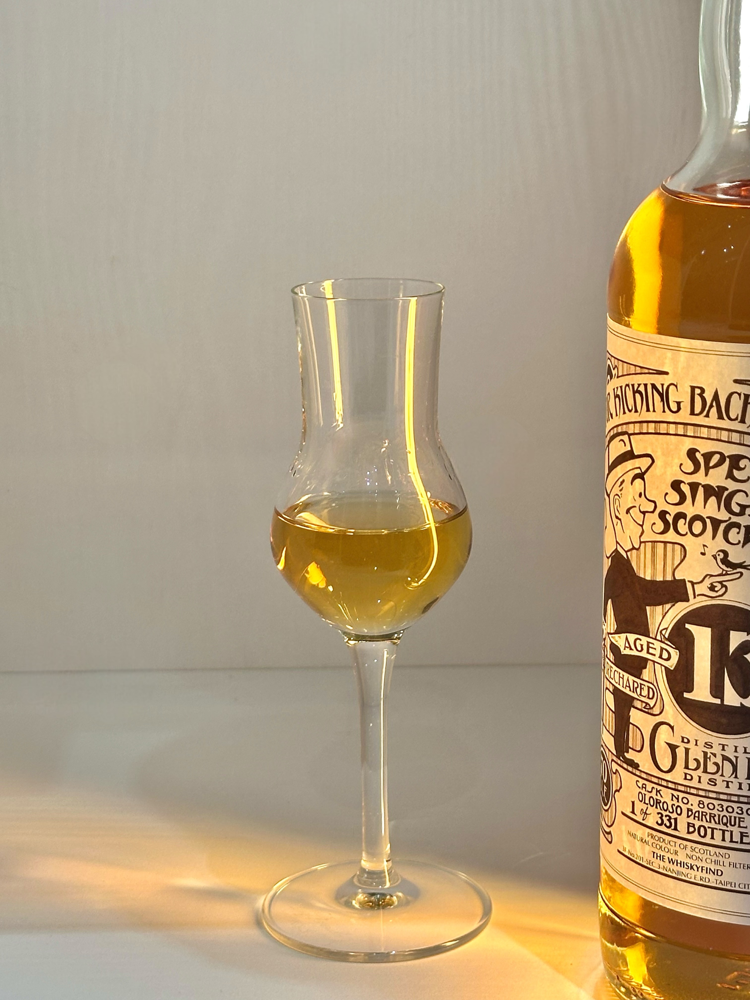
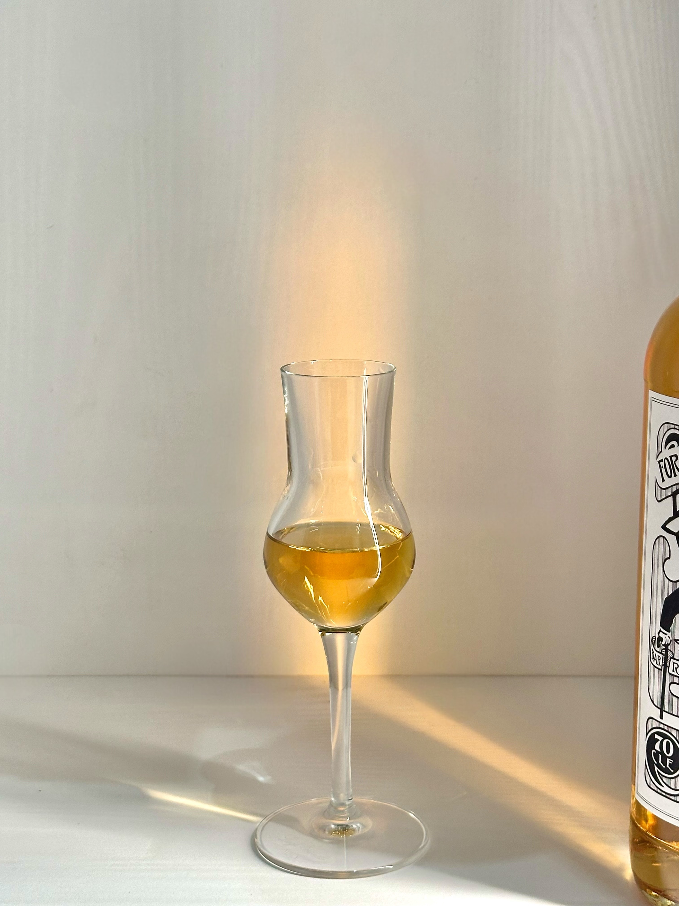
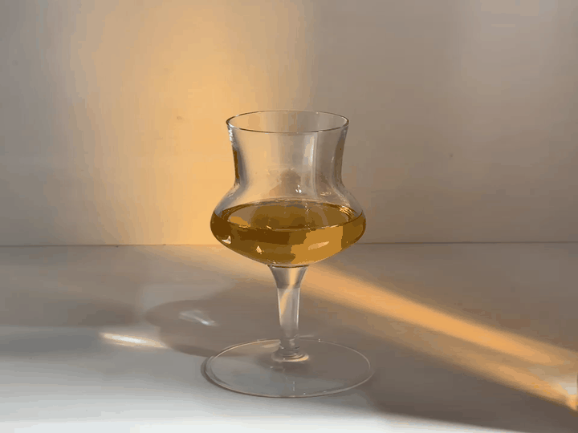
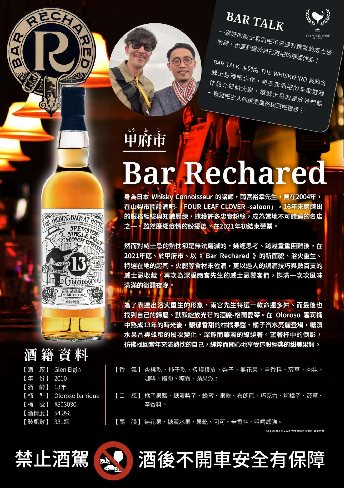

# Bar Rechared Glen Elgin WhiskyFind Bar Talk 2010 13yo Oloroso barrique 54.8%

【香氣】紅葡萄 黑糖 太妃糖  
【味道】葡萄乾 晚摘葡萄酒 柴窯麥芽糖 微微檜木香氣 胭脂，配了葵瓜子有山葵的味道  
【結語】像是蜂蜜糖漿的甜蜜，充滿香甜的調性但是不膩，配了葵瓜子有山葵的味道，超級酷，很適合，非常好喝，是我很喜歡的酒款  
【日期】2025.03.18
【評分】94
【價格】3500

#glenelgin
#whisky
#whsikey
#whiskyfind
#spicy9night

