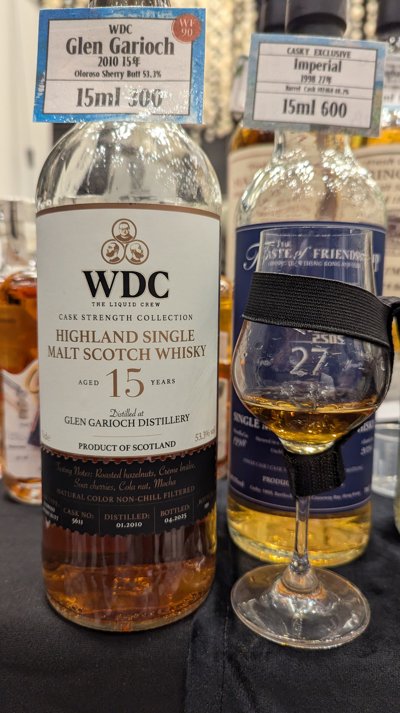

# Cask Strength Collection #02 Glen Garioch Duckhammer's Rare & Fine Spirits 2010 15yo Oloroso Sherry 53.3%

### 【香氣】火烤咖啡豆 堅果
### 【味道】原本甜美轉酸 皮革 帶瓜香
### 【日期】2025.11.22 @高雄酒展
### 【評分】91
### 【價格】300/15ml

### WhiskyFun 的品飲筆記

By purest chance, just as we’ll be putting this tasting note online, we’ll be en route to Whisky Live Hamburg via Deutsche Bahn. See you there? Colour: gold. Nose: perhaps it’s due to a few extra years, but here we’re decidedly closer to the ground, to the earth—both the acidic Scottish soil and that chalky albariza of Jerez. There’s also quite a bit of salted butter caramel, walnut biscuits, ultra-dried raisins forgotten in an old iron tin, and dried jujubes... In short, it’s complex, certainly broader than the previous ones. With water: the water awakens a touch of new leather and tobacco but also amplifies the dried fruits, very much like an apéritif mix. Which is jolly convenient... Mouth (neat): a little flint at first, then it unrolls, starting on bitter orange, moving through various dried fruits, notably thin apple slices and of course sultanas and goji berries, then drifting towards pepper and cardamom. With water: that flinty edge becomes even more pronounced, yet we’re not into the sulphur, and it makes a rather lovely counterpoint to the dried fruits queueing up at the door. Figs, raisins, longans, dates and so on. Finish: long, curiously massive and yet balanced, with the pepper gradually taking control, followed by more bitter orange lingering in the aftertaste. Comments: the way the pepper arrives unexpectedly in the dying moments is quite something. Fortunately, we’re rather fond of pepper.

SGP:562 - 90 points.

#glengarioch
#duckhammerrarefinespirits
#whisky
#whiskylover
#whisky
#spicy9night

