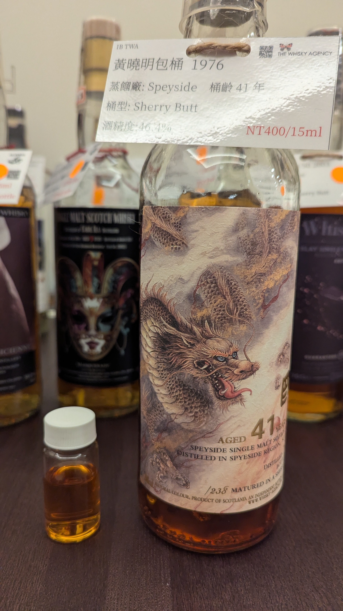

# 黃曉明包桶 Glen Grant The Whisky Agency 1976 41yo Sherry Butt 46.4%

### 【香氣】茉莉花香和胭脂香水氣息先行，帶出非常熟的水果感，芒果和榴槤的厚實甜度在鼻中綻放。這支來自 Glen Grant 的 41 年單一麥芽，經過 Sherry Butt 熟成後，香氣內斂卻有層次。

### 【味道】入口先是胭脂與輕柔玫瑰，隨後淡淡芒果的果甜浮現。酒體飽滿、奶油感明顯，尾韻帶一點肉味，讓整體結構更有深度。

### 【結語】這是一支屬於內斂含蓄的 Glen Grant，香氣不是誇張花果，而是溫柔而悠長。Sherry Butt 的影響讓它的成熟果實感更圓潤，46.4% 的酒精度讓口感依然穩定而不失輕盈。

### 【日期】2026.5.23

### 【評分】91

### 【價格】400

#whisky #whiskylover #whiskey #spicy9night #glengrant #thewhiskyagency

