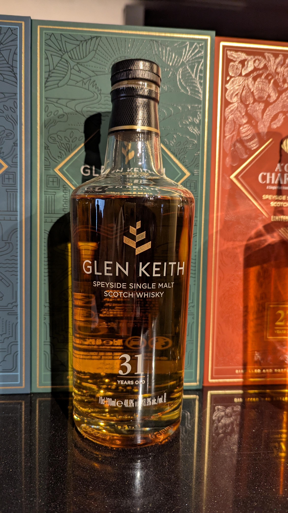
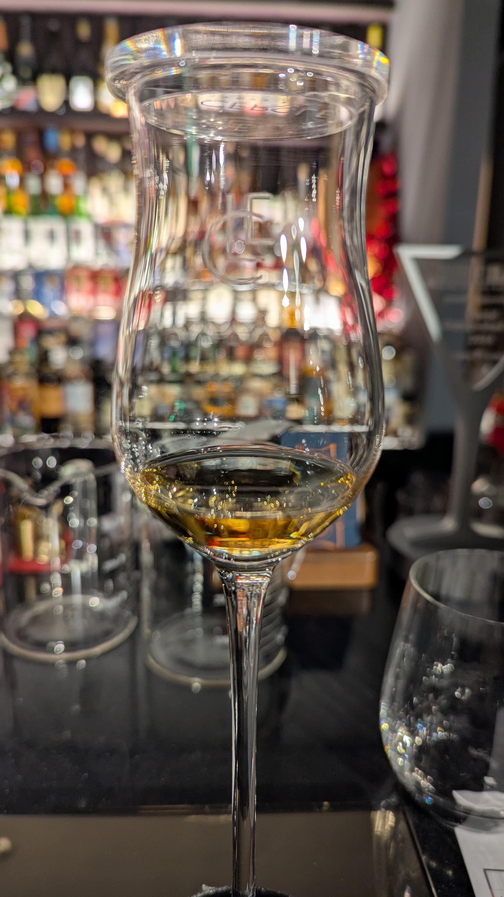
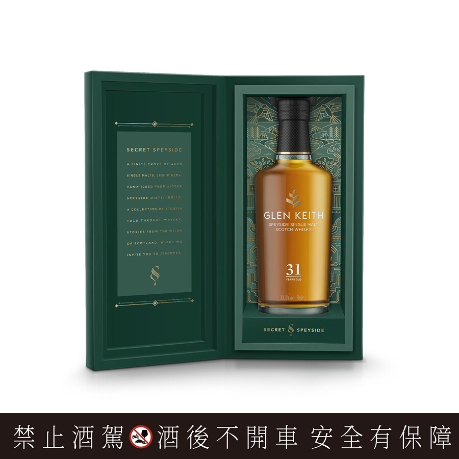
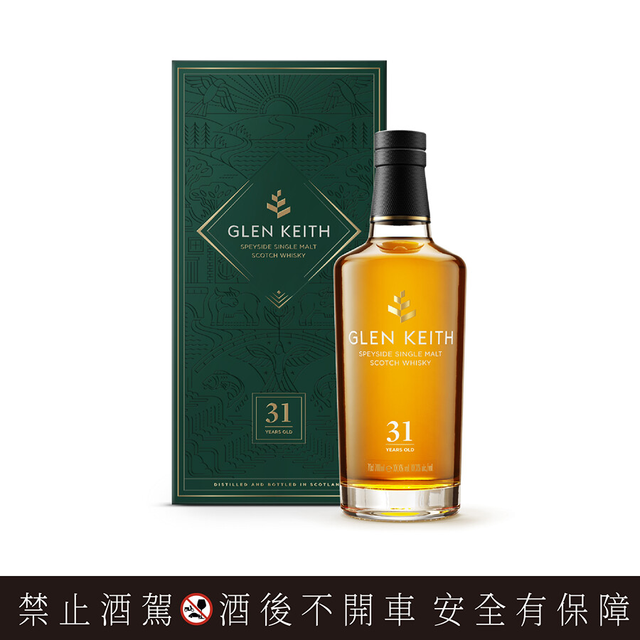
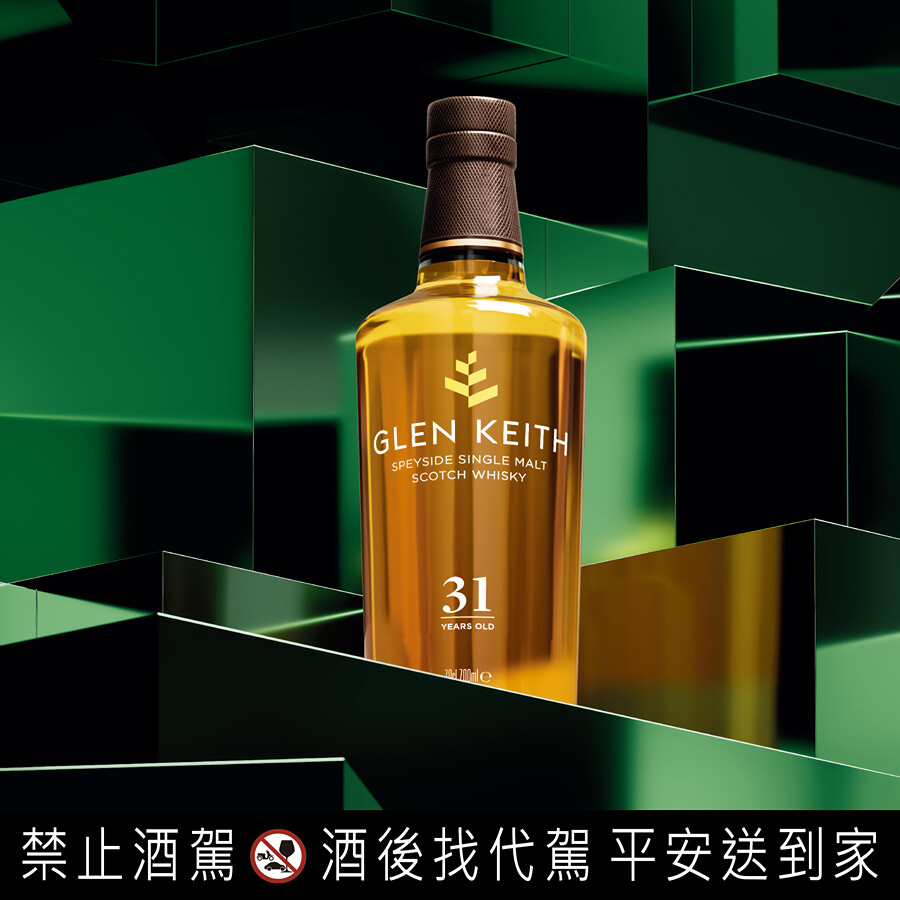

# Glen Keith 斯貝賽秘境 31yo 1st-Barrel 55.7%

【香氣】花露水 奶油 桂花香 麵包    
【味道】奶油 香草 青草 回味有芒果味 尤其芒果心帶毛的部分 清甜   
【結語】後續的水果味給人難以忘懷的好味道   
【日期】2025.03.19   
【評分】91   
【價格】29500   

Glen Keith 最初在 1958 年建立時只有 三支蒸餾器，是蘇格蘭第一個採用氣體加熱的蒸餾廠。後來為了提升產量，在 1970 年代增設為 六支蒸餾器，這是 Glen Keith 發展歷程中的一個里程碑。

Glen Keith 的蒸餾器具有 boil ball（沸騰球） 設計，有助於增加酒精蒸氣的回流，使得酒體更加輕盈、果香突出。這設計通常用來提升原酒的細緻度，是 Glen Keith 柔和風格的一部分來源。

Glen Keith 長年被用作生產 Chivas Regal（起瓦士） 調和威士忌的原酒，尤其強調其帶果香、柔和的酒體平衡其他酒廠風味。因此它雖然少有單一麥芽發售，但在起瓦士品牌的調和中扮演關鍵角色。

Glen Keith 被譽為「蘇格蘭的少林廚房」，是因為在 1970~80 年代，它被當成 Seagram（席格蘭）公司內部的 技術研發中心，進行許多蒸餾技術與酒體風味的實驗。甚至在這裡開發出像是 Glenisla（以泥煤水製成）與 Craigduff（泥煤+果香）等原酒風格。

Glen Keith 曾於 1999 年停產，直到 2013 年才由 Chivas Brothers（保樂力加集團旗下）進行現代化改造並復產。Alan Winchester 也參與了這項復場計畫，因此被視為復興 Glen Keith 的關鍵人物之一。這支復場團隊將傳統與現代工藝結合，使其重新成為調和威士忌的關鍵酒廠。

#glenkeith
#1stbarrel
#whisky
#whiskey
#pernodricard
#spicy9night
#whiskylover

以下資訊以及部分圖片來自https://www.097.com.tw/article/2619

「三大賣點」
從未發行，首次釋出原廠裝瓶的格蘭凱斯酒廠此年份單一麥芽威士忌。
2024限量臻藏版，小批次手工生產：首次臻選單一麥芽高年份裝瓶問世，存量屈指可數，僅此一版，滴滴珍稀，無法復刻。

臻選初次裝填美國橡木桶，原桶強度：非冷凝過濾，不加一滴水稀釋，保留住古威士忌酒廠最原始而純粹的斯貝賽風味，如同身歷罕為人至的酒廠桶邊品飲。

「品飲筆記」
香氣：撲鼻而來馥郁柑橘香氣揉合甜美莓果，交織以經典迷人奶油波本木質調性。
口感：入口襲來奶油薑餅，綴以多汁飽滿杏桃、李子風味，層次複雜豐厚，口感迷人。

尾韻：巧克力與核桃堅果交織，苦甜調性回甘，縈繞於口腔，尾韻複雜悠長。