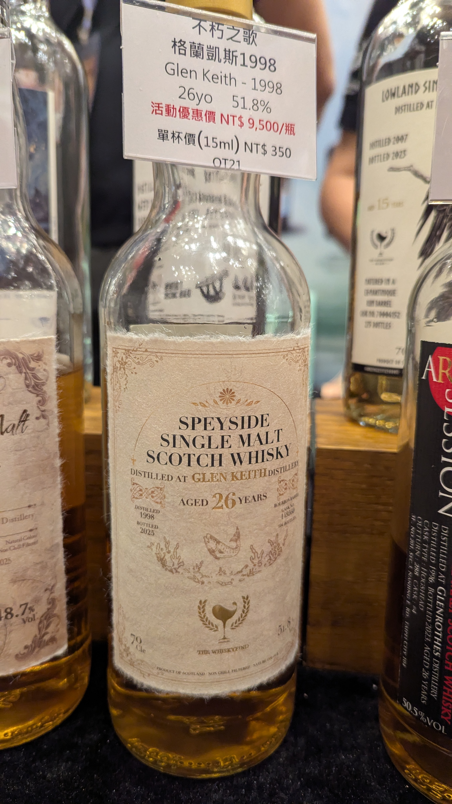

# 第十五章 Glen Keith WhiskyFind 不朽之歌 1998 26y Bourbon 51.8%

### 【結語】青草 麵粉 胭脂
### 【日期】2025.11.22 @高雄酒展
### 【價格】8500

Glen Keith 是我滿喜歡的酒廠，如果有能力的話希望可以看一支喝一支
我也很喜歡Whiskyfind 的不朽之歌系列，酒標好看又好喝價格也平易近人

### 官方品飲筆記
在斯佩賽的河畔小鎮，一段低語已靜靜流淌了二十六年。Glen Keith 酒廠於1958年開始投產，早期是做為集團調和威士忌的實驗平台，而後定調以優雅細膩、充滿果香的酒液著稱，為無數調和威士忌注入靈魂，如今，它以單一酒桶的姿態，訴說屬於自己的篇章。

這支 1998年蒸餾的Glen Keith，在波本桶中沉睡了26年，將花果香與時間的芬芳層層堆疊。輕抿一口，彷彿聽見蜜桃果園隨風搖曳的聲響，伴隨著花蜜與香草的甜潤緩緩展開；隨後，熟蘋果與脂粉的氣息逐漸浮現，如同春日午後的微光，清新卻又深邃；餘韻悠長而乾淨，留下優雅而明亮的印記。這不僅是一杯威士忌，更是時間書寫的詩篇。「不朽之歌」第十五章，將二十六年的靜默化為一段優雅的樂章，獻給懂得傾聽的人。

香 氣：脂粉、花蜜、加鹽奶油、水蜜桃、糖漬柑橘、杭菊、鹽津感。

口 感：入口柔和順滑，綿密果實感、水蜜桃、花蜜、榛果糖漿、香草莢。

尾 韻：糖漬柑橘、蜂蜜、香草莢、蜂巢、可可，令人回味不已。

#glenkeith
#whiskyfind
#不朽之歌
#whisky
#whiskylover
#whiskey
#spicy9night

