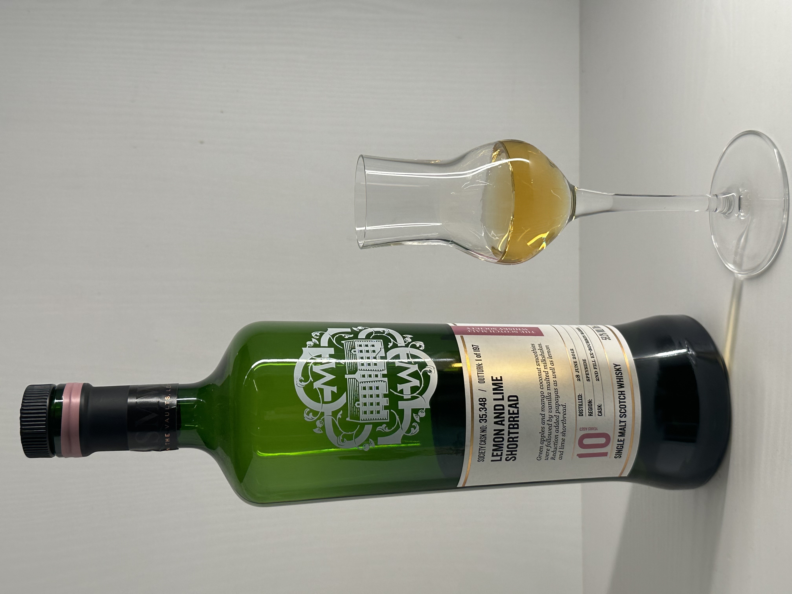
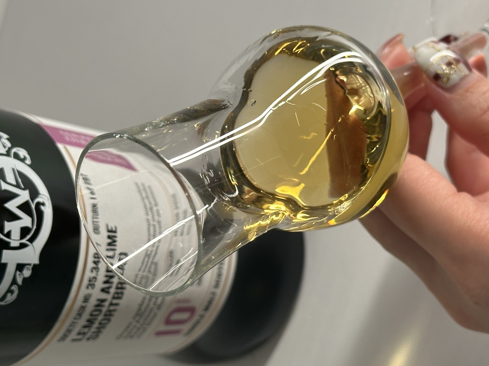
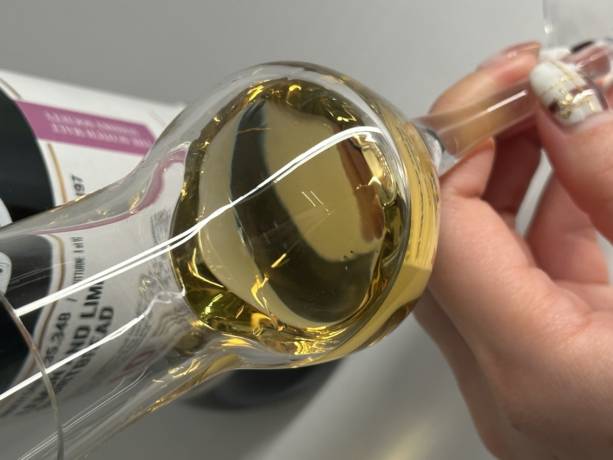

# 35.348 Glen Moray 2012 10yo 2nd Barrel 59.3%

### 【香氣】檸檬皮油蛋糕 柑橘皮 放了許久之後居然有巧克力的味道
### 【味道】橘子藥水 尾韻滿濃厚的的橘子酸，咀嚼之後，咬出一些機油味，嫩薑(壽司的薑)
### 【結語】這是一支皮油感滿豐富的品項，搭配麵粉餅乾感，有點檸檬奶霜餅乾的調性
### 【日期】2025.12.29
### 【評分】88
### 【價格】3300

### 官方品飲筆記
我們都注意到鼻腔感受到的水果香氣。包括脆青蘋果、芒果和椰子冰沙、桃子優格、檸檬慕斯和橙香糖霜蛋糕。口感甜美，帶有麥芽味，帶有奶油糖霜和橙皮，旁邊是溫暖的香草麥芽奶昔，餘韻中帶有醋栗和蘋果果醬的味道。在經過稀釋後，我們在香氣中找到了更多的香草味，水果變成了橘子和木瓜，再加上橙花柑橘莫吉托的香氣。品味時，我們品嚐到了烤椰子和檸檬酥餅，而微妙的鹹橡木、杏仁奶油和肉桂增添了複雜性和特色。

#glenmoray
#smws
#whisky
#whiskylover
#whisky
#spicy9night

