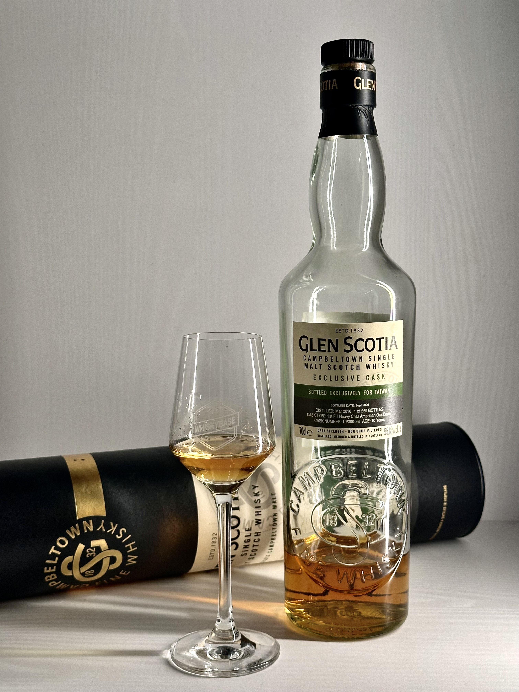
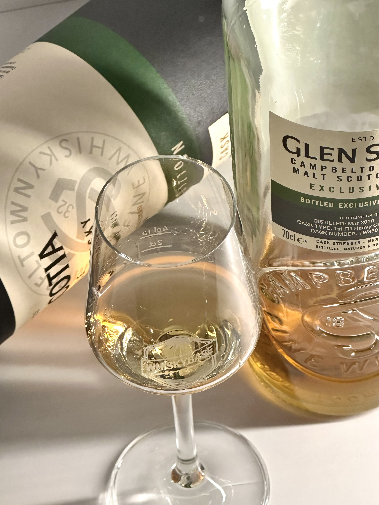
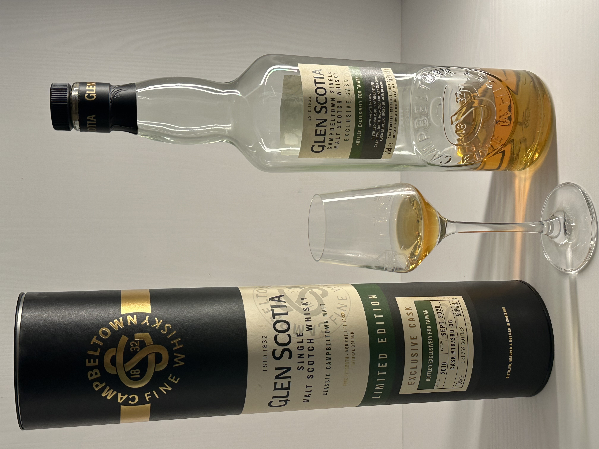
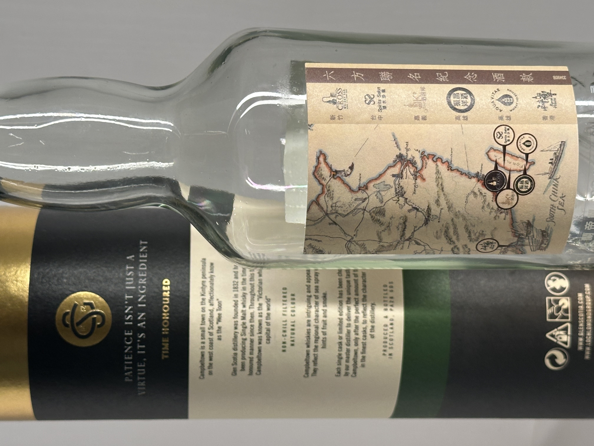

# Glen Scotia Exclusive Cask 2010 10yo 1st Fill Heavy Char American Oak Barrel 55.8%

### 【香氣】水果 一點蜜蘋果 荳蔻 辛香料 奶油 蜂蜜麵包
### 【味道】一開始有辣口感，放了一下溫和許多，甘蔗、水果醋、奶油甜點  
### 【結語】變化多端，原本辣口難耐，放了一下之後，圓融的口感跟奶油都來了
### 【日期】2025.12.29  
### 【評分】89

#glenscotia
#whisky
#whiskylover
#whisky
#spicy9night

