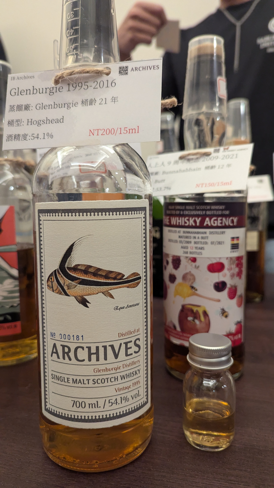

# The Fishes of Samoa Glenburgie Archives 1995 21yo HHD 54.1%

### 【香氣】在這瓶 1995 年 Glenburgie 21 年的 Archives 裝瓶中，最先帶出的是紅莓與覆盆莓的果香，還有些微的人篸氣息。整體香氣柔和但細緻，帶出一點成熟果實的甜感，讓人一聞就知道這是一款有層次的單一麥芽。

### 【味道】入口後 54.1% 的強度反而讓果香更飽滿，水蜜桃與杏桃的果肉感逐漸浮現。中段的甜度與果酸恰到好處，尾韻則持續延展出鮮果與淡淡香草的氣息，讓整體酒款有一種優雅的果香結構。

### 【結語】這支 The Fishes of Samoa 系列的 Glenburgie，雖然是 HHD 酒桶，但表現出來的水果感非常出色。Archives 系列的背景讓它多了一種精緻收藏感，適合慢慢品味、讓水果桃子味道在口中展開。

### 【日期】2026.5.23

### 【評分】92

### 【價格】200

#whisky #whiskylover #whiskey #spicy9night #glenburgie #archives