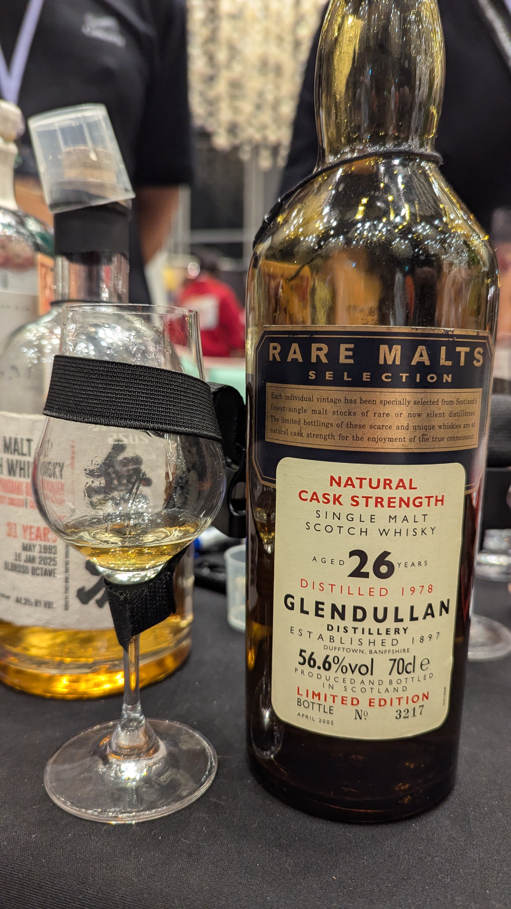

🥃
# Rare Malts Selection Glendullan OB 1978 26yo 56.6%

### 【香氣】桃花木 木質柚木
### 【味道】鹼粽加果糖甜蜜感
### 【日期】2025.11.22 @高雄酒展
### 【評分】90

【歷史起源：達夫鎮的最後拼圖】

格倫杜蘭酒廠（Glendullan）創立於 1897 年，座落於蘇格蘭威士忌重鎮——達夫鎮（Dufftown）的菲迪河畔。它是該地區在 19 世紀建立的第七家、也是最後一家酒廠。憑藉著純淨的「山羊井」泉水，其細緻風味在 1902 年便征服了愛德華七世的味蕾，榮獲皇家青睞。

【變革與轉身：從雙廠併行到帝亞吉歐巨人】
酒廠於 1926 年納入 DCL（帝亞吉歐前身）旗下。1972 年，在舊酒廠旁新建了現代化廠房，兩廠曾短暫併行，直至 1985 年舊廠正式退役。今日的格倫杜蘭擁有 500 萬公升的龐大產能，是帝亞吉歐最重要的單一麥芽酒廠之一。

【現今風貌：蘇格登的三大支柱】
2007 年，格倫杜蘭以「蘇格登」（The Singleton）品牌重新定義，與達夫鎮、格倫奧德共同揚名世界。其核心產品線以清爽與果香聞名：

#glendullan
#raremaltsselection
#whisky
#whiskylover
#whiskey
#spicy9night

