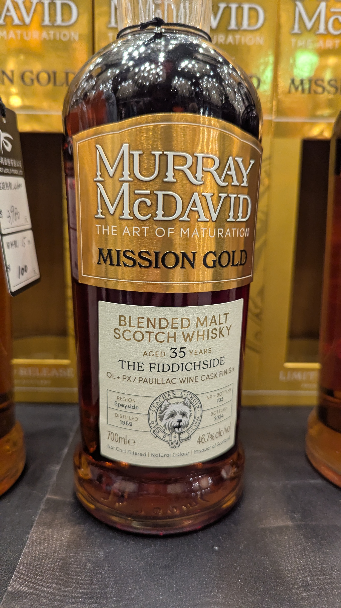

🥃
# Mission Gold Glenfiddich Murray McDavid 1989 35yo Oloroso+PX+Pauillac Wine Cask Finish 46.7%

### 【香氣】豐富的紅色水果、黑醋栗（紅酒桶影響）與濃郁的黑巧克力、葡萄乾（雪莉桶影響）。高年份帶來的舊皮革與淡淡的菸草氣息點綴其中。
### 【味道】酒體圓潤且充滿油脂感。首先感受到的是雪莉桶的濃稠甜感，隨後轉為紅酒桶帶來的單寧酸甜平衡，出現像是黑櫻桃、辛香料與老橡木的風味。
### 【結語】這支印象中也很喜歡，mission gold 系列好喝又便宜。極其悠長。深色的漿果餘味與木質調的香氣在口中繚繞，最後有一點溫暖的肉桂感。
### 【日期】2025.11.22 @高雄酒展

#glenfiddich
#murraymcdavid
#missiongold
#olorosso
#px
#pauillac
#whisky
#whiskylover
#whiskey
#spicy9night

