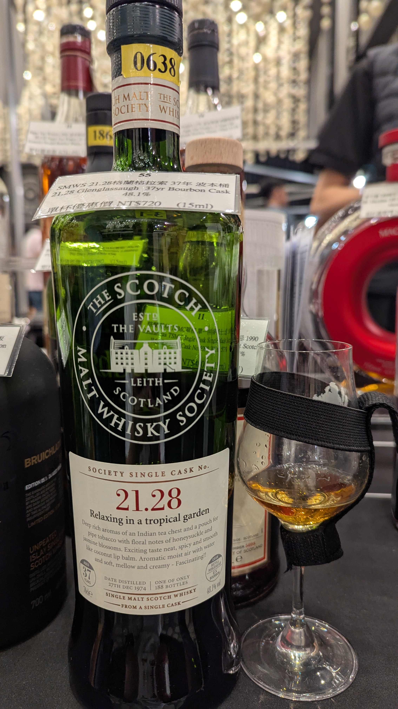

🥃
# 21.28 Glenglassaugh SMWS 1974 37yo Refill Bourbon HHD 48.1%

### 【香氣】舊書店 太妃糖 奶油
### 【味道】蜂蜜檸檬 
### 【日期】2025.11.22 @高雄酒展
### 【價格】720/15ml

深邃且豐富的香氣，讓人聯想到印度茶葉箱與菸斗草袋，伴隨著金銀花與茉莉花的芬芳花香。純飲時口感令人興奮，帶著辛香且如椰子護唇膏般滑順。加入水後，呈現出帶有芳香濕潤空氣感的氣息，口感變得柔軟、圓潤且綿密——令人著迷！！

Deep rich aromas of an Indian tea chest and a pouch for pipe tobacco with floral notes of honeysuckle and jasmine blossoms. Exciting taste neat, spicy and smooth like coconut lip balm. Aromatic moist air with water and soft, mellow and creamy - Fascinating!!

1. 酒廠背景與地理位置
創立年份： 1875 年。

地點： 位於蘇格蘭高地 (Highlands) 的東部海岸，座落在 Sandend 灣旁。

名稱含義： 「Glenglassaugh」在蓋爾語中意為「灰綠之地深谷」。

2. 波折的歷史（沉睡的巨人）
格蘭格拉索在威士忌界以其「坎坷」的歷史聞名，曾多次長期關廠停產：

沉睡期： 曾於 1907 年關廠，直到 1960 年才重建重開。

第二次沉睡： 1986 年再度因產業低迷而關廠，並沉睡了長達 22 年，直到 2008 年才復產。

現況： 目前隸屬於美商百富門 (Brown-Forman) 集團（旗下還有格蘭多納 GlenDronach、班瑞克 Benriach），近期已將官方中文譯名簡化為「格蘭索」。

3. 風味特色
海洋與果香： 由於酒窖緊鄰海洋，酒液帶有獨特的海洋鹹味 (Coastal salt) 與海風氣息。

熱帶風味： 其原酒以濃郁的熱帶水果甜味（如鳳梨、芒果）聞名，這也呼應了您這瓶酒的標籤主題「Relaxing in a tropical garden」。

高年份稀有性： 由於酒廠曾在 1986-2008 年間完全停產，中間出現了 22 年的產量斷層。因此，這瓶 1974 年蒸餾（來自關廠前的老酒庫存）的高年份威士忌，在市場上非常稀有且珍貴。

#glenglassaugh
#smws
#bourbon
#hogshead
#whisky
#whiskylover
#whiskey
#spicy9night

