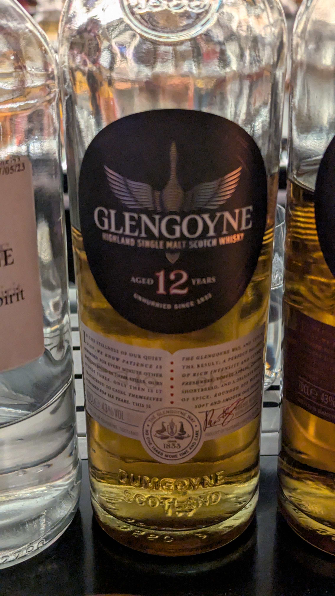
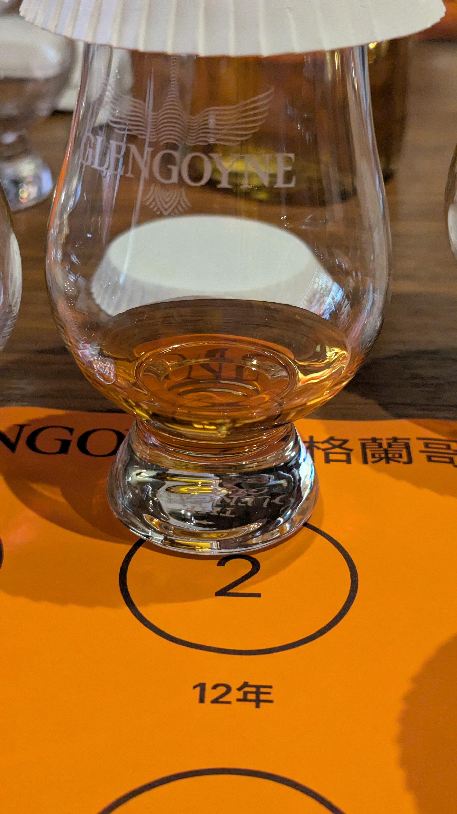
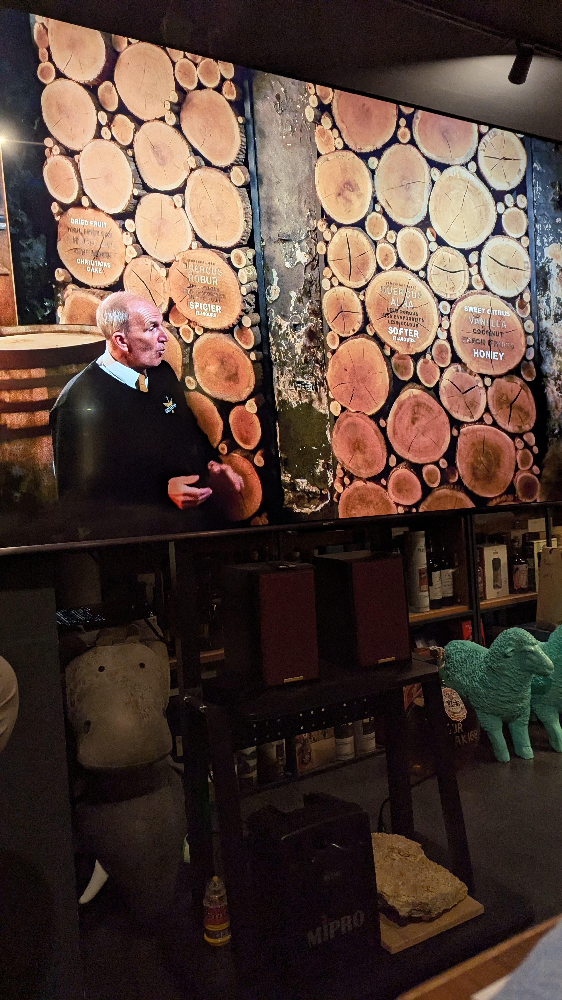
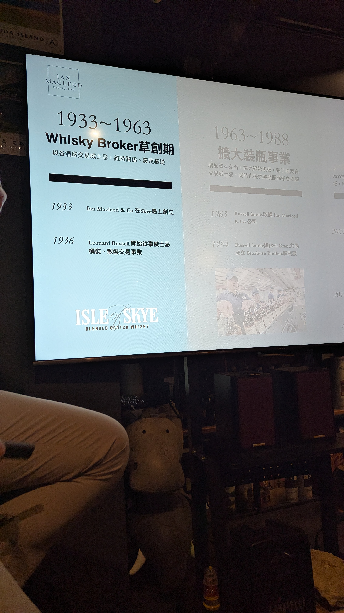
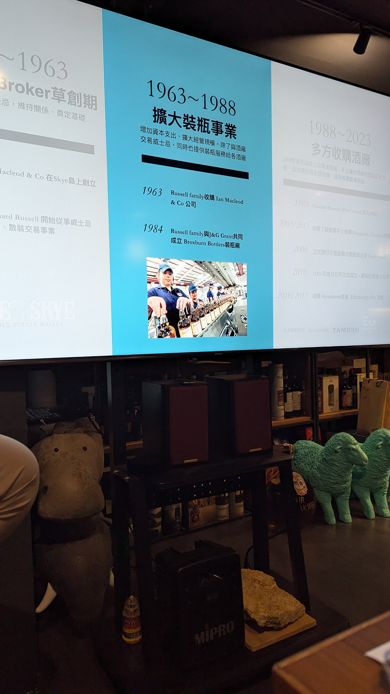
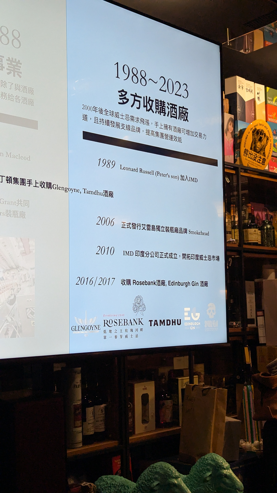
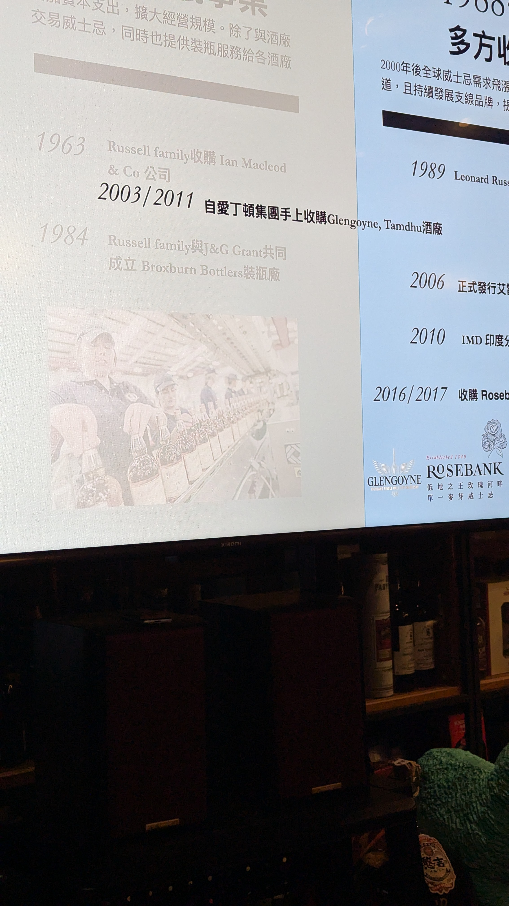

🥃
# Glengoyne OB 12yo 43%

### 【香氣】有點琉味 
### 【味道】香菜香菇 剛下完雨的草原 青草
### 【結語】豐富層次與清爽青蘋果風味的完美平衡。
### 【日期】2026.03.19
### 【評分】78

12年哥尼有使用到2成的bourbon 威士忌

歐洲橡木 (Quercus Robur) —— 深邃與香料

通常是西班牙紅橡木。

Dried Fruit（乾果）：葡萄乾、無花果。

Christmas Cake（聖誕節蛋糕）：那種濃郁、帶有香料感的甜美。

Spicier Flavours（辛香料）：丁香、肉桂。

色澤：賦予酒液較深的琥珀色或深紅褐色。

美國橡木 (Quercus Alba) —— 柔順與清甜

這通常是指波本桶或美國白橡木。它的特徵是：

Sweet Citrus（甜美柑橘）：這就是你之前問的，酒廠最核心的標誌性果香。

Vanilla / Coconut（香草/椰子）：美國橡木內含的香草醛。

Honey（蜂蜜）。

Softer（更柔順）：口感上比較圓潤、輕盈。

#glengoyne
#whisky
#whiskylover
#whiskey
#spicy9night

