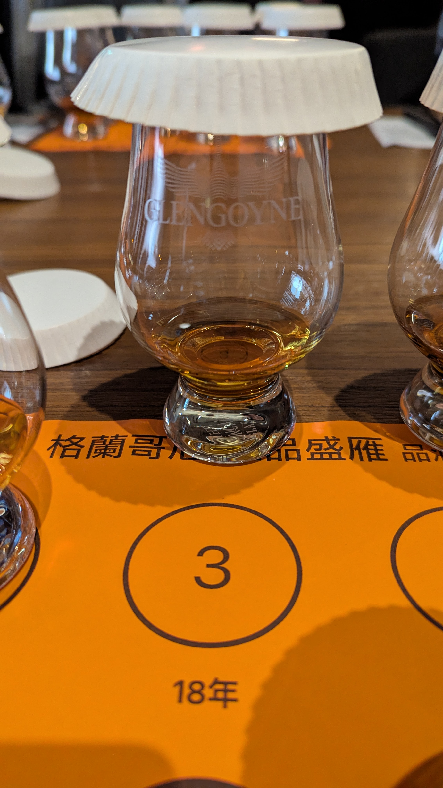
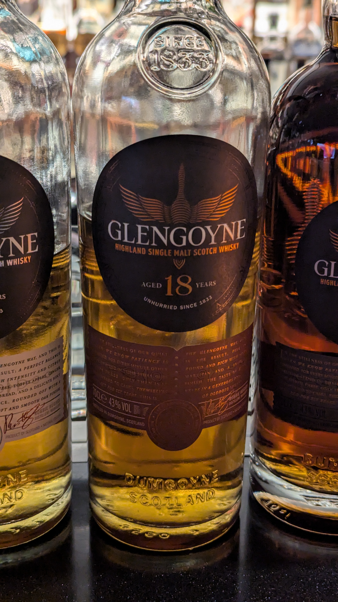

🥃
# Glengoyne OB 18yo 43.3%

### 【香氣】莓果 甘蔗
### 【味道】紅蘋果 茶感適中 紅茶
### 【結語】一半是 First Fill 初次雪莉桶，底蘊極其深厚。紅蘋果風味中帶有適中的紅茶感。這款酒雪莉桶的單寧很高，西方人或許沒那麼喜歡，但卻非常適合常喝茶、對單寧有高親和力的亞洲人。這正是為什麼雪莉桶在台灣能稱霸的關鍵——這是一份藏在味覺基因裡的共鳴。
### 【日期】2026.03.19
### 【評分】87
### 【價格】3380

｜生存與工藝的地理學｜

水源與酒精：歷史上，發展先進的城市（低地）因缺乏乾淨水源而「以酒代水」。

稅金的博弈：當時低地政府管得到，酒廠為了繳稅合法賣，只能用淺碟蒸餾器追求產量；而稅官管不到的高地，則為了在黑市賣出高價，專注於高品質、高級的「緩蒸慢餾」。

不用泥煤的原因：格蘭哥尼不使用泥煤烘烤大麥，理由非常單純——因為泥煤產地太遠了！ 這份因地理限制而產生的「純粹麥芽風」，反而成為酒廠最大的特色。

｜雪莉桶的黃金守護者｜

愛丁頓的遠見：1965 年愛丁頓（Edrington）買下哥尼。歷經 1970 年雪莉酒全盛期，到 1981 年西班牙禁止原桶外流，1986 年愛丁頓依然堅持投資完整的雪莉桶供應鏈（與Tevesa 合作），這份資源在 2003 年麥立得（Ian Macleod）接手後依然是哥尼的靈魂。

Tevesa 是一間位於西班牙赫雷斯（Jerez）的頂級製桶廠（Tonelería）

Tevesa 負責在西班牙北部森林挑選優質的歐洲橡木（Quercus Robur）。

橡木必須經過至少兩年的自然風乾（Air-seasoning），再由 Tevesa 的工匠手工製成木桶。

格蘭哥尼會委託 Tevesa 將新桶填入指定的優質雪莉酒（通常是 Oloroso），進行為期 2 到 3 年的「潤桶」。這段時間裡，雪莉酒的精華會滲透進橡木纖維。

#glengoyne
#whisky
#whiskylover
#whiskey
#spicy9night

