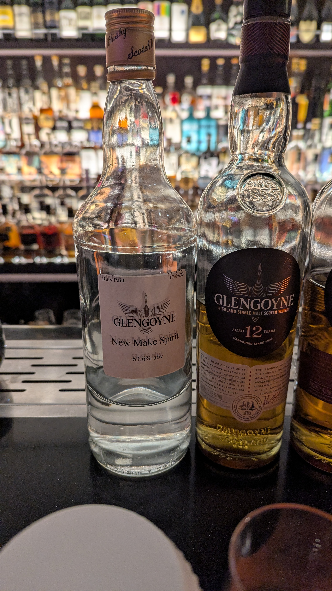
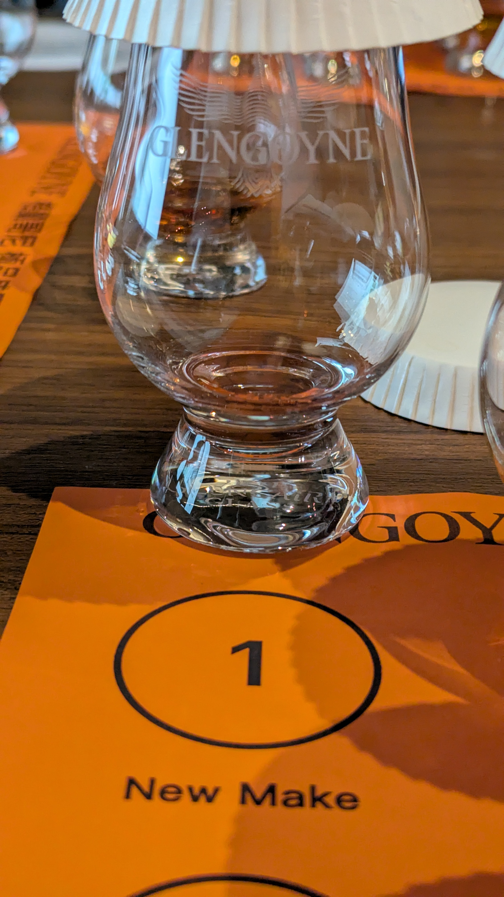
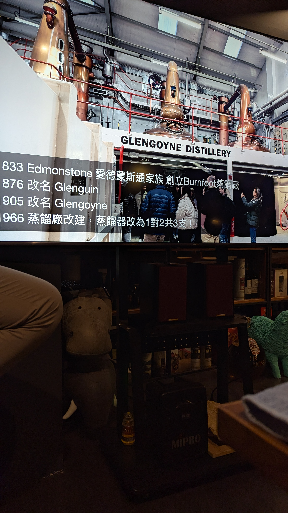
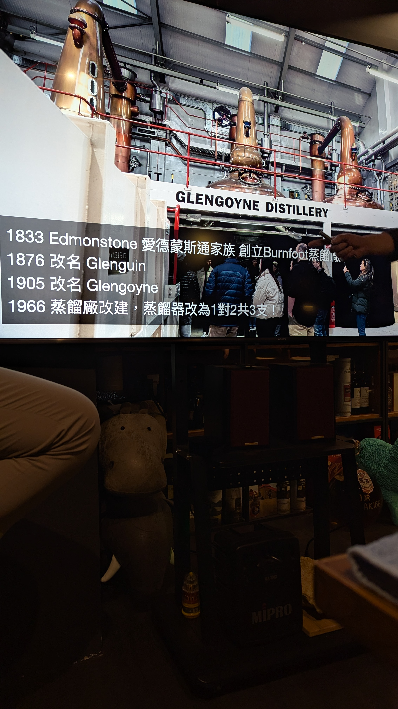
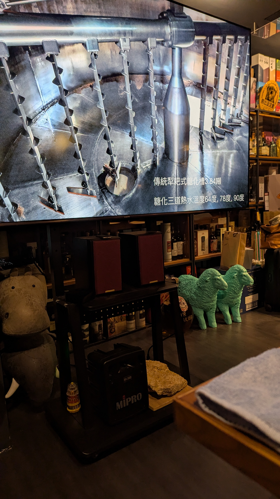

🥃
# Glengoyne OB 2023 0yo New Make 63.6%

### 【香氣】香蕉 荔枝 摸摸渣渣的罐頭水果 罐頭鳳梨 蘋果汁
### 【味道】油脂豐富 濃縮罐頭
### 【結語】油脂包覆性很強又滑順
### 【日期】2026.03.21

一條公路，劃分了兩個世界。🥃

｜地理冷知識：高地蒸餾，低地熟成｜

酒廠剛好被高低地分割線切到：公路一側是高地（Highland）的蒸餾室，另一側則是低地（Lowland的熟成倉庫。每一滴酒液都經歷了這場「跨區」的洗禮。

｜歷史長廊：酒廠的轉身｜

1833年：創立時原名 Burnfoot。

1876 / 1905年：經歷更名為 Glenguin，最終定名為 Glengoyne。

1889年：建築大師 Charles Chree Doig 設計了 Pagoda 煙囪，見證 1910 年前地板發麥的古典美學。

｜核心工藝：數據中的靈魂｜

讓大麥變成麥芽是為了釋出酶：大麥發芽只為轉化澱粉。無泥煤烘烤，保留純粹麥感。

發酵演進：80-90 年代 Kerry M & MX 酵母 ，現今 MG+ 乾式酵母。發酵時間 56 小時

蒸餾配置：1966 年起確立「1 對 2 共 3 支」的不對稱蒸餾配置。大的12666L 小的3200L ，酒精濃度經過蒸餾8.5%->25%->71%

風味公式：30% 來自蒸餾，70% 來自熟成。New Make 統一 63.5%，是為了酒廠間換酒的公平性。｜

#glengoyne
#whisky
#whiskylover
#whiskey
#spicy9night

