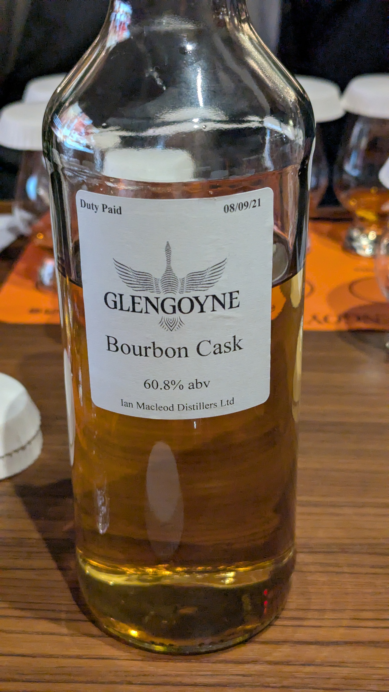
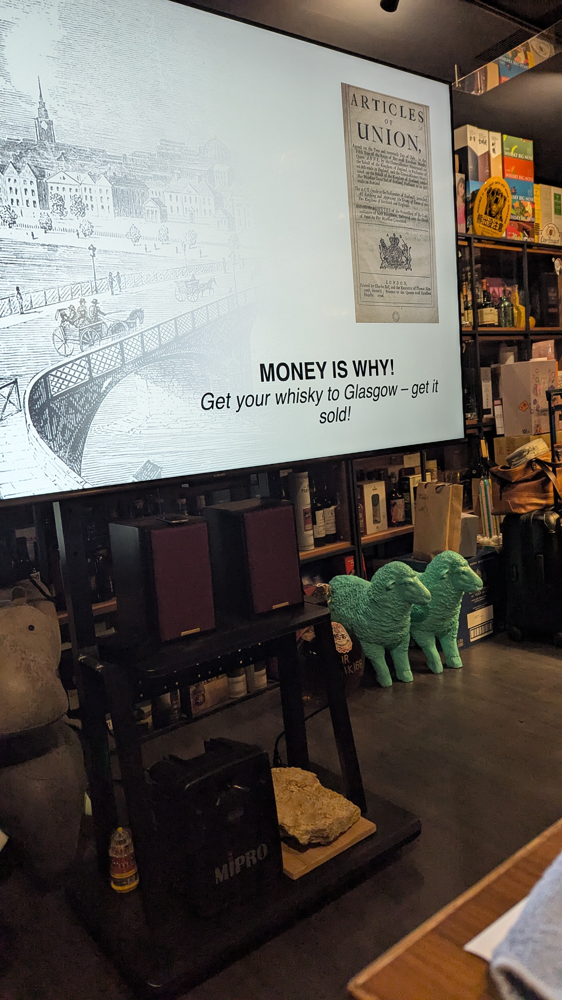
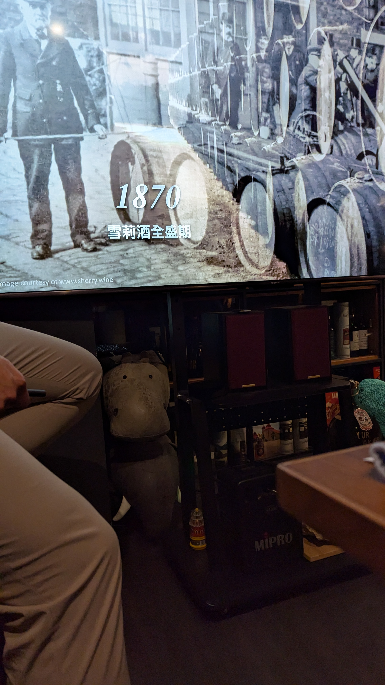

🥃
# Glengoyne OB 5yo Bourbon 60.8%

### 【香氣】蘋果、洋梨、甚至是熱帶水果
### 【味道】香草奶油、椰子、以及剛出爐的奶油酥餅
### 【日期】2026.03.19

波本桶哥尼!!!!!!!!!!!!!!!!!

1707 年《聯合法案》（Articles of Union）簽署後，英格蘭與蘇格蘭合併，隨之而來的是沉重的酒稅。對於當時的高地農夫來說，蒸餾威士忌是生存，而不是嗜好。

背景： 為了生存，酒徒們必須把威士忌運往格拉斯哥（Glasgow）這個大港口換取金錢。

從 1786 年到 1803 年，低地地區的蒸餾稅金暴漲了數十倍。

到了 19 世紀末，雪莉酒（Sherry）在英國進入全盛時代。

歷史交匯： 當時大量的雪莉酒桶從西班牙運抵格拉斯哥，這些原本只是裝載酒液的容器，卻意外成就了威士忌的絕美風味。

#glengoyne
#bourbon
#whisky
#whiskylover
#whiskey
#spicy9night

