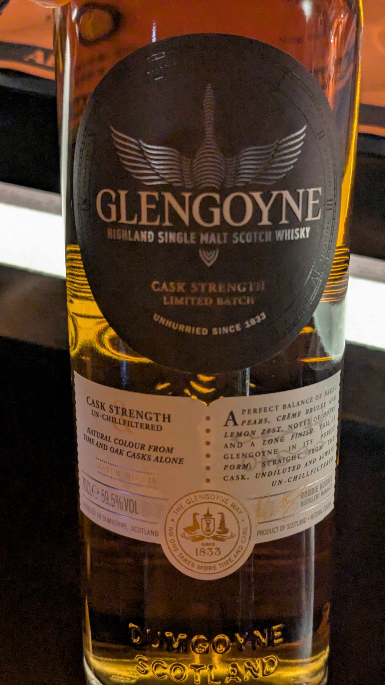
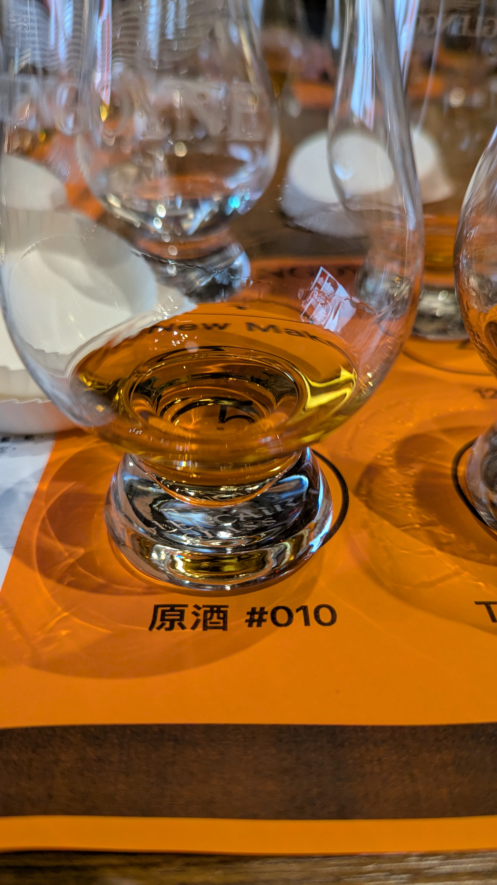

🥃
# Cask Strength Batch 010 Glengoyne OB Oloroso 59.2%

### 【香氣】辛香料 起司蛋糕
### 【味道】多了一些仙草 香草 麥芽糖
### 【日期】2026.03.21
### 【評分】85
### 【價格】1980

## 關於格蘭哥尼

格蘭哥尼酒廠以其標誌性的低速蒸餾法（Slow Distillation）聞名，這項技藝賦予威士忌更豐富的風味層次。Batch系列更是酒廠工藝的巔峰之作，代表著每個批次對於橡木桶選擇與調配的執著追求。

## Oloroso Batch 010 - 十週年紀念之作

此批次適逢原酒系列推出10週年的里程碑，一上市便勇奪2023年倫敦國際烈酒競賽（ISC）金牌的殊榮。這款Batch 010採用三桶策略：Oloroso雪莉桶（主導焦糖、堅果基調）、波本桶（增添香草與香料層次）及refill桶（保留雪梨般的新鮮感），以59.2%的酒精度賦予酒液飽滿的酒體與濃郁的風味表現。

## 品評筆記

**香氣：** 首先迎出黑莓與青蘋果的水果香，隨後是黑胡椒與芫荽的辛香調性，烘烤杏仁與輕微的椰絲香氣為基底增添了溫暖感。

**風味：** 入口即能感受到酒體的厚度與雪莉桶的影響——焦糖布丁、烤梨子與檸檬皮在舌尖交織，中段帶出與品飲筆記一致的草本感與香草香氣，伴隨著麥芽糖的甘甜。

**尾韻：** 悠長而綿延，蜂蜜的甘甜感與清爽的柑橘皮香為完美的餘韻收尾，37秒以上的尾留時間展現出此酒的陳年潛力與層次深度。

#glengoyne
#whisky
#whiskylover
#whiskey
#spicy9night

