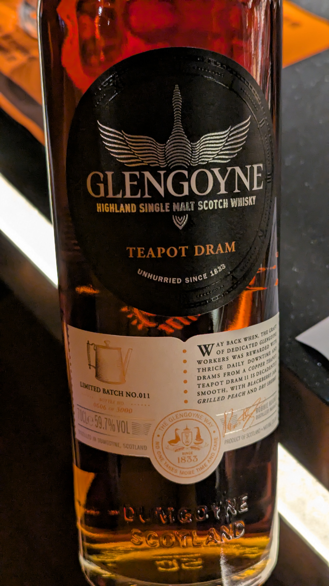
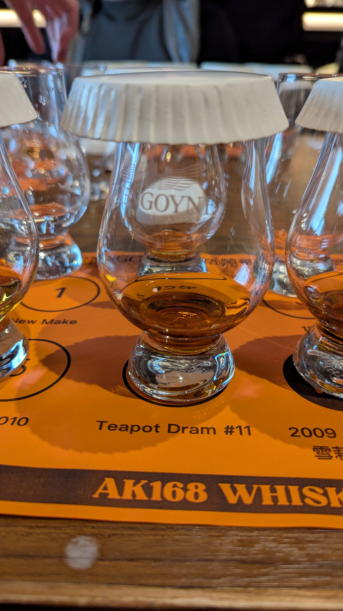

🥃
# TeaPot Dram #11 Glengoyne OB 59.7%

### 【香氣】太妃糖
### 【味道】螢火蟲之墓糖果的糖粉
### 【日期】2026.03.21
### 【評分】91
### 【價格】5888

滿滿的first fill 雪莉

🍶 你有聽過「茶壺裡的威士忌」嗎？揭秘蘇格蘭酒廠的秘密傳統！

在威士忌愛好者心中，Glengoyne（格蘭哥尼）是「慢速蒸餾」的代名詞，但在老一輩的員工口中，這裡還有一個關於 **「三指幅」與「茶壺」** 的溫暖傳說。

🥃 什麼是「三指幅」的配酒？
在 1970 年代以前，蘇格蘭酒廠有個霸氣的傳統——The Dramming Tradition。每天，酒廠會發放 2 到 3 次的「員工配酒」。
重點來了：這酒不是隨便倒一點，而是整整 **「三根手指高」的分量！而且通常是剛從橡木桶取出的原酒（Cask Strength）** ，酒精度極高。

㊙️ 喝不完怎麼辦？茶壺登場！
對於剛入行、酒量還沒鍛鍊好的年輕員工來說，一天三杯三指高的原酒簡直是挑戰。

職場潛規則： 直接倒掉酒液是對酒廠的大不敬！

求生妙招： 年輕員工會趁人不注意，偷偷把喝不完的酒倒進茶水間的「茶壺」裡。

👴 老員工的「體恤」與默契
這時候，酒量驚人的老前輩們就會上場了。他們會優雅地拿起那個裝滿威士忌的「茶壺」，幫後輩們解決這些「甜蜜的負擔」。這種躲避管理階層目光、卻又充滿同僚情誼的行為，讓茶壺成了酒廠裡最受歡迎的祕密。

✨ 現在的 Glengoyne...
雖然現代為了職場安全，這種豪邁的配酒制度已成為歷史，但這段「茶壺傳說」依然流傳至今，提醒著我們威士忌背後那份樸實的人情味。

下次喝 Glengoyne 時，不妨想像一下當年那個躲在茶壺背後的小故事，感覺酒液是不是又多了一點層次感？

#glengoyne
#whisky
#whiskylover
#whiskey
#spicy9night

