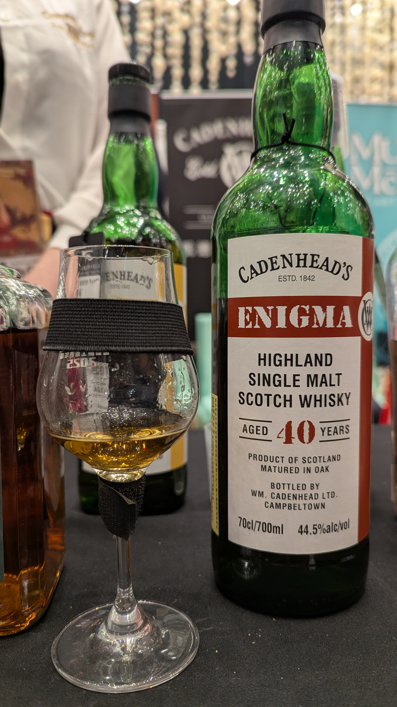

🥃
# Enigma Glenmorangie Cadenhead's 1985 40yo Bourbon HHD 44.5%

### 【香氣】展現出極致的老酒風情。初聞是濃郁的熱帶水果氣息（熟成芒果、蜜漬鳳梨），隨後散發出優雅的蜂蠟與老舊圖書館的木質調。隱約中帶有細緻的乾花香與香草莢的甜味。
### 【味道】酒體絲滑且極具層次。44.5% 的酒精度讓它入口非常溫潤，出現了橙皮果醬、糖漬生薑與焦糖燉蘋果的風味。中段發展出細膩的單寧感，像是高級皮革與苦甜巧克力的交織。
### 【結語】印象中很好喝。悠長且優雅。帶有淡淡的薄荷清涼感、檀香與乾果的餘甜，最後停留在口中是一股溫暖的香料味與老波本桶特有的奶油質感。
### 【日期】2025.11.22 @高雄酒展
### 【評分】90

雖然酒標沒寫，但根據 Whiskybase 上的社群資訊與業界消息，這款 Enigma Highland 40年 的真實身份幾乎可以確定是來自 Glenmorangie (格蘭傑)。

為什麼是格蘭傑？ 

這一批次的 Enigma 40年普遍被認為是格蘭傑的酒液，通常是使用了 Refill Bourbon Casks (二次波本桶) 進行超長年份的陳年。

風味調性： 

格蘭傑以優雅的高頸蒸餾器聞名，經過 40 年的淬煉，原本清爽的柑橘味會轉化為極其複雜的熱帶水果（芒果、鳳梨）、高級木質調、老舊皮革與細緻的花香。

#glenmorangie
#cadenhead
#enigma
#bourbon
#whisky
#whiskylover
#whiskey
#spicy9night

