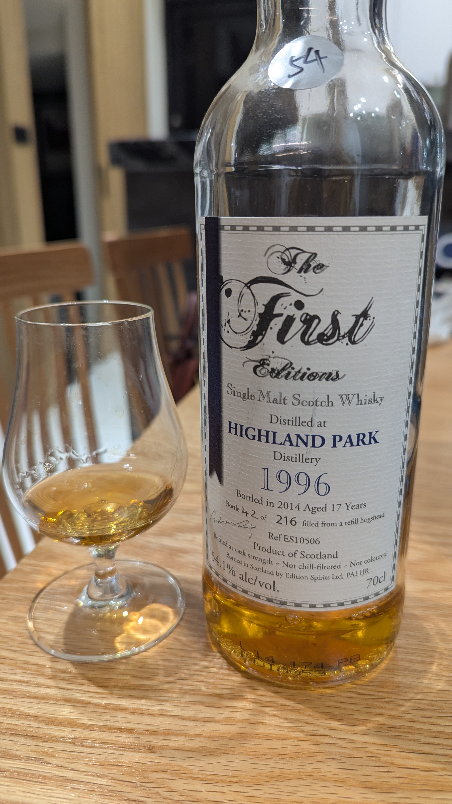

# The First Editions Highland Park Edition Spirits 1996 17yo HHD 54.1%

### 【香氣】
淡淡的奶油、香草和小白花香氣在杯中徐徐散開，帶著一種優雅的花香調。這款來自 Edition Spirits 的 Highland Park，香氣中有一種柔和的甜感，不像一般泥煤那般猛烈，更像是花園裡的清新草本與香草混合。

### 【味道】
入口 creamy 的口感很剛好，酒體並不覺得厚重或油膩，反而有一種輕盈的平衡。香草籽和百合花的味道襯托出甜香，酸甜之間拿捏得宜，尾韻轉成芒果的果香，讓人很容易連續品嚐。

### 【結語】
有花香的泥煤總是容易讓人印象深刻，這支 1996 年 17 年 HHD 單一麥芽並沒有走濃烈路線，而是在細緻和柔和之間找到一個舒服的節奏。酒體稍嫌淡薄，但整體仍然是優質的表現，尤其適合想要感受 Highland Park 典雅花香的一杯。

### 【日期】2026.5.18

### 【評分】90

#whisky #whiskylover #whiskey #spicy9night #highlandpark #editionspirits
