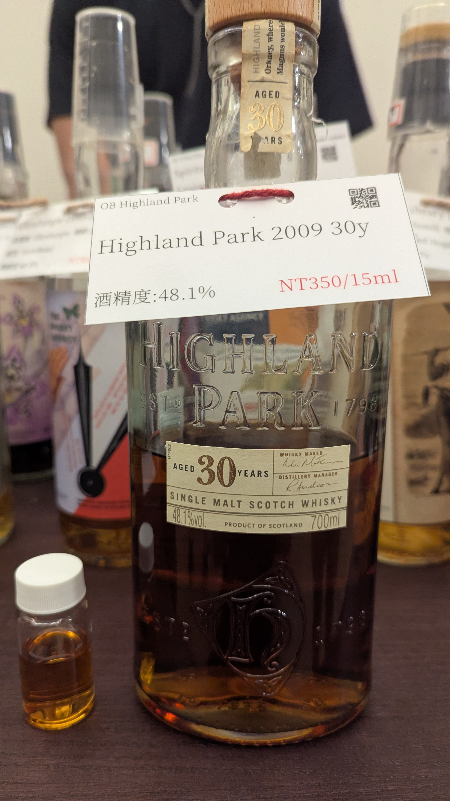

# Highland Park OB 1979 30yo 48.1%

### 【香氣】奶油、蜂蜜和淡淡的橡木香氣交織，帶出一絲柔和的煙燻與香草底蘊。
### 【味道】入口先是薄荷與堅果的清爽感，接著慢慢轉為奶油甜感與淡淡鹹味，餘韻中有柔和煙燻與香草回甘。
### 【結語】這支 1979 年 30 年單一麥芽原廠裝瓶，48.1% 的強度仍保留溫潤口感，整體風格沉穩內斂，帶著 Highland Park 經典的煙燻與奶油香。
### 【日期】2026.5.24
### 【評分】88
### 【價格】350

這次品飲的是一款來自 Highland Park 的 30 年單一麥芽 OB，雖然沒有特別標明桶型，但靠著高年份與 48.1% 的強度，依然能感受到穩定的風味表現，適合想體驗老年份 Highland Park 風格的時候拿出來慢慢品。

#whisky #whiskylover #whiskey #spicy9night #highlandpark

