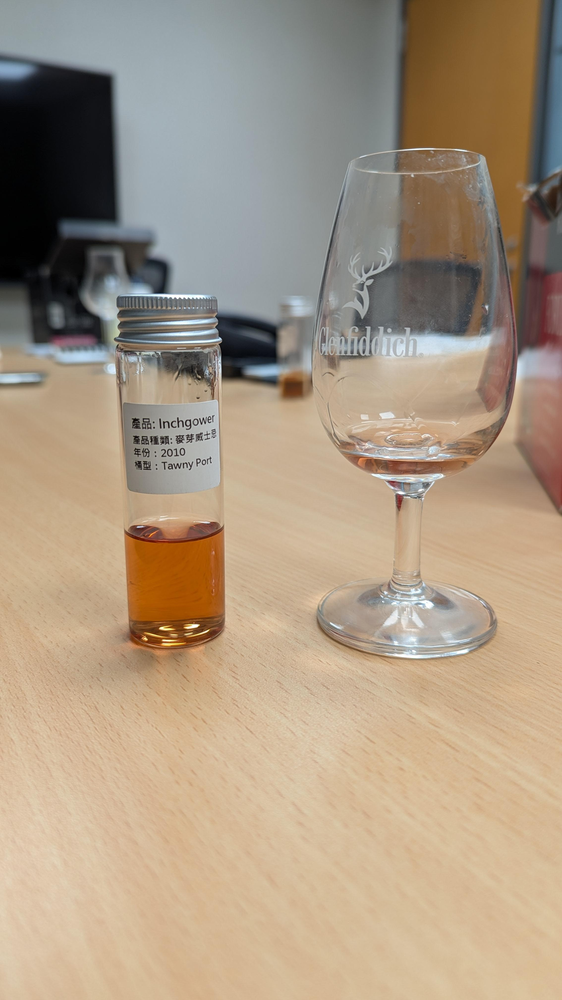

# Inchgower 2010 Tawny Port

【香氣】撲鼻的蔓越莓 莓果調性  
【味道】苦甜糖 甘蔗糖 樹葡萄  
【結語】我認為是一支中規中矩的味道，一排sample裡面，我給予正中間的評價，但朋友間分享，有覺得這支味道太雜亂   
【日期】2025.04.25   
【評分】85   
【價格】NA   

#inchgower
#whisky
#whiskey
#spicy9night
#whiskylover

