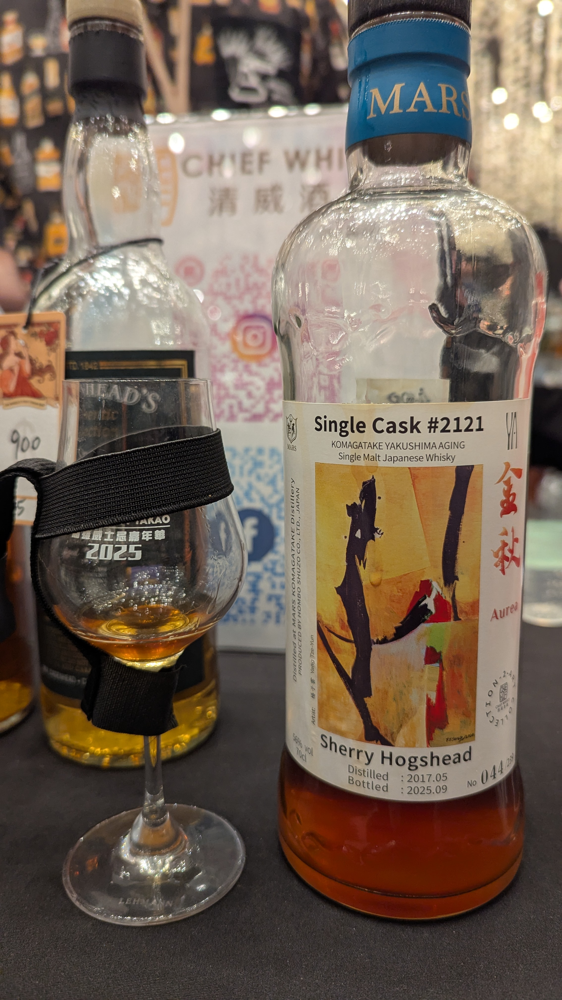

🥃
# 金秋 Komagatake OB 2017 8yo Sherry HHD 56%

### 【日期】2025.11.22 @高雄酒展
### 【評分】70

這款酒選用 2017 年蒸餾的駒之岳原酒，離開了寒冷的長野信州，
送往名列世界自然遺產的 **「屋久島」** 進行熟成，
8 年的時光，為其注入了濃郁的深色果實與烏梅香氣，並帶出一抹優雅的氧化調性。

酒標跨界合作台灣藝術家楊子雲。其同名作品《金秋》以流動的金色筆勢與抽象線條，精準捕捉了 56% 原桶強度下，那種果香綻放卻又沉穩內斂的雙重韻律。

初聞： 像是撥開一層硬水果糖，隨之而來的是溫柔的奶香與一抹輕盈的烏梅芬芳。

入口： 口感立體且明亮。草莓與葡萄乾的甜美與烏梅汁的酸香交織，甜潤中帶著爽脆的酸度。

尾韻： 極具戲劇性。以清涼的薄荷開場，最終化作極其深邃、如高級雪茄般的綿長煙燻感。

#komagatake
#whisky
#whiskylover
#whiskey
#spicy9night

