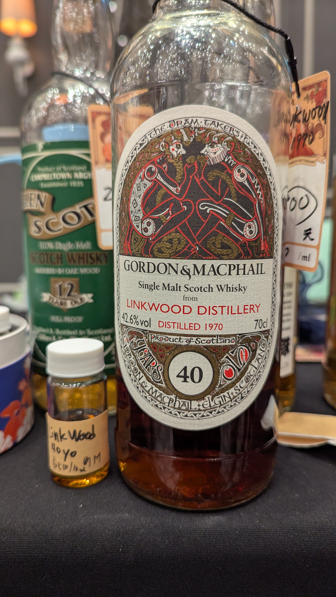
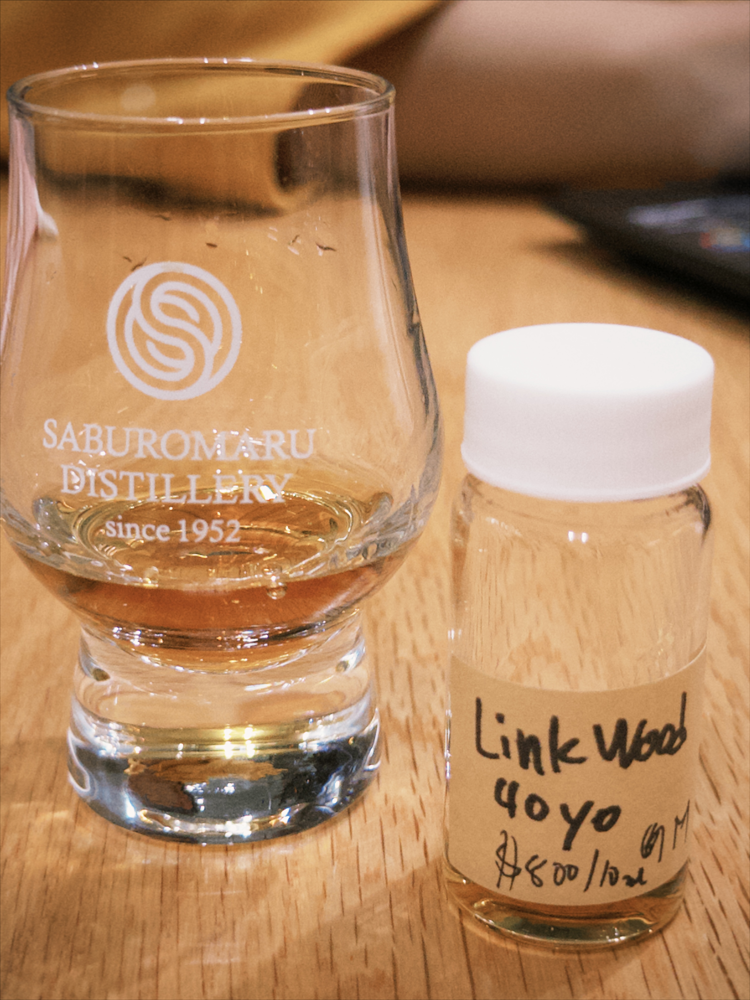

# Linkwood Gordon&MacPhail Celtic Series The Book of Kells 1970 40yo 42.6%

### 【香氣】一開始撲鼻的黑色李子 葡萄酒桶 泡泡膠 西洋梨 尾韻茶感
### 【味道】苦味可能有點木頭水了，味道有點臭水果，但是厲害的來了，回甘有超級明顯的太妃糖 森永牛奶糖的味道，超級讚，放一下之後，酒醒了，臭的味道就沒了
### 【結語】香氣一級棒，味道一開始有點臭，但是入口的回甘非常出色，放了一下之後的臭味也消失了
### 【日期】2025.12.26
### 【評分】92
### 【價格】800元/15ml

### **Nose**

The initial pour greets you with bold **dark plums** and distinct **wine cask** influence. It’s surprisingly playful, layering notes of **bubblegum** and crisp **pear** over a refined, lingering **tea-like finish** in the nostrils.

### **Taste**

The palate is a journey of transformation. It starts with a touch of "wood water" bitterness and a hint of overripe, funky fruit. However, the magic happens in the development: an explosion of **rich toffee** and **Morinaga milk caramel** sweetness. As the dram breathes, the initial funk dissipates, leaving a smooth, balanced profile.

### **Finish**

Incredible aromatic intensity from start to finish. While the first sip had a brief "funky" moment, the **aftertaste** is truly exceptional—highlighted by that stellar caramel comeback. Give this one a little time to open up; it rewards patience beautifully.

#linkwood
#gordonmacphail
#celticseriesthebookofkells
#whisky
#whiskylover
#whisky
#spicy9night

