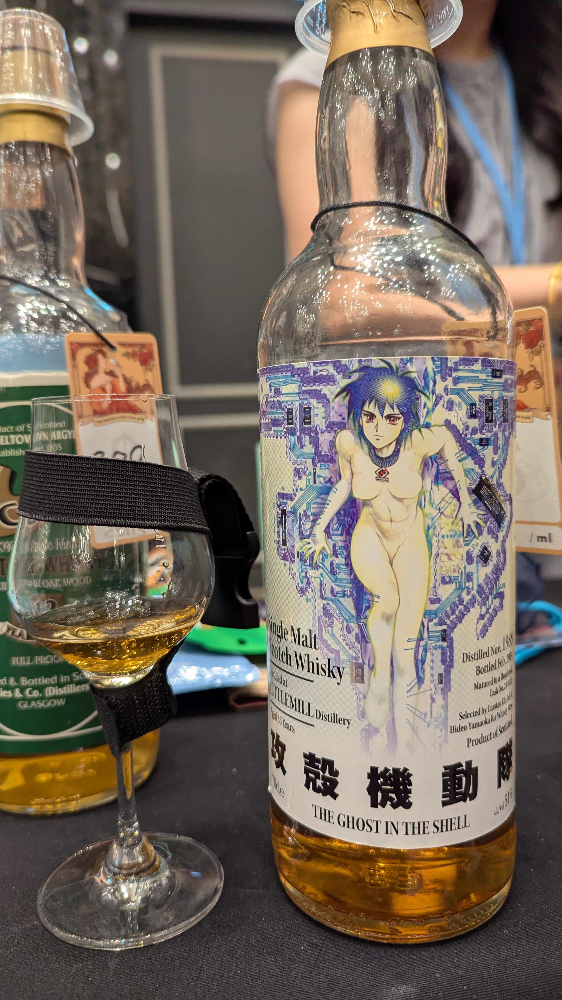

🥃
# Whisky Mew_攻殻機動隊 草薙素子 Littlemill Hideo Yamaoka 1988 35yo HHD 51%

### 【香氣】充滿果香。草莓果醬、蘋果乾、年份香檳。蜂蜜蛋糕烤焦的部分。塗了清漆的古董家具。
### 【味道】最初帶有苦韻與熱感。宜人的木質調。無花果、芒果乾、過熟的水果。略帶些許陳年粉塵感，但尾韻悠長。加水稀釋後口感會變得清爽，但層次感依然厚實不減。
### 【結語】經典的濃郁青草味搭配水果
### 【日期】2025.11.22 @高雄酒展
### 【價格】24000

#littlemill
#whiskymew
#hideoyamaoka
#motokokusanagi
#ghostintheshell
#whisky
#whiskylover
#whiskey
#spicy9night

